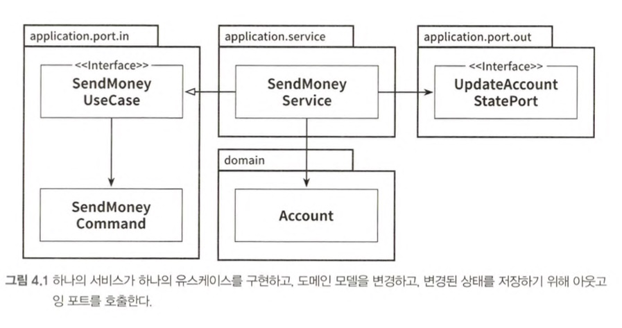

# 4장 유스케이스 구현하기

## 유스 케이스 둘러보기

1. 입력을 받는다
2. 비즈니스 규칙을 검증한다
3. 모델 상태를 조작한다
4. 출력을 반환한다



```java
@RequiredArgsConstructor
@Transactional
public class SendMoneyService implements SendMoneyUseCase {
    
    @Override
    public boolean sendMoney(SendMoneyCommand command) {
        // TODO: 비즈니스 규칙 검증 
        
        // TODO: 모델 상태 조작
        
        // TODO: 출력 값 반환
    }
}
```

## 입력 유효성 검증

> 유스케이스가 아닌 애플리케이션 계층에서 입력 유효성을 검증!<br>
> 애플리케이션 코어의 바깥쪽으로부터 유효하지 않은 입력값을 받게 되고, 모델의 상태를 해칠 수 있음

```java
@Getter
public class SendMoneyCommand {
    private final AccountId sourceAccountId;
    private final AccountId targetAccountId;
    private final Money money;
    
    public SendMoneyCommand(
        AccountId sourceAccountId,
        AccountId targetAccountId,
        Money money
    ) {
        this.sourceAccountId = sourceAccountId;
        this.targetAccountId = targetAccountId;
        this.money = money;
        
        requireNonNull(sourceAccountId);
        requireNonNull(targetAccountId);
        requireNonNull(money);
        requireGreaterThan(money, 0);
    }
}
```

- 객체 생성 시점에 예외를 던져 객체 생성 막음
- 불변 필드로 만들어 객체 생성에 성공하면 상태는 **유효하고 잘못된 상태로 변경할 수 없다는 사실** 보장

## 비즈니스 규칙 검증하기

> 입력 유효성 검증은 유스케이스 로직의 일부가 아니지만, 비즈니스 규칙 검증은 로직의 일부!

#### `입력 유효성 검증` &rarr; 구문 상의(= syntactical) 유효성 검증

- 송금되는 금액은 0보다 커야 한다
- 모델에 접근하지 않고 검증 가능

#### `비즈니스 유효성 검증` &rarr; 의미적인(= semantical) 유효성 검증

- 출금 계좌는 초과 출금되어서는 안된다
- 모델의 현재 상태에 접근 해야함
- 비즈니스 규칙을 도메인 엔티티 안에 포함시킴

```java
public class Account {
    public boolean withdraw(
        Money money,
        AccountId targetAccountId
    ) {
        if (!mayWithdraw(money)) {
            return false;
        }
    }
}
```

- 도메인 엔티티 내 로직과 가깝게 위치시킴

```java
@RequiredArgsConstructor
@Transactional
public class SendMoneyService implements SendMoneyUseCase {
    @Override
    public boolean sendMoney(SendMoneyCommand command) {
        requireAccountExists(command.getSourceAccountId());
        requireAccountExists(command.getTargetAccountId());
        ...
    }
}
```

- 도메인 엔티티에서 검증이 어려우면 유스케이스 코드에서 도메인 엔티티 사용전에 검증

## 유스케이스마다 다른 출력 모델

- 각 유스케이스에 맞게 입출력이 구체적일수록 좋음
- 출력은 호출자에게 꼭 필요한 데이터만 들고 있어야함 &rarr; 가능한 적게!

## 읽기 전용 유스케이스는 어떨까?

> 쿼리를 위한 인커밍 전용 포트를 만들어 쿼리 서비스에 구현

```java
@RequiredArgsConstructor
public class GetAccountBalanceService implements GetAccountBalanceQuery {
    private final LoadAccountPort loadAccountPort;
    
    @Override
    public Money getAccountBalance(AccountId accountId) {
        return loadAccountPort.loadAccount(accountId, LocalDateTime.now())
            .calculateBalance();
    }
}
```

