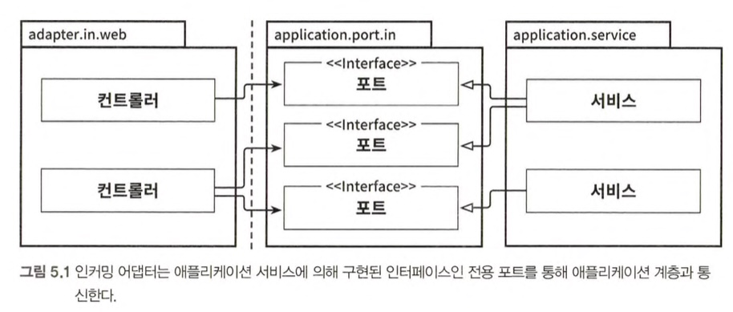
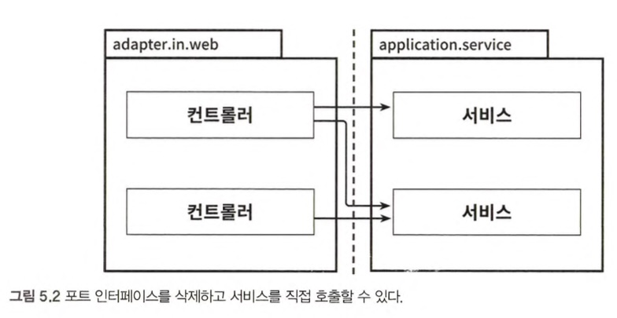
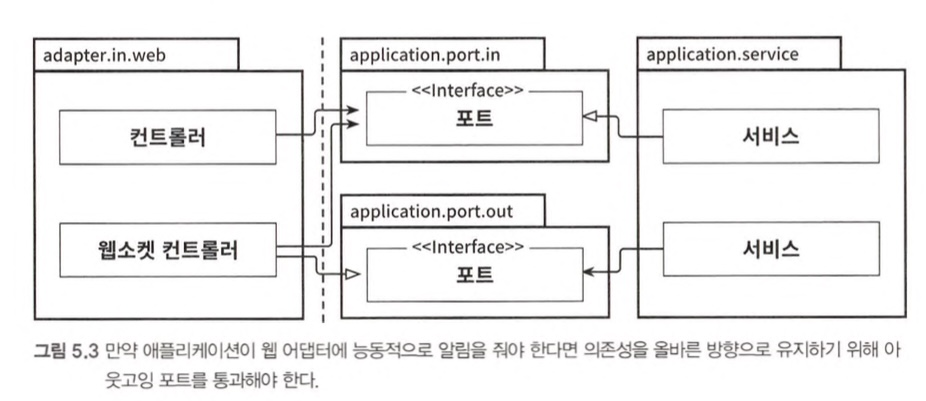

# 5장 웹 어댑터 구현하기

## 의존성 역전



- 웹 어댑터 &rarr; 외부로부터 요청을 받아 애플리케이션 코어를 호출
- 웹 어댑터 &rarr; 애플리케이션 계층 서비스 흐름
- 애플리케이션 계층 &rarr; 웹 어댑터가 통신할 수 있는 특정 포트 제공



- 웹 어댑터가 유스 케이스 직접 호출 가능



- 애플리케이션이 웹 어댑터에 능동적으로 알람 주는 경우
- 의존성을 올바른 방향으로 유지하기 위해 포트 삽입
- 서비스 &rarr; 웹소켓 컨트롤러 X, 웹소켓 컨트롤러 &rarr; 포트, 서비스 &rarr; 포트

## 웹 어댑터의 책임

1. HTTP 요청을 자바 객체로 매핑
2. 권한 검사
3. 입력 유효성 검증
4. 입력을 유스케이스의 입력 모델로 매핑
5. 유스케이스 호출
6. 유스케이스의 출력을 HTTP로 매핑
7. HTTP 응답을 반환

## 컨트롤러 나누기

```java
@RestController
@RequiredArgsConstructor
class AccountController {

    @GetMapping("/accounts")
    List<AccountResource> listAccounts() {
        ...
    }
    
    @GetMapping("/accounts/{accountId}")
    AccountResource getAccount(@PathVariable("accountld”) Long accountld) {
        ...
    }
    
    @GetMapping("/accounts/{accountId}/balance")
    long getAccountBalance(@PathVariable("account!d") Long accountld) {
        ...
    }

    ...
```

- 하나의 클래스 내 너무 많은 코드량
- 많은 연산이 특정 모델 공유
- 각 연산에 대해 별도의 패키지 내 별도의 컨트롤러 생성

```java
@RestController
@RequiredArgsConstructor
public class SendMoneyController {
    
    @PostMapping("/accounts/send/{sourceAccountId}/{targetAccountId}/{amount}")
    void sendMoney(
        @PathVariable("sourceAccountId") Long sourceAccountId,
        @PathVariable("targetAccountId") Long targetAccountId,
        @PathVariable("amount") Long amount
    ) {
        SendMoneyCommand command = new SendMoneyCommand(
            new AccountId(sourceAccountId),
            new AccountId(targetAccountId),
            Money.of(amount)
        );
        
        sendMoneyUseCase.sendMoney(command);
    }
}
```

- 컨트롤러에 맞는 모델 새롭게 만듬
- 병합 충돌도 일어나지 않은 확률 &uarr;

