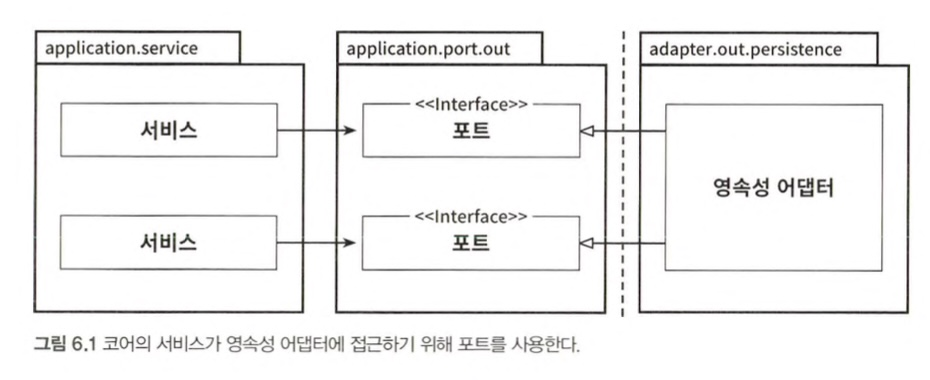
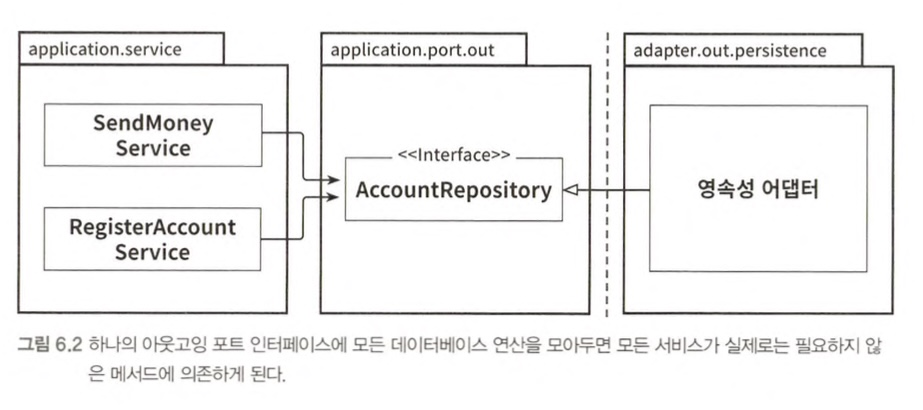
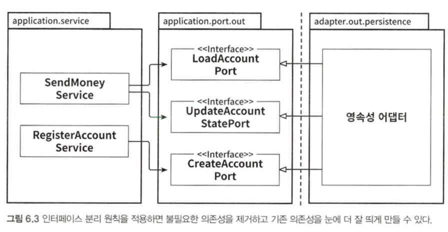
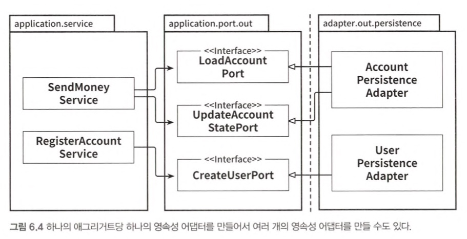
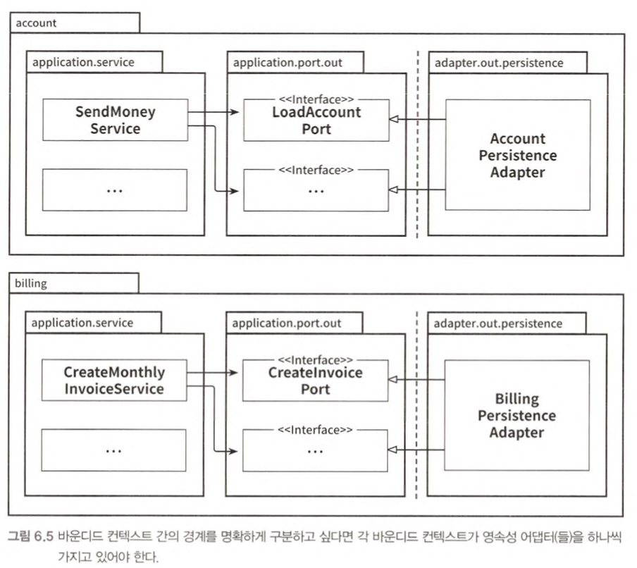

# 6장 영속성 어댑터 구현하기

## 의존성 역전

> 영속성 작업을 수행하고 DB와 통신할 책임을 가진 영속성 어댑터 클래스

## 영속성 어댑터의 책임

1. 입력을 받는다
2. 입력을 DB 포맷으로 매핑한다
3. 입력을 DB로 보낸다
4. DB 출력을 애플리케이션 포맷으로 매핑한다
5. 출력을 반환한다

- DB 연산에 의존하는 각 서비스는 인터페이스에서 단 하나의 메서드만 사용하더라도 넓은 포트 인터페이스에 의존성 갖게됨

- 각 서비스는 실제로 필요한 메서드에만 의존
- 포트의 이름이 포트의 역할 표현

## 영속성 어댑터 나누기

- 애그리거트 당 하나의 영속성 어댑터 &rarr; 영속성 요구사항 분리

