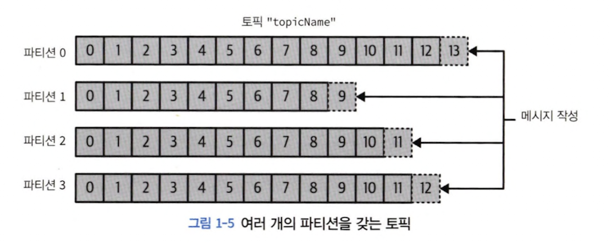
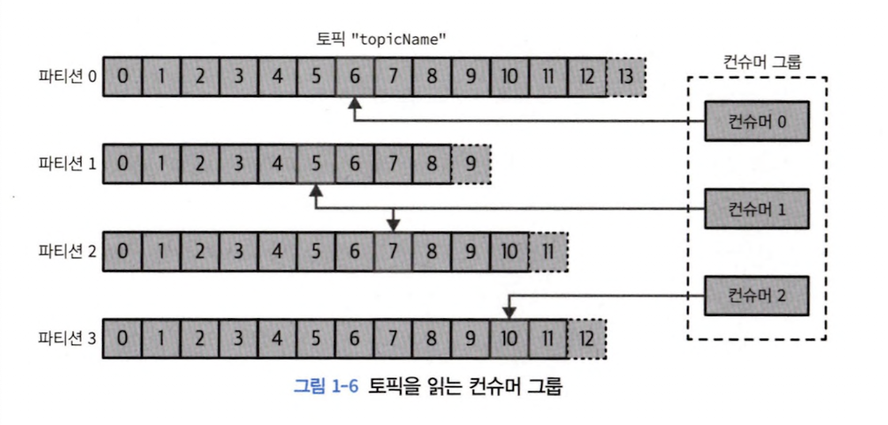
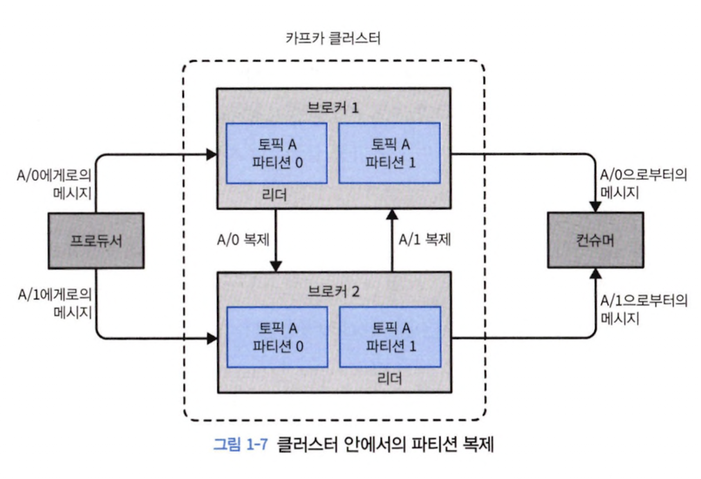

# 1장 카프카 시작하기

## 1.1 발행/구독 메세지 전달

- 전송자가 데이터 전송 시 직접 수신자로 전달 x
- 전송자 &rarr; 메세지를 분류해서 전송
- 수신자 &rarr; 분류된 메시지 구독
- 메시지 전달받아 중계해주는 broker 존재

## 1.2 카프카 입문

> 카프카 = 메시지 발행/구독 시스템 &rarr; 분산 커밋 로그, 분산 스트리밍 플랫폼

- 카프카 내 저장된 데이터 순서 유지한채로 지속성 있게 보관

### 1.2.1 메시지와 배치

- 카프카 데이터 기본 단위 = 메시지
- 키 = 메시지 저장 파티션 결정 시 사용
- 키 값에서 해시값 생성 후 토픽 파티션 수로 나눠 나온 나머지 값에 해당하는 파티션에 메시지 저장
- 메시지 저장 단위 = 배치 &rarr; 토픽의 파티션에 쓰여지는 메시지 집합

### 1.2.3 토픽과 파티션

> - `토픽` = DB table
> - `파티션` = 커밋 로그 내 하나의 로그

    

- stream = 하나의 토픽에 저장된 데이터 = `producer ~ consumer`로의 하나의 데이터 흐름

    

### 1.2.5 브로커와 클러스터

> 카프카 서버 = 브로커

- 메시지를 전달받아 오프셋에 할당한 뒤 디스크 저장소에 쓰기
- consumer의 파티션 읽기 요청 처리 & 발행된 메시지 전달

    

- 하나의 클러스터 내 여러 개의 브로커 포함 가능
- 하나의 브로커가 클러스터 컨트롤러 역할
- 파티션 &larr; 클러스터 내 브로커 중 하나 담당(= 파티션 리더)
- 복제된 파티션이 여러 브로커에 할당 가능 &rarr; 팔로워