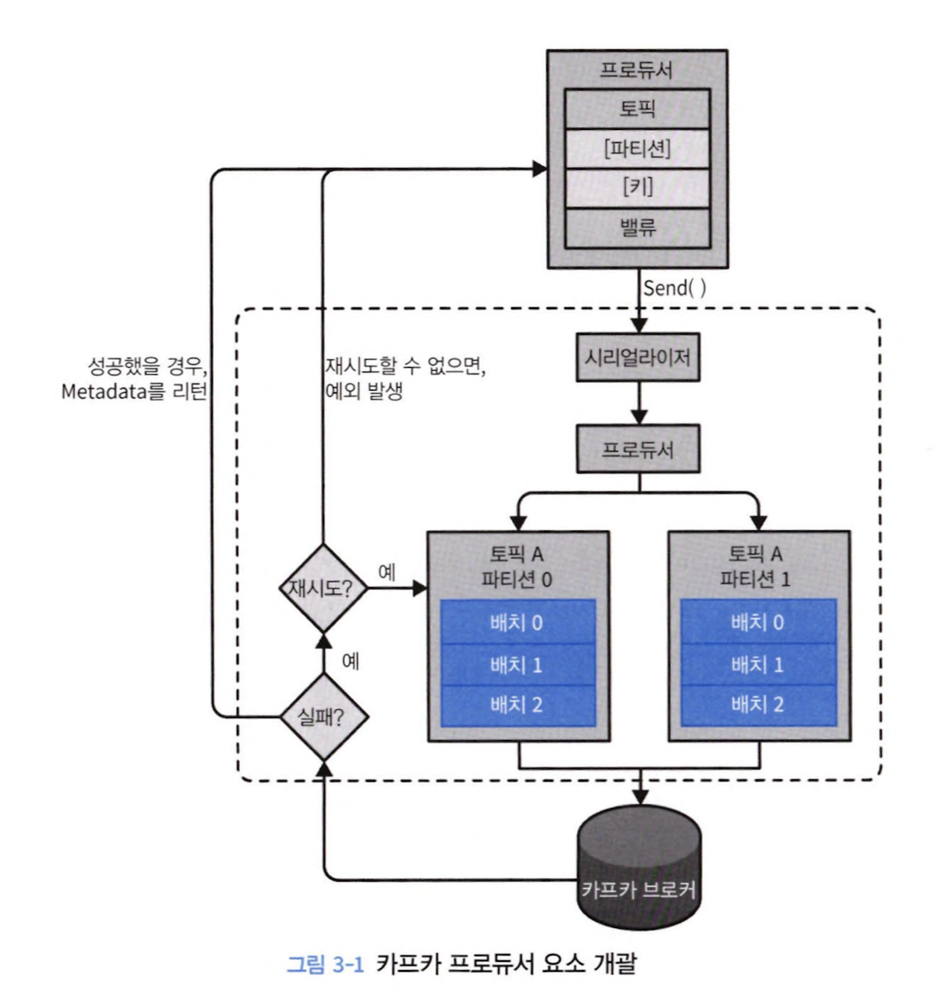
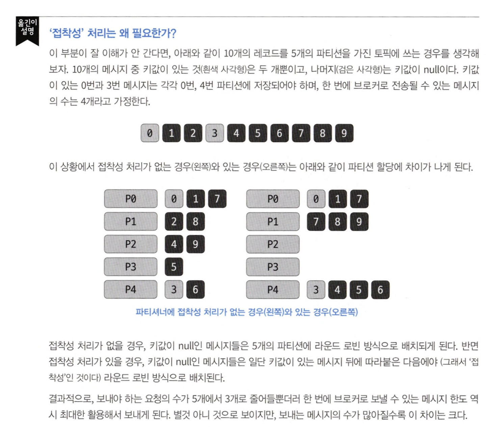

# 3장 카프카 프로듀서: 카프카에 메시지 쓰기

## 3.1 프로듀서 개요

1. 카프카에 쓰려는 메세지 갖는 `ProducerRecord` 생성
2. 직렬화
3. 파티셔너 컴포넌트에 전달
4. 같은 토픽과 파티션으로 전달될 레코드를 모은 레코드 배치에 추가
5. 특정 스레드가 그 배치를 카프카 브로커에 전달
6. 브로커는 메세지 처리 후 응답 메세지 전송

## 3.2 카프카 프로듀서 생성하기

#### bootstrap.servers

- 카프카 클러스터와리 첫 연결을 위해 프로듀서가 사용할 브로커 host, port 목록
- 첫 연결 후 추가 정보 받아와야 함

#### key.serializer

- kafka에 쓸 record **key** 값 직렬화 위해 사용하는 serializer

#### value.serializer

- kafka에 쓸 record **value** 값 직렬화를 위해 사용하는 serializer

#### 메세지 전송 3가지 방법

- `fire-and-forget` : 메세지 전송만 하고 후속 조치 x
- `synchronous send` : 전송 후 future 객체 반환
- `asynchronous send` : 전송 후 callback 호출

## 3.4 프로듀서 설정하기

#### client.id

- broker가 producer가 보낸 메세지 구분하기 위해 사용하는 식별자

#### acks
> producer가 쓰기 작업이 성공했다고 판별하기 위해 파티션 레플리카가 얼마나 많이 해당 레코드를 받아야 하는지 설정

ISR이란, replication 되고 있는 replica group

> 카프카에서 리더와 팔로워는 각자 역할이 나뉘는데 가장 중요한 것은 
> 리더는 Read/Write를 하고, 팔로워는 주기적으로 리더의 데이터를 보며 복제만 한다는 것이다.  
> 만약 리더가 있는 브로커가 장애가 난다면 팔로워는 새로운 리더가 될 수 있다. 
> 이때 데이터의 정합성을 유지하기 위해 등장한 개념이 카프카의 ISR이다.

- `acks = 0` &rarr; 메세지 전달 성공 간주로 브로커 응답 기다리지 않음
- `acks = 1` &rarr; producer는 리더 레플리카가 메시지 받는 순간 브로커로부터 성공 응답 받음
- `acks = all` &rarr; in-sync replica(= ISR)에 전달된 뒤 브로커로부터 성공 응답 받음

## 3.6 파티션

## 3.7 헤더

- 헤더 내 추가 메터 데이터 저장
- 메세지 전달 내역 기록
- 헤더 내 정보만으로 메세지 라우팅, 출처 추적

## 3.8 쿼터, 스로틀링

> 쿼터란, 카프카 브로커에 쓰기/읽기 속도 제한 기능

- 초당 평균적으로 프로듀서가 쓸 수 있는 데이터 제한 &rarr; quota.producer.default = 2M

> 스로틀링이란, 메세지 할당량을 초과하지 않도록 제한 기능
