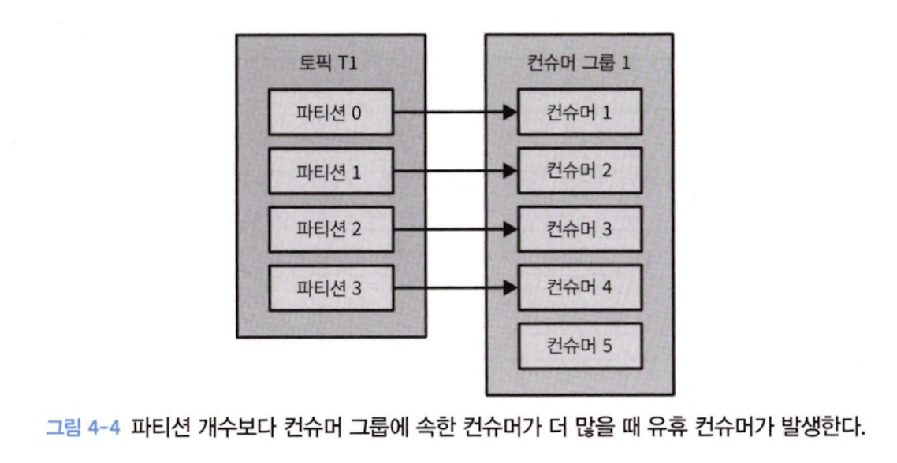
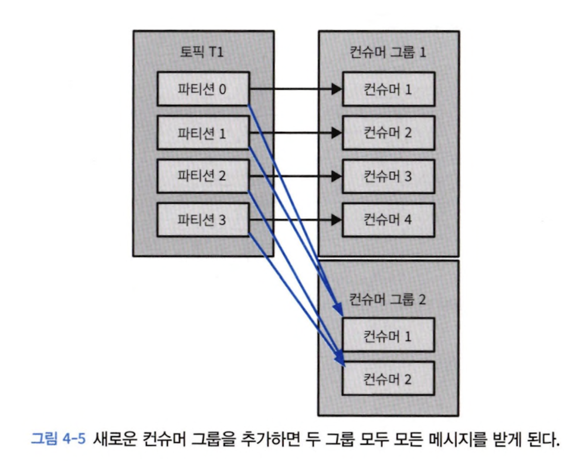
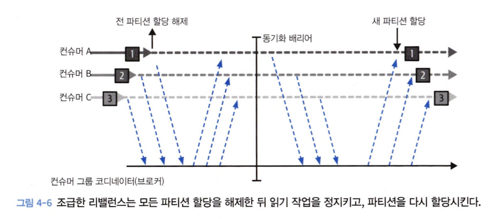
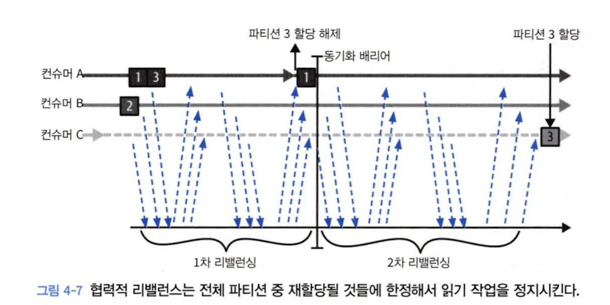
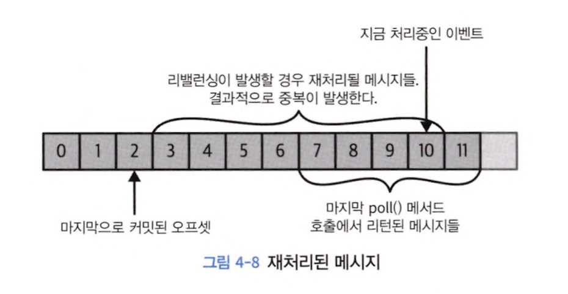
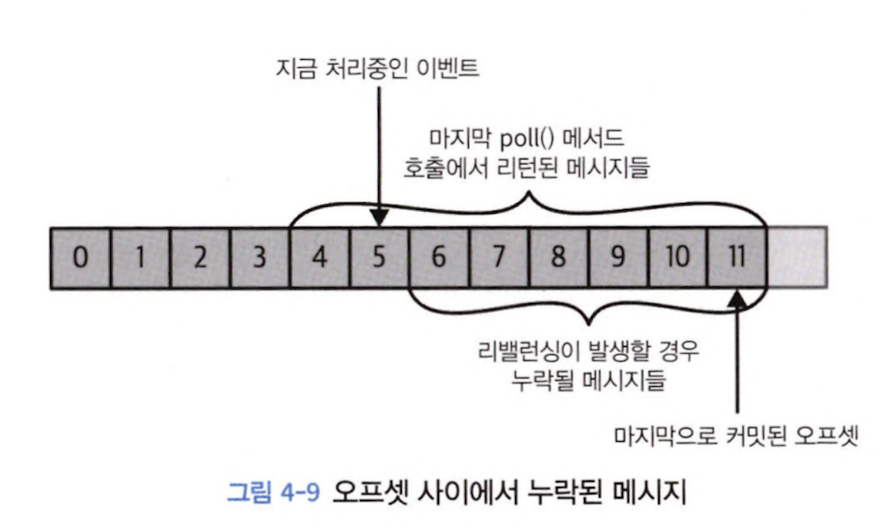

# 4장 카프카 컨슈머: 카프카에서 데이터 읽기

## 4.1 카프카 컨슈머: 개념

### 4.1.1 컨슈머와 컨슈머 그룹

#### 파티션 개수보다 컨슈머 그룹에 속한 컨슈머가 더 많을 때 유휴 컨슈머 발생

- 토픽에 설정된 파티션 수 이상으로 컨슈머 증가 의미 x

&rArr; 새로운 컨슈머 그룹 추가하여 모두 메세지 받게함

### 4.1.2 컨슈머 그룹과 파티션 리밸런스

> 리밸런스란, 컨슈머에 할당된 파티션을 다른 컨슈머에 할당해주는 작업

#### eager rebalance

> 모든 컨슈머는 읽기 작업 멈추고 자신에게 할당된 파티션 해제 후 컨슈머 그룹에 다시 join하여 새로운 파티션 할당

#### cooperative rebalance

> 한 컨슈머에게 할당되어 있던 파티션만을 다른 컨슈머에 재할당

1. 컨슈머 그룹 리더가 재할당 통보
2. 컨슈머 읽기 작업 멈추고 파티션 해제
3. 컨슈머 그룹 리더가 파티션 재할당

### 4.4.1 스레드 안전성

> `스레드 : 컨슈머 = 1 : 1`

## 4.6 오프셋과 커밋

> 오프셋 커밋이란 파티션에서의 현재 위치를 업데이트 
> 레코드를 개별적으로 커밋하지 않고 파티션에서 성공적으로 처리한 마지막 메세지를 커밋하여 이전 메세지 완료 처리

