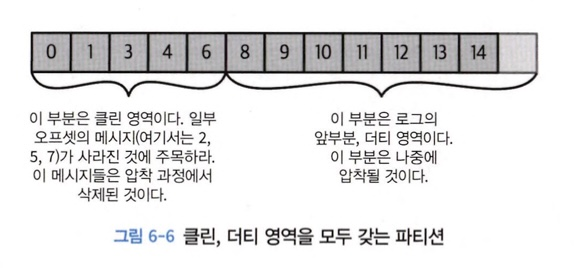

# 6장 카프카 내부 메커니즘

## 6.1 클러스터 멤버십

- `apache zookeeper` &rarr; 클러스터 멤버인 브로커 목록 유지
- broker &rarr; zookeeper에 **Ephemeral node** 형태로 등록
- 동일한 ID 가진 다른 브로커 시작하면 에러 발생
- 브로커 정리하면 브로커 나타내는 ZNode는 삭제되지만 브로커 ID 다른 자료구조에 저장

#### Znode

- `Ephemeral node(= 임시 노드)`: 노드를 생성한 클라이언트 연결 세션이 유지될때만 유효
- `Persistance Node(= 영구 노드)`: 데이터를 강제로 삭제하지 않는 이상 영구적으로 저장
- `Sequence Node(= 시퀀스 노드)`: 노드를 생성할 때 자동으로 sequence 번호가 붙는 노드 &rarr; 분산 락 구현에 이용

## 6.2 컨트롤러

- 클러스터에서 가장 먼저 시작되는 브로커 &rarr; /controller에 Ephemeral node 생성하면서 컨트롤러 됨
- 카프카 브로커 기능에 더해 파티션 리더를 선출하는 역할
- 컨트롤러 삭제되면 주키퍼에 가장 먼저 새로운 노드를 생성하는데 성공한 브로커가 다음 컨트롤러됨

#### 컨트롤러 선출

- 컨트롤러 선출시마다 epoch AI(= auto-increment) 연산
- 더 낮은 epoch 값을 가진 컨트롤러로부터 메세지 받을 경우(= 좀비) 무시
- 컨트롤러 되면 주키퍼로부터 최신 레플리카 상태 맵 조회

#### LeaderAndIsr 이란

> 리더 팔로워 상태가 변경된 경우 변경된 상태를 전달/수정 할 수 있도록 하는 API 스펙

### 6.2.1 KRaft: 카프카의 새로운 래프트 기반 컨트롤러

#### 파티션 확장하기 어려운 이유

1. 브로커, 컨트롤러, 주키퍼 간 메타 데이터 불일치 발생 가능성

- 컨트롤러가 주키퍼에 메타데이터 쓰는 작업 &rarr; 동기
- 브로커가 메세지 보내는 작업 &rarr; 비동기
- 주키퍼로부터 업데이트 받는 과정 &rarr; 비동기

2. 컨트롤러 재시작마다 주키퍼로부터 모든 브로커와 파티션에 대한 메타 데이터 필수 조회 &rarr; 재시작 소요 시간 &uarr;

#### Zookeeper 중요한 역할

> 컨트롤러 선출 & 클러스터 메타데이터 저장

- 클러스터 메타 데이터: 파티션 리더 선출, 토픽 생성/삭제, 레플리카 할당

## 6.3 복제

> 복제 &rarr; 개별적인 노드에 필연적으로 장애가 발생할 수 밖에 없는 상황에서 카프카가 신뢰성과 지속성을 보장하는 방식

#### 리더 레플리카

> 각 파티션 내 리더 역할을 하는 레플리카

- 일관성을 보장하기 위해 모든 쓰기 요청은 리더 레플리카만 가능
- 클라이언트 &rarr; 리더 레플리카나 팔로워로부터 레코드 조회 가능

#### 팔로워 레플리카

> 파티션에 속한 모든 레플리카 중 리더 레플리카를 제외한 나머지

- 디폴트로 팔로워는 클라이언트 요청 처리 불가
- 주로 리더 레플리카로 들어온 최근 메세지 복제하여 최신 상태 유지
- 리더 레플리카 에러 발생 시 팔로워 레플리카 중 리더 파티션으로 승격

#### out-of-sync replica

> 팔로워 레플리카가 10초 이상 메세지 요청을 보내지 않거나 가장 최근 메세지를 가져가지 않은 경우 
> 레프리카 동기화 풀린것으로 간주

#### in-sync replica

> 지속적으로 최신 메세지를 요청하고 있는 레플리카

- 리더에 장애 발생한 경우 인-싱크 레플리카만 파티션 리더로 선출 가능

#### preferred leader

> 토픽이 처음 생성되었을 때 리더 레플리카였던 레플리카

- 클러스타 내 모든 파티션에 대해 preferred leader가 실제 리더가 될 경우 브로커 사이 부하 균등 분배 예상

## 6.4 요청 처리

#### 메세지 헤더

- `요청 유형`: API Key
- `요청 버전`: 브로커는 서로 다른 버전의 클라이언트로부터 요청을 받아 각 버전에 맞는 응답 가능
- `Correlation ID`: 각 요청에 붙는 고유한 식별자
- `클라이언트 ID`: 요청 보낸 앱 식별에 사용

#### 요청 처리

#### 클라이언트가 어디로 요청을 보내야 하는지 어떻게 알까?

메타 데이터

- 클라이언트가 다루는 토픽 목록
- 토픽 내 파티션 정보
- 각 파티션 레플리카 내 정보
- 리더 레플리카 정보

### 6.4.1 쓰기 요청

> acks &rarr; 쓰기 작업이 성공한 것으로 간주되기 전 메세지에 대한 응답 보내야 하는 브로커 수

- `acks = 1`: 리더만 메세지 받음
- `acks = all`: 모든 in-sync replica 메세지 받음
- `acks = 0`: 메세지가 보내졌을 때 &rarr; 브로커 응답 기다리지 않음

#### 쓰기 요청 유효성 검사

- 데이터 보낸 사용자 토픽 쓰기 권한
- 올바른 acks 설정값 = 0, 1, all
- acks = all인 경우 in-sync replica가 충분한지

### 6.4.2 읽기 요청

- 충분한 수의 레플리카에 복제되지 않은 메세지는 '불안전함'

#### fetch session cache

- cnosumer가 읽고 있는 파티션 목록과 메타데이터 캐시하는 세션 생성 가능
- 세션 생성 이후 컨슈머는 더 이상 요청 보낼 때마다 모든 파티션을 지정할 필요 없이 점진적 읽기 요청 가능
- 브로커는 변경사항이 있는 경우에만 응답에 메타 데이터 포함

## 6.5 물리적 저장소

- 파티션 레플리카: 카프카 기본 저장 단위
- 파티션 &rarr; 서로 다른 브로커들 사이에 분리될 수 없음, 서로 다른 디스크에 분할 저장 x

### 6.5.1 계층화된 저장소(= tiered storage)

#### 기존 문제

- 파티션 별로 저장 가능한 데이터 한도 존재 &rarr; 디스크 크기 제한
- 디스크와 크러스터 크기는 저장소 요구 조건에 의해 결정 &rarr; 비용 직결
- 클러스터 크기 변경 시 파티션 위치를 다른 브로커로 옮기는데 걸리는 시간 파티션 수에 따라 결정

#### 계층화된 저장소

> local 계층 + remote 계층

local 저장소

- 원격 저장소에 비해 지연 &darr;
- 처리 속도 &uarr; &rarr; 비용 &uarr; &rarr; 보존 기한 &darr;

remote 저장소

- local 저장소보다 오래된 데이터를 필요로하는 데이터 저장
- 보통 백업 데이터 저장 목적

### 6.5.2 파티션 할당

> 브로커 6개 존재, 파티션 10개, 복제 패터 3인 토픽 생성 &rarr; 60개 파티션 레플리카를 6개 브로커에 할당

#### 파티션 할당 목표

- 레플리카를 브로커 간 고르게 분산
- 각 파티션에 대해 각 레플리카는 서로 다른 브로커에 배치 ex) 파티션 0 리더 브로커2 존재, 팔로워는 브로커 3,4 배치
- 브로커에 랙 설정되어 있다면 파티션 리플리카를 서로 다른 랙 할당

#### 랙

> kafka consumer lag이란, 프로듀서가 넣은 데이터 오프셋 - 컨슈머가 가져간 데이터 오프셋

- 오프셋은 파티션 기준으로 한 값 &rarr; 파티션 : 랙 = 1 : 1

### 6.5.5 인덱스

> 컨슈머가 임의의 오프셋에서부터 메세지를 읽을 수 있게함

- index = timestamp or message offset

#### segments

> 카프카 데이터를 하나의 파일에만 저장하면 삭제해야할 오래된 데이터 조회 어려움 
> 이런 문제 해결하기 위해 파티션은 세그먼트로 나누어 저장 
> 세그먼트 크기 한계에 도달하면 새로운 세그먼트 생성되고 
> 생성된 세그먼트 = 액티브 세그먼트

### 6.5.6 압착

#### 보존 정책

- `delete` 보존 정책: 지정된 보존 기한보다 더 오래된 이벤트 삭제
- `compact` 보존 정책: 토픽에서 각 키의 가장 최근값만 저장

### 6.5.7 압착의 작동 원리

#### 클린

- 이전에 압착된 적이 있던 메세지 저장 &rarr; 하나의 키마다 하나의 값 포함

#### 더티

- 마지막 압착 작업 이후 쓰여진 메세지 저장

### 6.5.9 토픽은 언제 압착되는가?

- 액티브 세그먼트 절대로 압착 x
- 토픽 내용물의 50% 이상이 더티 레코드인 경우