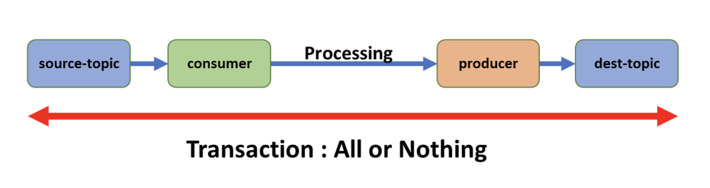
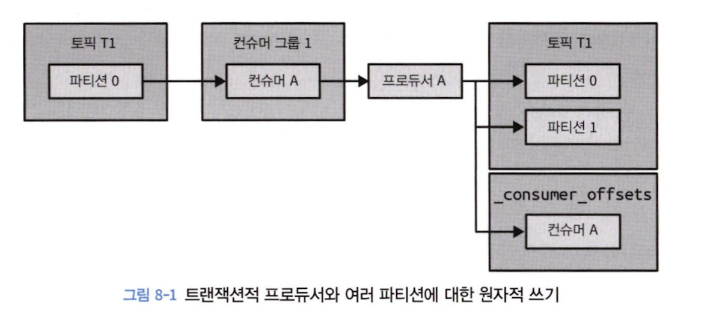
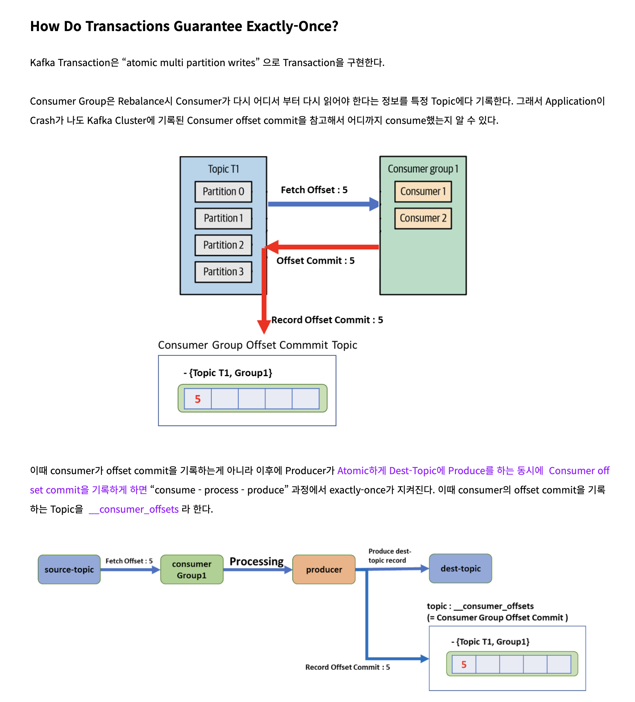
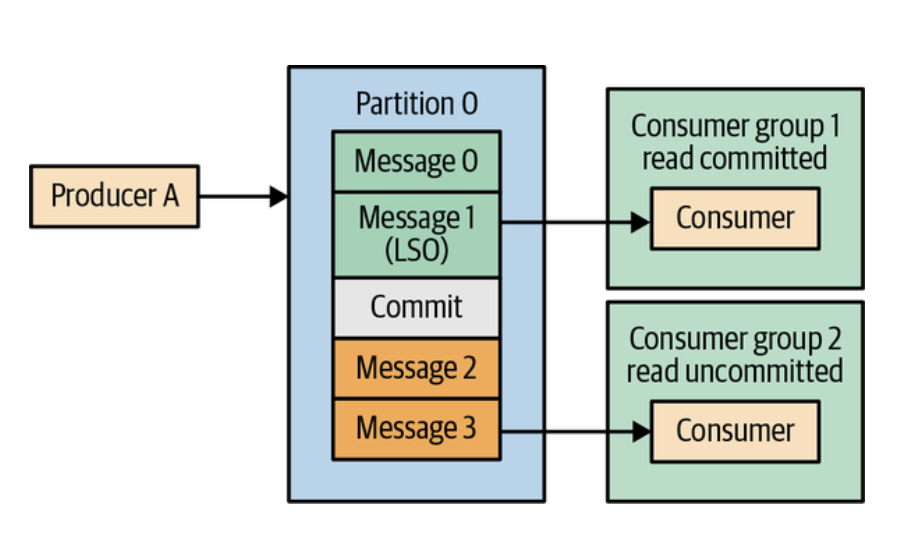

# 8장 '정확히 한 번' 의미 구조

## 8.1 멱등적 프로듀서

> 멱등적이란, 동일한 작업을 여러 번 실행해도 한 번 실행한 것과 결과가 같은 서비스

- 멱등적 프로듀서 &rarr; 메세지 내 프로듀서 ID + Sequence ID 삽입
- 토픽 + 파티션 + ID &rarr; 메세지 고유 식별자
- 브로커에 이전에 받은 메세지 받게되면 에러 발생

### 프로듀서 에러 발생 시 멱등적 프로듀서 처리 방안

#### 1. 프로듀서 재시작

- 프로듀서 장애 발생 시 새 프로듀서 생성 후 장애 난 프로듀서 대체
- 새로운 프로듀서는 새로운 프로듀서 ID를 갖게 돼 기존 메세지와의 구별 불가

#### 2. 브로커 장애

- 브로커 장애 시 컨트롤러는 새 리더 선출
- 리더 &rarr; 새 메세지 쓰여질 때마다 인-메모리 프로듀서 상태에 저장된 최근 5개 sequence ID 업데이트
- 팔로워 &rarr; 새 메세지 복제마다 인-메모리 버퍼 업데이트
- 팔로워가 리더가 된 시점에는 최근 5개 sequence ID 갖고 있어 문제 없이 새로 쓰인 메세지 유효성 검증 재개 가능
- 만약 예전 리더 복구되면 인-메모리 프로듀서 상태에 sequence ID 저장 x &rarr; 다시 시작될 때 파일에서 최신 상태 조회/복구

### 8.1.2 멱등적 프로듀서의 한계

- 프로듀서가 메세지 전송 2번 요청하면 중복 메세지 발생

### 8.1.3 멱등적 프로듀서 사용법

> 프로듀서 `enable.idempotence = true` 설정

- 프로듀서 ID 조회 위해 프로듀서 시동 과정에서 API 하나 더 호출
- 전송되는 레코드 배치 내 프로듀서 ID + 배치 내 첫 메세지 sequence ID 포함
- 브로커는 모든 프로듀서 인스턴스에서 들어온 레코드 배치 sequence ID 검증 후 메세지 중복 방지
- 장애 발생하더라도 메세지 순서 보장됨

## 8.2 트랜잭션

> source topic으로 부터 `consume - process - produce` 작업을 한 후 dest-topic에 저장할 때 Duplication 없이 dest-topic에 한번만 저장 보장



### 8.2.2 트랜잭션이 해결하는 문제

> 원본 토픽으로부터 이벤트를 읽어 처리 후 결과를 다른 토픽에 씀<br>
> 각 메세지 결과를 정확히 한번만 쓰고 싶다.<br>
> 잘못될 수 있는 점은?

#### 1. 애플리케이션 크래시로 인한 재처리

- 메세지 consume 시 결과를 출력 토픽에 쓰고, consume 메세지 오프셋 커밋 필요
- 만약 출력 토픽엔 썼지만 커밋에 실패하면 리밸런스 발생 후 마지막 커밋된 오프셋 ~ 크래시 난 시점 재처리하여 중복 발생

#### 2. 좀비 애플리케이션에 의해 발생하는 재처리

- 메시지 consume 직후 에러 발생 시 하트비트가 끊겨 죽은 앱으로 간주
- 해당 컨슈머에 할당된 파티션은 다른 컨슈머에 재할당 &rarr; 재할당 된 컨슈머가 처리
- 죽은 앱이 살아나 다시 처리 가능 &rarr; 좀비 &rarr; 중복된 결과 발생 가능

### 8.2.3 트랜잭션은 어떻게 '정확히 한 번'을 보장하는가?

> `정확히 한 번`이란, 읽기/처리/쓰기 작업이 원자적으로 이루어짐

#### atomic multipartition write

> 오프셋 커밋과 결과 작성은 파티션에 메세지 쓰는 과정을 수반






#### zombie fencing

> zombie instance가 중복 프로듀서 생성을 방지하기 위해 `transactional.id` 설정

- producer 생성 시 `transactional.id` 할당하면 Producer ID 할당 &rarr; `transactional.id` &harr; `producerID`
- producer ID 생성 시 epoch 값 증가
- zombie producer가 가진 old한 epoch값 producing 할 때 reject
- epoch &rarr; 가장 최후에 확보한 사람 획득할 수 있는 lock

#### isolation level



- 커밋되면 LSO(= last stable offset)이 해당 메세지 가리킴
- 아직 커밋되지 않았다면 LSO offset은 아직 이전 message 가리킴
- `isolation.level = read_uncommitted` consumer는 LSO 이후 메세지까지 조회
- default: read_uncommitted

### 8.2.4 트랜잭션으로 해결할 수 없는 문제들

#### 1. 스트림 처리에 있어서의 side effect

- 외부 서비스 호출 방지 어려움
- ex) 이메일 발송 &rarr; kafka가 이메일 발송 취소 어려움

#### 2. 카프카 토픽에서 읽어서 DB에 쓰는 경우

- 하나의 트랜잭션에서 외부 DB에 결과를 쓰고 카프카에는 오프셋을 커밋할 수 있도록 해주는 기능 x

#### 3. DB에서 읽어서 카프카에 쓰고 여기서 다시 다른 DB에 쓰는 경우

- 카프카 트랜잭션엔 e2e 보장 기능 x

#### 4. 한 클러스터에서 다른 클러스터로 데이터 복제

- kafka data &rarr; rdbms migration 시 유실 가능
- 컨슈머 입장에서 트랜잭션 모든 데이터를 읽어 왔는지 알 수 없고 보장 어려움

#### 5. 발행/구독 패턴

## 8.2.7 트랜잭션의 작동 원리

```
1. 현재 진행중인 트랜잭션이 존재함을 로그에 기록, 연간된 파티션도 함께 기록
2. 로그에 커밋, 중단 시도 기록
3. 모든 파티션에 트랜잭션 마커 사용
4. 트랜잭션이 종료되었음을 로그에 씀
```