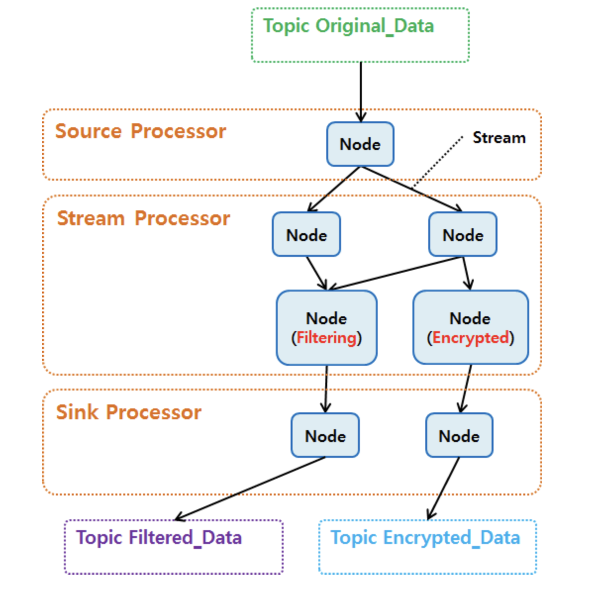
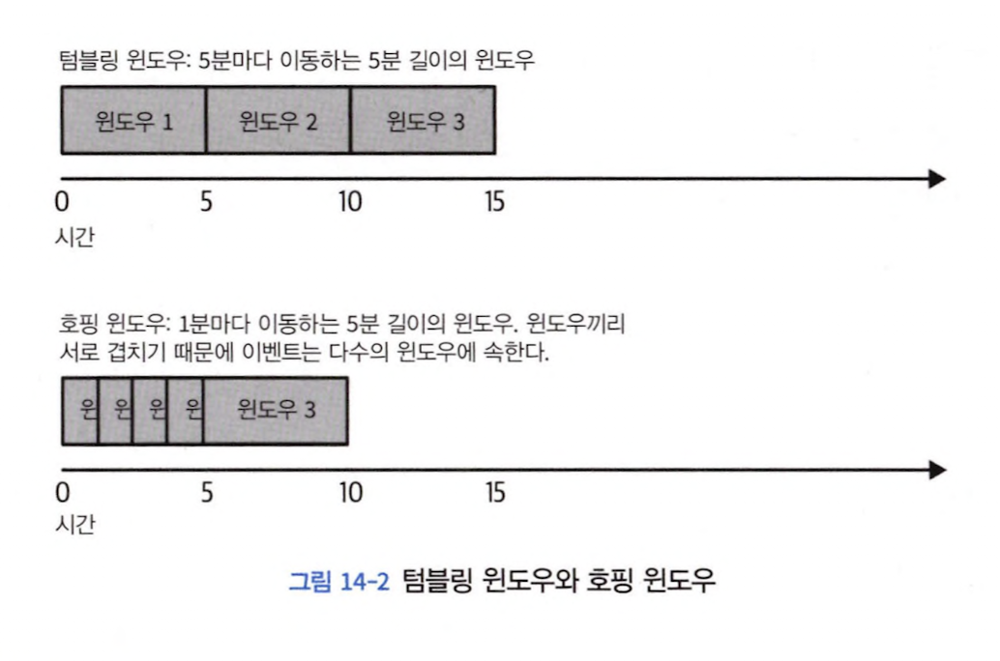
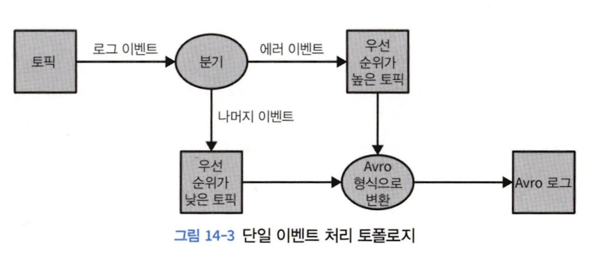
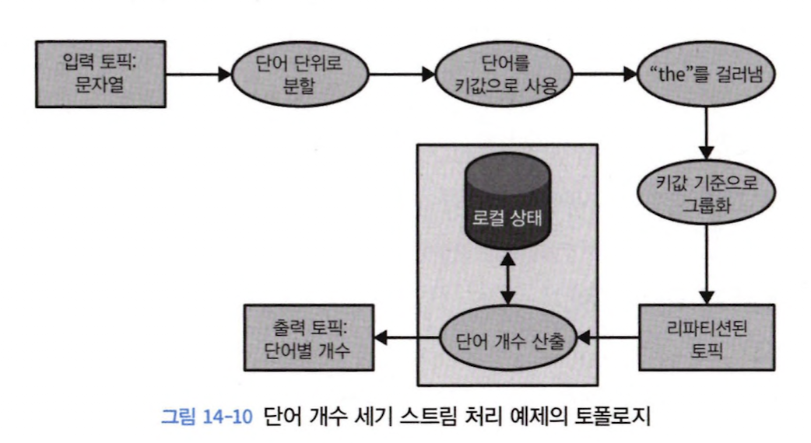
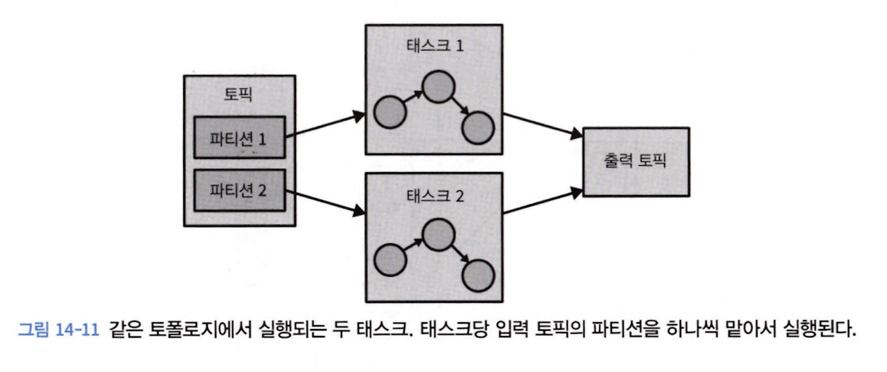
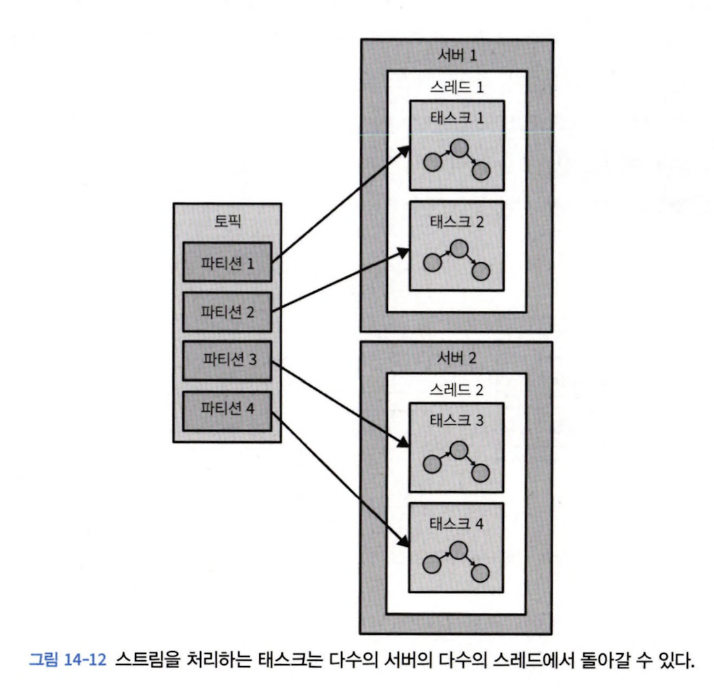

# 14장 스트림 처리

## 14.1 스트림 처리란 무엇인가?

- 이벤트 스트림에는 순서가 있다
- 데이터 레코드는 불변하다
- 이벤트 스트림은 replay가 가능하다

## 14.2 스트림 처리 개념

### 14.2.1 토폴로지

> topology = source stream + stream processor + sink stream

- 하나 이상의 소스 스트림에서 시작된 이벤트 스트림은 연결된 스트림 프로세서들을 거쳐 처리되다가 마지막엔 하나 이상의 싱크 스트림에 결과 쓰는 것으로 끝남
- node와 선으로 이루어짐

### 14.2.2 시간

#### 이벤트 시간

> 이벤트가 발생하여 레코드가 생성된 시점

#### 로그 추가 시간(= 접수 시간, ingestion time)

> 이벤트가 카프카 브로커에 전달되어 저장된 시점

#### 처리 시간(= processing time)

> 스트림 처리 앱이 연산을 수행하기 위해 이벤트를 받은 시간

### 14.2.5 시간 윈도우

> 윈도우란, 스트림을 잘라 처리하는 시간 단위

#### 윈도우 크기

> 세션 윈도우란, inactive 기간 길이에 따라 윈도우 크기가 결정되는 윈도우

- 정의한 session gap 보다 작은 시간 간격을 두고 연속적으로 도착한 이벤트는 하나의 세션에 속함
- session gap 이상으로 이벤트가 도착하지 않으면 새로운 세션이 생성

#### 시간 윈도우 진행 간격

- `hopping window`: 윈도우 크기와 윈도우 사이 고정된 시간 간격이 같은 윈도우
- `tumbling window`: 진행 간격과 윈도우 크기가 같은 경우

## 14.3 스트림 처리 디자인 패턴

### 14.3.1 단일 이벤트 처리

> map/filter 패턴

- 스트림 이벤트 조회 후 각 이벤트 수정한 뒤 수정된 이벤트 다른 스트림에 씀

## 14.5 카프카 스트림즈: 아키텍처 개요

### 14.5.1 토폴로지 생성하기

### 14.5.2 토폴로지 최적화하기

1. `Kstream`, `KTable` 객체 생성 후 필터, 조인 같은 DSL 작업 수행함으로써 토폴로지 정의
2. 논리적 토폴로지 &rarr; 물리적 토폴로지 생성
3. 토폴로지 실행 &rarr; 데이터 조회/처리/쓰기 작업 실행

### 14.5.4 토폴로지 규모 확장하기

- 스트림즈 엔진 &rarr; 토폴로지 실행을 다수의 태스크로 분할함으로써 병렬 처리
- 앱이 처리하는 토픽 파티션 수에 따라 태스크 수 결정
- 태스크 독립적으로 실행되어 카프카 스트림즈 내 병렬 처리 기본 단위

