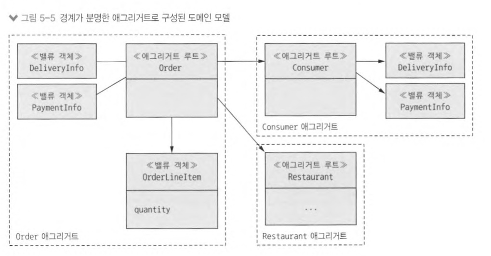

# 5장 비즈니스 로직 설계

## 5.1 비즈니스 로직 구성 패턴


- `Rest API adapter`: 비즈니스 로직을 호출하는 REST API가 구현된 인바운드 어댑터
- `OrderCommandHandlers`: 메세지 채널에서 들어온 커맨드 메세지를 받아 비즈니스 로직을 호출하는 인바운드 어댑터
- `DB adapter`: 비즈니스 로직이 DB 접근을 위해 호출하는 아웃바운드 어댑터
- `도메인 이벤트 발행 adapter`: 이벤트를 메세지 브로커에 발행하는 아웃바운드 어댑터

### 5.1.1 비즈니스 로직 설계: 트랜잭션 스크립트 패턴


### 5.1.2 비즈니스 로직 설계: 도메인 모델 패턴


## 5.2 도메인 모델 설계: DDD 애그리거트 패턴


- 어느 클래스가 `Order` 비즈니스 객체의 일부인지 분명하지 않음

### 5.2.2 애그리거트는 경계가 분명하다

> 애그리거트란, 한 단위로 취급 가능한 경계 내부의 도메인 객체들<br>
> 하나의 루트 엔티티 + 하나 이상의 기타 엔티티 + VO



#### 애그리거트는 일관된 경계

- 업데이트 작업은 애그리거트 루트에서 호출 &rarr; 불변 값 강제됨
- 애그리거트 루트를 lock으로 처리

### 5.2.3 애그리거트 규칙

#### 규칙 1: 애그리거트 루트만 참조하라

- 외부 클래스에서 반드시 애그리거트 루트 엔티티만 참조할 수 있도록 제한
- 클라이언트 &rarr; 애그리거트 루트 메서드만 호출하여 애그리거트 업데이트 가능
- 애그리거트 자신의 불변 값 강제 가능

#### 규칙 2: 애그리거트 간 참조는 반드시 기본키를 사용하라


- 애그리거트는 객체 래퍼런스 대신 ID로 서로 참조
- ID를 참조함으로써 느슨하게 결합되고 애그리거트 간 경계 분명해짐

#### 규칙 3: 하나의 트랜잭션으로 하나의 애그리거트를 생성/수정하라


### 5.2.4 애그리거트 입도

> 애그리거트는 작으면 작을수록 좋다!<br>
> 각 애그리거트의 업데이트는 직렬화되므로 잘게 나누어져 있으면 애플리케이션이 동시 처리 가능한 요청 개수 &uarr;


### 5.2.5 비즈니스 로직 설계: 애그리거트


## 5.3 도메인 이벤트 발행

> 도메인 이벤트란, 애그리거트에 밸상한 사건 ex) Order 애그리거트 = 주문 생성됨, 주문 취소됨, 주문 배달됨 등의 상태 변경 이벤트

### 5.3.5 도메인 이벤트 생성 및 발행

#### 도메인 이벤트 생성

> 도메인 이벤트는 애그리거트가 발행

- 애그리거트와 호출하는 서비스의 책임을 분리

```java
public class Ticket {
    public List<TicketDomainEvent> accept(LocalDateTime readyBy) {
        ...
        this.acceptTime = LocalDateTime.now();
        this.readyBy = readyBy;
        return singletonList(new TicketAcceptedEvent(readyBy));
    }
}

public class KitchenService {
    public void accept(long ticketId, LocalDateTime readyBy) {
        Ticket ticket = ticketRepository.findById(ticketld)
            .orElseThrow(() -> new TicketNotFoundException(ticketld));
        
        List<TicketDomainEvent> events = ticket.accept(readyBy); 
        
        domainEventPublisher.publish(Ticket.class, orderld, events);
    }
}
```

## 5.4 주방 서비스 비즈니스 로직


### Ticket 애그리거트 동작

```java
public class Ticket {
    public static ResultWithAggregateEvents<Ticket, TicketDomainEvent> create(
        long restaurantld,
        Long id,
        TicketDetails details
    ) {
        return new ResultWithAggregateEvents<>(new Ticket(restaurantId, id, details));
    }
    
    public List<TicketPreparationStartedEvent> preparing() {
        switch (state) {
            case ACCEPTED:
                this.state = Ticketstate.PREPARING;
                this.preparingTime = LocalDateTime.now();
                return singletonList(new TicketPreparationStartedEvent());
            default:
                throw new UnsupportedStateTransitionException(state);
        }
    }

    public List<TicketDomainEvent> cancel() {
        switch (state) {
            case AWAITING_ACCEPTANCE:
            case ACCEPTED:
                this.previo니sState = state;
                this.state = Ticketstate.CANCEL_PENDING;
                return emptyList();
            default:
                throw new UnsupportedStateTransitionException(state);
        }
    }
}
```

### KitchenService 도메인 서비스

- 주방 서비스의 인바운드 어댑터가 `KitchenService` 호출
- 각각 애그리거트 루트를 가져와 애그리거트 루트에 있는 주문 상태를 변경하는 메서드를 호출한 후 도메인 이벤트 발행

```java
public class KitchenService {
    
    @Autowired
    private TicketRepository ticketRepository;
    
    @Autowired
    private TicketDomainEventPublisher domainEventPublisher;
    
    public void accept(long ticketld, LocalDateTime readyBy) {
        Ticket ticket = ticketRepository.findById(ticketId)
            .orElseThrow(() -> new TicketNotFoundException(ticketld));
        
        List<TicketDomainEvent> events = ticket.accept(readyBy);
        
        domainEventPublisher.publish(ticket, events);
    }
}
```

### KitchenServiceCommandHandler 클래스

- `KitchenServiceCommandHandler` 클래스는 주문 서비스에 구현된 사가가 전송한 커맨드 메시지를 처리하는 어댑터

```java
public class KitchenServiceCommandHandler {
    ©Autowired
    private KitchenService kitchenService;

    public CommandHandlers commandHandlers() {
        return SagaCommandHandlersBuilder
            .fromChannel(KitchenServiceChannels.kitchenServiceChannel)
            .onMessage(CreateTicket.class, this::createTicket)
            .onMessage(ConfirmCreateTicket.class, this::confirmCreateTicket)
            .onMessage(CancelCreateTicket.class, this::cancelCreateTicket)
            .build;
    }

    private Message createTicket(CommandMessage<CreateTicket> cm) {
        CreateTicket command = cm.getCommand();
        
        long restaurantld = command.getRestaurantId();
        Long ticketld = command.getOrderId();
        
        TicketDetails ticketDetails = command.getTicketDetails();
        try {
            Ticket ticket = kitchenService.createTicket(restaurantId, ticketld, ticketDetails);
            
            CreateTicketReply reply = new CreateTicketReply(ticket.getId());
            
            return withSuccess(reply);
        } catch (RestaurantDetailsVerificationException e) {
            return withFailure();
        }
    }

    private Message confirmCreateTicket (CommandMessage<ConfirmCreateTicket> cm) { 
        Long ticketld = cm.getCommand().getTicketId();
        
        kitchenService.confirmCreateTicket(ticketId);
        
        return withSuccess(); 
    }
}
```