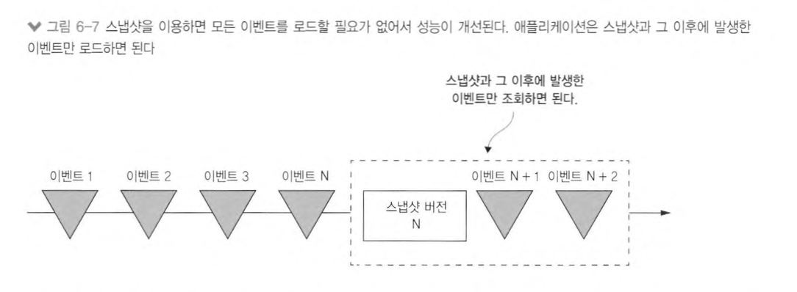

# 6장 비즈니스 로직 개발: 이벤트 소싱

## 6.1 이벤트 소싱 응용 비즈니스 로직 개발

### 6.1.1 기존 영속화의 문제점


#### 애그리거트 이력이 없다

- 기존 영속화는 현재 애그리거트 상태만 저장
- 애그리거트 업데이트되면 이전 상태 사라지고 없음

#### 이벤트 발행 로직이 비즈니스 로직에 추가된다

- 기존 영속화는 도메인 이벤트 발행 지원 x
- 트랜잭션 내 이벤트 생성 로직 추가 필요

### 6.1.2 이벤트 소싱 개요

#### 이벤트를 이용하여 애그리거트를 저장


- 애그리거트 생성/수정 시 애플리케이션은 애그리거트가 발생시킨 이벤트를 EVENTS 테이블에 삽입

### 6.1.4 이벤트 소싱과 이벤트 발행

- `이벤트 소싱`: 애그리거트를 여러 이벤트로 저장하며, 이벤트를 가져와 현재 애그리거트의 상태 재구성

#### 이벤트 발행: 폴링

- 이벤트를 events 테이블에 저장한다고 가정하면, 이벤트 발행기는 select 문으로 새 이벤트를 계속 폴링하면서 메세지 브로커에 발행
- 트랜잭션이 이벤트를 발행시키는 순서와 다르게 커밋할 수 있다는 문제 &rarr; 이벤트 발행기가 실수로 이벤트 건너뛰게 될수도 있음


1. 미발행 이벤트 검색

```sql
select *
from events
where published = 0
order by event_id
```

2. 메세지 브로커에 이벤트 발행
3. 이벤트가 발행된 것으로 표시

```sql
update events
set published = 1
where event_id = ${event_id}
```

### 6.1.5 스냅샷으로 성능 개선



- 주기적으로 애그리거트 상태 스냅샷 저장
- 가장 최근에 뜬 스냅샷과 그 이후 발생한 이벤트만 조회하여 애그리거트 상태 복원

## 6.3 사가와 이벤트 소싱을 접목


- 메세지 브로커가 적어도 한번은 메세지를 전달하기 때문에 사가를 생성하는 이벤트 핸들러가 여러 번 호출 가능
- 사가 인스턴스를 정확히 하나만 생성하도록 보장

1. 이벤트 유일한 속성에서 사가 ID 추출

- 이벤트를 발생시킨 애그리거트 ID를 사가 ID로 사용
- 애그리거트 생성 이벤트에 반응하여 생성되는 사가에 적합

2. 이벤트 ID를 사가 ID로 사용

- 이벤트 ID는 유일하므로 사가 ID 역시 유일
- 중복 이벤트라면 이벤트 핸들러가 사가를 생성 시도할 때 이미 해당 ID 존재하여 실패

### 6.3.3 이벤트 소싱 기반의 사가 참여자 구현

#### 커맨드 메시지를 멱등하게 처리

- 이벤트 소싱 사가 참여자가 중복 메세지를 구별할 수 있는 수단 마련 필요
- ex) 이벤트 내 메시지 ID 삽입

#### 응답 메시지를 원자적으로 전송

1. 사가 커맨드 핸들러가 애그리거트를 생성/수정할 때, 애그리거트가 발생시킨 진짜 이벤트와 가짜 이벤트 SagaReplyRequested를 모두 이벤트 저장소에 저장
2. SagaReplyRequested 이벤트 핸들러는 이벤트에 포함된 데이터로 응답 메시지를 만들어 사가 오케스트레이터 응답 채널에 출력

