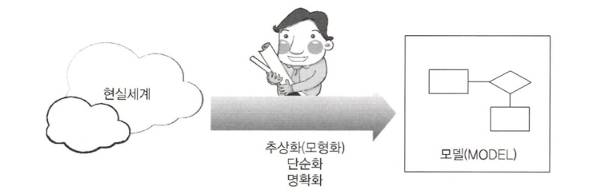
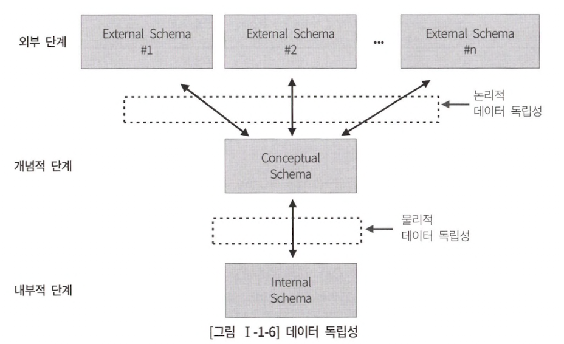
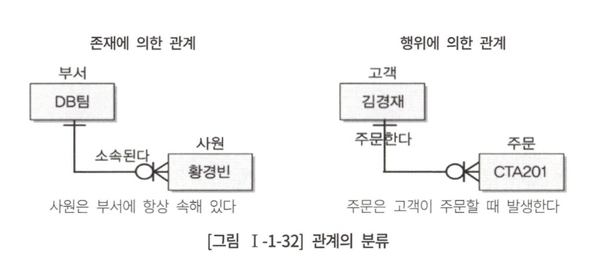
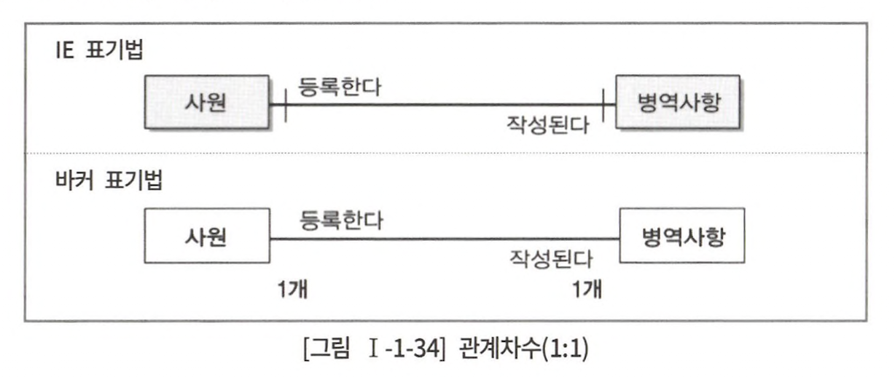
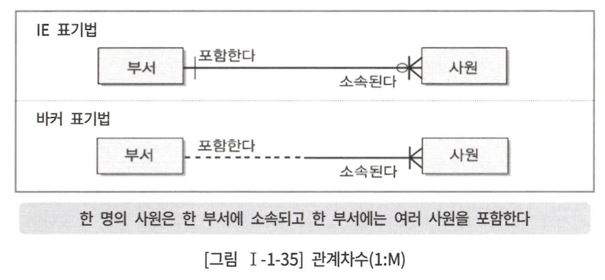
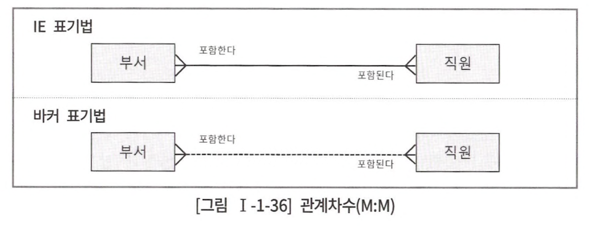

# 1장 데이터 모델링의 이해

## 1절 데이터 모델링의 이해

### 1. 모델링의 이해

모델링이란,

> 복잡한 현실 세계를 일정한 표기법에 따라 표현하는 일

<div align="center">
    
</div>

모델링의 특징

1. `추상화` : 현실 세계를 일정한 형식에 맞추어 표현
2. `단순화` : 복잡한 현실 세계를 일정한 형식에 맞춰 쉽게 이해할 수 있도록 표현
3. `명확화` : 누구나 이해하기 쉽게 대상의 애매모호함을 제거하고 정확히 현상 기술

모델링의 3가지 관점

1. `데이터 관점` : 업무와 관련 있는 데이터, 데이터 간의 관계에 대한 모델링
2. `프로세스 관점` : 실제하고 있는 업무 정의와 프로세스에 대한 모델링
3. `데이터와 프로세스 상관 관점` : 업무가 처리하는 일에 방법에 따라 영향 받는 데이터에 대한 모델링

### 3. 데이터 모델링의 중요성과 유의점

1. 파급 효과 : 데이터 구조 변경이 일어나면 일련의 변경 작업 필요
2. 복잡한 정보 요구 사항의 간결한 표현 : 시스템 정보 요구 사항과 한계를 명확히 표현할 수 있는 데이터 모델
3. 데이터 품질
   - 중복 : 여러 곳에 같은 정보를 저장하는 행위 x
   - 비유연성 : 데이터의 정의를 애플리케이션과 분리함으로써 각각의 변화에 영향받지 않도록 함
   - 비일관성 : 데이터와 데이터 간 상호 연관 관계 명확한 정의

### 4. 데이터 모델링의 3단계 진행

|데이터 모델링|내용|수준|
|:----:|:---|:----:|
|개념적 데이터 모델링|업무 중심적이고 포괄적인 데이터 모델링|추상적|
|논리적 데이터 모델링|Key, 속성, 관계 표현|중간|
|물리적 데이터 모델링|실제 DB에 저장할 수 있도록 성능과 같은 물리적 성격 고려|구체적|

1. 개념적 데이터 모델링 : 데이터 요구 사항 정의
2. 논리적 데이터 모델링 : 정규화를 통해 비즈니스 정보의 논리적인 구조와 규칙 표현
3. 물리적 데이터 모델링 : 논리 데이터 모델이 DB로서 컴퓨터 하드웨어에 표현 방법 다룸

### 6. 데이터 모델링에서 데이터 독립성의 이해

<div align="center">
   
</div>

|스키마|내용|
|:----:|:---|
|외부 스키마|DB 사용자 및 개발자가 DB 정의|
|개념 스키마|DB에 저장되는 데이터 및 관계 표현|
|내부 스키마|하드웨어에서 데이터가 저장되는 방법 표현|

|독립성| 내용                                                          |
|:----:|:------------------------------------------------------------|
|논리적 독립성| 개념 스키마가 변경되어도 외부 스키마 영향 x<br>&rarr; 논리적 구조 변경이 애플리케이션 영향 x  |
|물리적 독립성| 내부 스키마가 변경되어도 외부/개념 스키마 영향 x<br>&rarr; 하드웨어 번경이 애플리케이션 영향 x |

|사상(= Mapping)|내용|
|:----:|:---|
|외부적/개념적 사상(= 논리적 mapping)|사용자가 접근하는 형식에 따라 다른 타입 필드|
|개념적/내부적 사상(= 물리적 mapping)|DB 구조가 바뀐다면 개념적/내부적 mapping 변경|

## 2절 엔터티

### 1. 엔터티의 개념

> 업무에 필요하고 정보를 저장하고 관리하기 위한 사물<br>
> 인스턴스의 집합

### 3. 엔티티의 특징

- **반드시 필요**하고 관리하고자 하는 정보
- **유일한 식별자**에 의해 식별 가능
- 영속적으로 존재하는 인스턴스의 집합 &rarr; **2개 이상의 데이터**
- 업무 프로세스에 의해 이용돼야함
- 반드시 **속성 존재**
- 다른 엔티티와 최소 **1개 이상의 관계**

> 우리 테이블 중 하나인 duration_policy는 위 특징을 만족하는걸까..?

### 4. 엔티티의 분류

1. `기본 엔티티` : 독립적으로 생성이 가능하고 타 엔티티의 부모 역할 ex) users, products
2. `중심 엔티티` : 기본 엔티티로부터 발생하고 프로세스 내 중심 역할 ex) contracts, orders
3. `행위 엔티티` : 2개 이상의 부모 엔티티로부터 발생하고 자주 내용이 바뀌거나 데이터 &uarr; ex) history table

## 3절 속성

> 더이상 분리할 수 없는 최소의 데이터 단위

정의
- 프로세스 내 필요로 함
- 의미상 더 이상 분리 x
- 엔티티를 설명하고 인스턴스 구성 요소

특징

- 반드시 필요하고 관리하고자 하는 정보
- 정규화에 의거하여 주식별자에 함수적 종속성을 가져야함
- 속성 : 값 = 1 : 1

[함수적 종속성](http://www.jidum.com/jidums/view.do?jidumId=136)이란,

>  데이터들이 어떤 기준값에 의해 항상 종속되는 현상

### 4. 속성의 분류

1. `기본 속성` : 업무로부터 추출한 모든 속성(= 원래 속성)
2. `설계 속성` : 규칙화 하기 위해 속성을 새로 만들거나 정의 ex) unique
3. `파생 속성` : 다른 속성에 영향 받아 발생, 보통 계산된 값

### 5. 도메인

> 가질 수 있는 값의 범위가 있는 속성의 특징<br>
> ex) 학점은 0.0 ~ 4.5까지 가능

## 4절 관계

> 엔티티 사이에서 서로에게 연관성이 부여된 상태

### 2. 관계의 분류

<div align="center">
   
</div>

관계 차수

> 엔티티 간 관계에서 참여자의 수

|관계|                      설명                      |
|:----:|:--------------------------------------------:|
|1:1|  |
|1:n|  |
|n:m|  |

## 5절 식별자

> 엔티티를 구분할 수 있는 논리적인 이름

특징

- `유일성` : 주 식별자에 의해 모든 **인스턴스가 유일**하게 구분
- `최소성` : 주 식별자를 구성하는 속성의 수는 **유일성을 만족하는 최소**의 수
- `불변성` : 지정된 주식별자는 **자주 변하지 않음**
- `존재성` : 주 식별자 **not null**

### 4. 주식별자 도출 기준

- 자주 이용되는 속성
- 명칭, 내역과 같은 이름으로 기술 되는 속성 x
- 복합으로 구성할 경우 너무 많은 속성 x

### 5. 식별자 관게와 비식별자 관계에 따른 식별자

<table>
<tr>
<td align="center">식별자 관계</td><td align="center">비식별자 관계</td>
</tr>
<tr>
<td>부모 식별자를 자식의 주 식별자로 이용</td><td>부모 식별자를 자식의 속성으로 사용</td>
</tr>
<tr>
<td rowspan="3">부모 엔티티가 생성돼야 자식 엔티티 생성</td><td>부모 없는 자식이 생성될 수 있는 경우</td></tr>
<tr><td>엔티티 별로 데이터 생명 주기가 다른 경우 ex) 자식만 남겨두고 부모만 삭제할 수 있는 경우</td></tr>
<tr><td>여러 엔티티가 하나의 엔티티로 통합 표현 되었는데 각각의 엔티티가 별도 관계를 가질 경우</td></tr>
</table>

**식별자 관계로만 설정할 경우의 문제점**

> 부모에서 자식으로 식별자 관계를 연결할 때 마다 주 식별자 속성 &uarr;

```text
부모 엔티티 ID : 1개
2층 엔티티 ID : 2개 이상 = 1층 부모 ID + 추가 1개 이상
3층 엔티티 ID : 3개 이상 = 1층 부모 ID + 2층 부모 ID + 추가 1개 이상
...
```

결론 : **where절이 매우 길어짐**

```sql
SELECT *
FROM EQPEVTSTSHST A, 
     EQP_ITEM B, 
     EQP_WORKER C
WHERE A.PLANT = B.PLANT
  AND A.EQUIPMENT_ID = B.EQUIPMENTJD 
  AND A.STATUS_SEQ = B.STATUS_SEQ
  AND A.EVENT_ID = B.EVENT_ID
  AND A.TRANS_TIME = B.TRANS.TIME
  AND B.ITEM_CD = 'A001'
  AND A.PLANT = = C.PLANT
  AND A.EQUIPMENT_ID = C.EQUIPMENT_ID 
  AND A.STATUS_SEQ = = C.STATUS_SEQ
  AND A.EVENT_ID = C.EVENT_ID
  AND A.TRANS_TIME = C.TRANS_TIME 
  AND C.WORKER.SID = 'A012008001'
```

**비식별자 관계로만 설정할 경우의 문제점**

> 여러 테이블 join 시 unique를 보장하기 위해 다수의 조건이 필요
