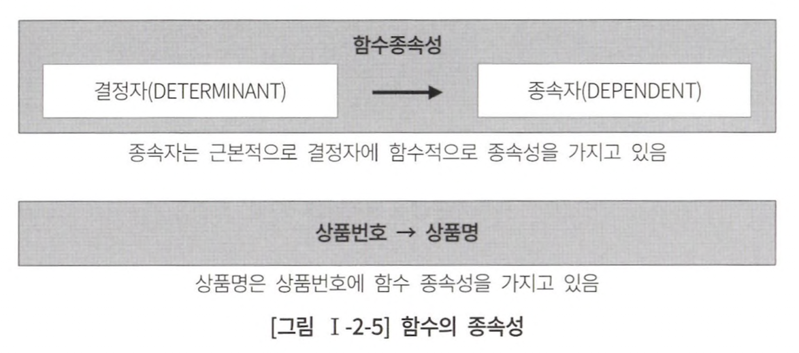
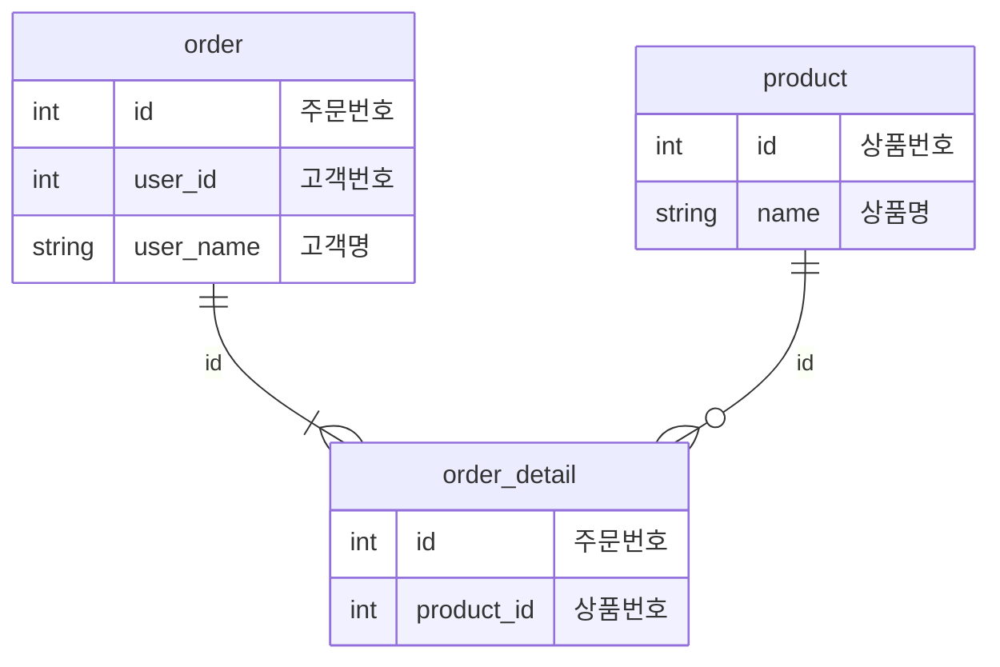
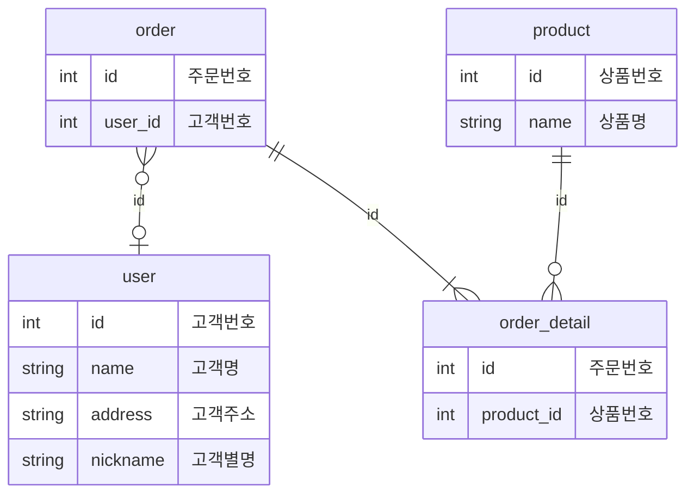
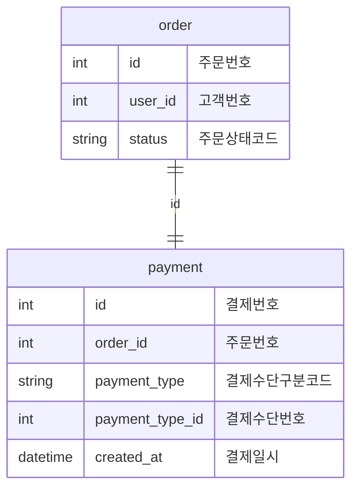
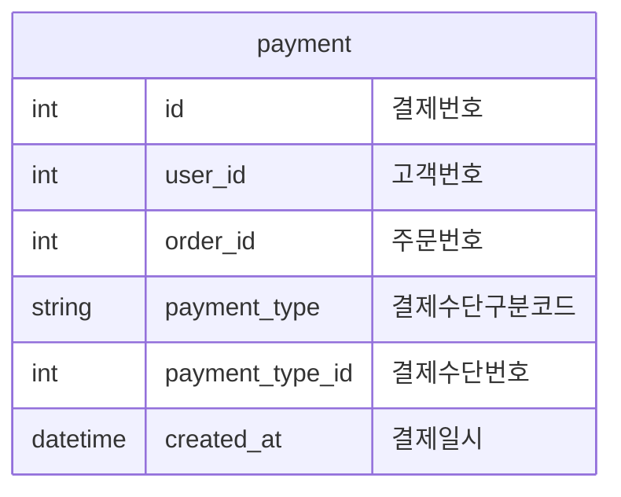
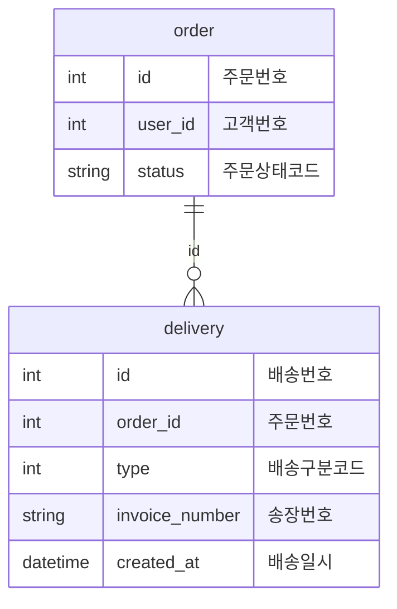
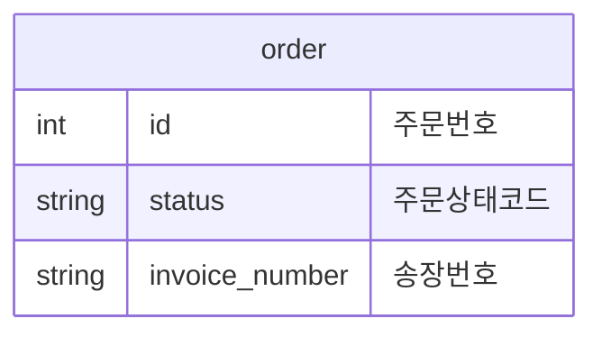
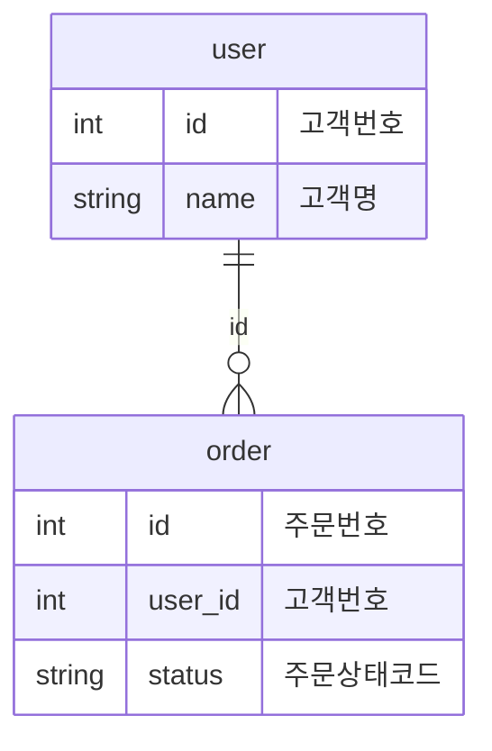
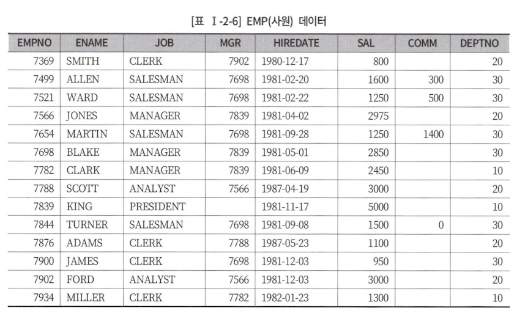

# 2장 데이터 모델과 SQL

## 1절 정규화

### 제1정규화

> 모든 속성은 반드시 하나의 값만 저장<br>
> 두 개 이상의 속성을 저장했을 때 두 속성을 구분하기 어려움

<table>
<tr>
<td align="center">AS-IS</td><td align="center">TO-BE</td>
</tr>
<tr>
<td>

|고객 번호|고객명|연락처|
|:----:|:----:|:----|
|1|정우진|02-123-4567,010-1234-5678|
|2|한형식|010-5678-2345|
|3|황영은|02-234-2345,010-4234-1234|

</td>

<td>
<div style="display: flex">

|고객 번호|고객명|
|:----:|:----:|
|1|정우진|
|2|한형식|
|3|황영은|

| id  | 고객 번호 | 연락처 |
|:---:|:-----:|:----:|
|  1  |   1   |02-123-4567|
|  2  |   1   |010-1234-5678|
|  3  |   2   |010-5678-2345|
|  4  |   3   |02-234-2345|
|  5  |   3   |010-4234-1234|

</div>
</td>
</tr>
<tr>
<td>연락처 vs 핸드폰 번호 구별 X</td><td>연락처 vs 핸드폰 번호 구별 O</td>
</tr>
<tr>
<td align="center">

| 주문 테이블 |
|:------:|
| 주문 ID  |
| 상품 ID1 |
|  상품명1  |
| 상품 ID2 |
|  상품명2  |
| 고객 ID  |
|  고객명   |

</td>
<td align="center">

<div style="display: flex">

|주문 테이블|
|:---:|
|주문 ID|
|고객 ID|
|고객명|

|주문 상세 테이블|
|:----:|
|주문 ID|
|상품 ID|
|상품명|

</div>
</td>
</tr>
<tr>
<td>- 상품 3개 이상 주문 x<br>- 상품1, 상품2 빠르게 조회 위해 인덱스 추가 필요</td>
<td>- 상품 복수개 주문 가능<br>- PK를 통해 인덱스 자동 생성</td>
</tr>
</table>

### 제2정규화

> 엔티티 일반 속성 &rarr; 주 식별자 전체에 종속적

<div style="display:flex;">
<table>
<tr>
<td colspan="3" align="center">주문 상세 테이블</td>
</tr>
<tr>
<td>1</td><td>256</td><td>SQL 전문가 가이드</td>
</tr>
<tr>
<td>2</td><td>257</td><td>SQL 전문가 가이드</td>
</tr>
<tr>
<td>3</td><td>256</td><td>SQL 전문가 가이드</td>
</tr>
<tr>
<td>4</td><td>256</td><td>SQL 전문가 가이드</td>
</tr>
<tr>
<td>5</td><td>258</td><td>데이터 분석 전문가 가이드</td>
</tr>
</table>


</div>

- 'SQL 전문가 가이드' 데이터 중복<br>
&rarr; **상품명 속성이 상품 번호에 대해 반복되어 쌓이게됨**<br>
&rarr; 주 식별자에 종속되도록 설계 수정 필요

- 상품명이 변경되면 주문 상세 테이블 내 모든 상품명 변경 필요<br>
&rarr; 모두 변경한다 하더라도 특정 시점에는 아직 변경되지 않은 상품명이 존재하여 해당 트랜잭션 내에서 일관되지 않은 데이터 조회 가능

<div style="display: flex">
<table>
<tr>
<td colspan="2" align="center">상품 테이블</td>
</tr>
<tr>
<td align="center">상품 번호</td><td align="center">상품명</td>
</tr>
<tr>
<td align="center">256</td><td align="center">SQL 전문가 가이드</td>
</tr>
<tr>
<td align="center">257</td><td align="center">데이터 아키텍쳐 전문가 가이드</td>
</tr>
<tr>
<td align="center">258</td><td align="center">데이터 분석 전문가 가이드</td>
</tr>
</table>
<table>
<tr>
<td colspan="2" align="center">주문 상세 테이블</td>
</tr>
<tr>
<td align="center">주문번호</td><td align="center">상품 번호</td>
</tr>
<tr>
<td align="center">1</td><td align="center">256</td>
</tr>
<tr>
<td align="center">2</td><td align="center">257</td>
</tr>
<tr>
<td align="center">3</td><td align="center">256</td>
</tr>
<tr>
<td align="center">4</td><td align="center">256</td>
</tr>
<tr>
<td align="center">5</td><td align="center">258</td>
</tr>
</table>
</div>

### 제3정규화

> 엔티티의 일반 속성 간에는 서로 종속 x<br>
> 이행적 종속 배제

<table>
<tr>
<td align="center">AS-IS</td><td align="center">TO-BE</td>
</tr>
<tr>
<td>


</td>
<td>


</td>
</tr>
<tr>
<td>
고객번호는 주문번호에 종속적이고, 고객명은 고객번호에 종속<br>
&rarr; 고객명이 주문 번호에 종속<br>
&rarr; 고객명이 변경되면 주문 테이블 내 고객명 전부 갱신 필요(= 제2정규화 문제 동일)
</td>
<td>
- 고객 속성 변경이 주문 테이블에 영향 x<br>
- 데이터 중복 문제 x
</td>
</tr>
</table>

### 4. 반정규화와 성능

> 반정규화(= 역정규화)란, 정규화를 반대로 하는 것<br>
> 성능을 위해 데이터 중복 허용 &rarr; 조회 성능 &uarr;, 삽입/수정/삭제 성능 &darr; 가능

#### 반정규화를 통해 성능이 향상될 수 있는 경우

- 고객번호가 1234인 고객이 가장 최근에 신용 카드로 결제한 결제 수단 번호를 조회하는 쿼리

> rownum = 1(oracle) == limit 1(mysql) 같은 표현

<table>
<tr>
<td align="center">AS-IS</td><td align="center">TO-BE</td>
</tr>
<tr>
<td>


</td>
<td>


</td>
</tr>
<tr>
<td>

```sql
select A.payment_type_id
from (
    select B.payment_type_id
    from order A, payment B
    where A.id = B.order_id and
          A.user_id = 1234 and
          B.payment_type = '신용카드'
    order by b.created_at desc
     ) A
where rownum = 1;
```
</td>
<td>

```sql
select A.payment_type_id
from (
    select A.payment_type_id
    from payment A
    where A.user_id = 1234 and
          A.payment_type = '신용카드'
    order by A.created_at desc
     ) A
where rownum = 1;
```
</td>
</tr>
<tr>
<td>고객번호가 1234인 고객의 주문이 많을 수록 성능 &darr;</td><td>(고객번호, 결제수단구분코드, 결제일시)로 index 생성</td>
</tr>
</table>

#### 반정규화를 통해 성능이 저하될 수 있는 경우

<table>
<tr>
<td align="center">AS-IS</td><td align="center">TO-BE</td>
</tr>
<tr>
<td>


</td>
<td>


</td>
</tr>
<tr>
<td>
주문, 배송, 송장 정보를 조회하기 위해 두 테이블 join 필요
</td>
<td>
장점 : 하나의 테이블로 합쳐 join 없이 주문, 송장 정보 조회 가능<br>
단점 : 실제로 배송 이후 송장 번호 update 필요<br> &rarr; 불필요한 update가 아닌지 고민 필요
</td>
</tr>
</table>

## 2절 관계와 조인의 이해

### 1. 조인



<div style="display: flex">

|고객번호|고객명|
|:----:|:----:|
|100|정우진|
|101|한형식|
|102|황영은|

|  주문번호   | 고객번호 | 주문상태코드 |
|:-------:|:----:|:------:|
| 1100001 | 100  |  주문완료  |
| 1100002 | 101  |  주문완료  |
| 1100003 | 101  |  취소요청  |
| 1100004 | 102  |  환불요청  |
| 1100005 | 100  |  교환완료  |

</div>

- 주문번호가 1100001 인 주문의 고객명은 누구인지?

1. 주문 테이블에서 주문번호가 1100001 데이터 조회
2. 주문번호가 1100001 데이터 행에서 고객번호가 100임을 확인
3. 고객 테이블에서 고객번호가 100인 데이터 조회
4. 고객번호가 100인 데이터 행에서 고객명이 '정우진' 으로 확인

```sql
select user.name
from order, user
where order.id = 1100001 and
      order.user_id = user.id
```

### 2. 계층형 데이터 모델

> 1개 테이블 내에서의 참조 관계

<div align="center">

</div>

- 'SMITH' 관리자 = 사원번호가 7902인 'FORD'
- 'FORD' 관리자 = 사원번호가 7566인 'JONES'

1. EMP A에서 이름이 'SMITH' 인 데이터 조회
2. EMP A에서 이름이 'SMITH' 데이터 행에서 MGR이 7902 확인
3. EMP B에서 EMPNO가 7902인 데이터 조회
4. EMP B에서 EMPNO가 7902인 데이터의 행에서 이름이 'FORD' 확인

```sql
select B.ENAME
from EMP A, EMP B
where A.ENAME = 'SMITH' and
      A.MGR = B.EMPNO;
```

### 3. 상호 배타적 관계

<table>
<tr>
<td colspan="3" align="center">주문 테이블</td>
</tr>
<tr>
<td align="center">주문번호</td><td align="center">고객구분코드</td><td align="center">개인/법인번호</td>
</tr>
<tr>
<td align="center">1</td><td align="center">01</td><td align="center">1234</td>
</tr>
<tr>
<td align="center">2</td><td align="center">02</td><td align="center">1122334455</td>
</tr>
<tr>
<td align="center">3</td><td align="center">01</td><td align="center">1356</td>
</tr>
<tr>
<td align="center">4</td><td align="center">01</td><td align="center">2556</td>
</tr>
<tr>
<td align="center">5</td><td align="center">02</td><td align="center">1122334455</td>
</tr>
</table>

- 주문번호가 1100001인 주문한 사람의 이름을 보여주는 쿼리

> [coalesce](https://gent.tistory.com/479) 란, parameter 중 null이 아닌 첫번째 값 반환

<table>
<tr>
<td align="center">AS-IS</td><td align="center">TO-BE</td>
</tr>
<tr>
<td>

```sql
select B.개인고객명
from 주문 A, 개인고객 B
where A.주문번호 = 1100001 and
      A.고객구분코드 = '01' and
      A.개인/법인번호 = B.개인번호

union all

select B.법인명
from 주문 A, 법인고객 B
where A.주문번호 = 1100001 and 
      A.고객구분코드 = '02' and
      A.개인/법인번호 = B.법인번호
```
</td>
<td>

```sql
select coalesce(B.개인고객명, C.법인명) 고객명
from 주문 A
left join 개인 고객 B on A.개인/고객번호 = B.개인번호
left join 법인 고객 C on A.개인/고객번호 = C.법인번호
where A.주문번호 = 1100001;
```
</td>
</tr>
</table>

## 4절 Null 속성의 이해

> Null 의미 : 아직 정의되지 않은 미지의 값, 현재 데이터를 입력하지 못하는 경우<br>
> &rarr; 값이 존재하지 않음

### 1. Null 값의 연산은 언제나 Null이다

> [NVL](https://gent.tistory.com/189)이란, NULL인 경우 지정값 출력, NULL이 아니면 원래 값을 그대로 출력<br> 
> 함수 : NVL("값", "지정값") 

<table>
<tr>
<td align="center" colspan="3">주문 테이블</td>
</tr>
<tr>
<td align="center">주문번호</td><td align="center">주문금액</td><td align="center">주문취소금액</td>
</tr>
<tr>
<td align="center">1100001</td><td align="center">100,000</td><td align="center">20,000</td>
</tr>
<tr>
<td align="center">1100002</td><td align="center">15,000</td><td align="center"></td>
</tr>
</table>

<table>
<tr>
<td>

```sql
select 주문 금액 - 주문취소금액 col1
        , nvl(주문 금액 - 주문최소금액, 0) col2
        , nvl(주문 금액, 0) - nvl(주문취소금액, 0) col3
from 주문
```
</td>
<td>
<table>
<tr>
<td align="center" colspan="3">수행 결과</td>
</tr>
<tr>
<td align="center">col1</td><td align="center">col2</td><td align="center">col3</td>
</tr>
<tr>
<td align="center">80,000(= 100,000 - 20,000)</td><td align="center">80,000(= 100,000 - 20,000)</td><td align="center">80,000(= 100,000 - 20,000)</td>
</tr>
<tr>
<td align="center">null(= 15,000 - null)</td><td align="center">0(= nvl(15,000 - null, 0)</td><td align="center">15,000(= 15,000 - 0)</td>
</tr>
</table>
</td>
</tr>
</table>
 
### 2. 집계함수는 Null 값을 제외하고 처리한다.

#### sum

<table>
<tr>
<td align="center" colspan="3">주문 테이블</td>
</tr>
<tr>
<td align="center">주문번호</td><td align="center">주문금액</td><td align="center">주문취소금액</td>
</tr>
<tr>
<td align="center">1100001</td><td align="center">100,000</td><td align="center"></td>
</tr>
<tr>
<td align="center">1100002</td><td align="center">15,000</td><td align="center"></td>
</tr>
<tr>
<td align="center">1100003</td><td align="center">40,000</td><td align="center"></td>
</tr>
<tr>
<td align="center">1100004</td><td align="center">45,000</td><td align="center"></td>
</tr>
<tr>
<td align="center">1100005</td><td align="center">100,000</td><td align="center"></td>
</tr>
</table>

<table>
<tr>
<td>

```sql
select sum(주문금액) - sum(주문취소금액) col1
        , nvl(sum(주문금액 - 주문취소금액), 0) col2
        , nvl(sum(주문금액), 0) - nvl(sum(주문취소금액), 0) col3
```
</td>
<td>
<table>
<tr>
<td align="center" colspan="3">수행 결과</td>
</tr>
<tr>
<td align="center">null(= 300,000 - null)</td><td align="center">0(= nvl(300,000 - null, 0)</td><td align="center">300,000(= 300,000 - 0)</td>
</tr>
</table>
</td>
</tr>
</table>

#### average

<table>
<tr>
<td align="center" colspan="3">주문 테이블</td>
</tr>
<tr>
<td align="center">주문번호</td><td align="center">주문금액</td><td align="center">주문취소금액</td>
</tr>
<tr>
<td align="center">1100001</td><td align="center">100,000</td><td align="center">20,000</td>
</tr>
<tr>
<td align="center">1100002</td><td align="center">15,000</td><td align="center"></td>
</tr>
<tr>
<td align="center">1100003</td><td align="center">40,000</td><td align="center">10,000</td>
</tr>
<tr>
<td align="center">1100004</td><td align="center">45,000</td><td align="center">10,000</td>
</tr>
<tr>
<td align="center">1100005</td><td align="center">100,000</td><td align="center">10,000</td>
</tr>
</table>

<table>
<tr>
<td>

```sql
select sum(주문취소금액) / count(*) col
        , avg(주문취소금액) col2
from 주문
```
</td>
<td>
<table>
<tr>
<td align="center" colspan="2">수행결과</td>
</tr>
<tr>
<td align="center">10,000</td><td align="center">12,500</td>
</tr>
<tr>
<td>record 수 5로 나눔</td><td>주문 취소 금액이 Null이 아닌 4로 나눔</td>
</tr>
</table>
</td>
</tr>
</table>

### 5절 본질식별자 vs 인조식별자

> 본질 식별자 : data domain 상의 pk ex) ledger.tbl_dpwd_info PK(거래 시간, 사용자 ID)<br>
> 인조 식별자 : 본직 식별자가 복잡한 구성을 갖고 있어 인위적으로 만든 식별자 ledger.tbl_dpwd_info PK(id)

<table>

<tr>
<td align="center">본질 식별자</td><td align="center">인조 식별자</td>
</tr>
<tr>
<td align="center">
<table>
<tr>
<td colspan="3" align="center">주문 상품</td>
</tr>
<tr>
<td align="center">주문번호</td><td align="center">상품번호</td><td align="center">주문수량</td>
</tr>
<tr>
<td align="center">110001</td><td align="center">1234</td><td align="center">1</td>
</tr>
<tr>
<td align="center">110002</td><td align="center">1566</td><td align="center">5</td>
</tr>
<tr>
<td align="center">110003</td><td align="center">234</td><td align="center">2</td>
</tr>
</table>
</td>
<td align="center">
<table>
<tr>
<td colspan="4" align="center">주문 상품</td>
</tr>
<tr>
<td align="center">주문 상품 ID</td><td align="center">주문번호</td><td align="center">상품번호</td><td align="center">주문수량</td>
</tr>
<tr>
<td align="center">1</td><td align="center">110001</td><td align="center">1234</td><td align="center">1</td>
</tr>
<tr>
<td align="center">2</td><td align="center">110002</td><td align="center">1566</td><td align="center">5</td>
</tr>
<tr>
<td align="center">3</td><td align="center">110003</td><td align="center">234</td><td align="center">2</td>
</tr>
</table>
</td>
</tr>
<tr>
<td align="center">
<table>
<tr>
<td colspan="5" align="center">주문 상품</td>
</tr>
<tr>
<td align="center">주문번호</td><td align="center">주문순번</td><td align="center">상품번호</td><td align="center">상품명</td><td align="center">배송지</td>
</tr>
<tr>
<td align="center">110001</td><td align="center">1</td><td align="center">1234</td><td align="center">제주감귤 1 box</td><td align="center">우리집</td>
</tr>
<tr>
<td align="center">110001</td><td align="center">2</td><td align="center">1234</td><td align="center">제주감귤 1 box</td><td align="center">부모님집</td>
</tr>
<tr>
<td align="center">110001</td><td align="center">3</td><td align="center">1234</td><td align="center">제주감귤 1 box</td><td align="center">친구집</td>
</tr>
</table>
</td>

<td align="center">
<table>
<tr>
<td colspan="5" align="center">주문 상품</td>
</tr>
<tr>
<td align="center">주문상세번호</td><td align="center">주문번호</td><td align="center">상품번호</td><td align="center">상품명</td><td align="center">배송지</td>
</tr>
<tr>
<td align="center">1</td><td align="center">110001</td><td align="center">1234</td><td align="center">제주감귤 1 box</td><td align="center">우리집</td>
</tr>
<tr>
<td align="center">2</td><td align="center">110001</td><td align="center">1234</td><td align="center">제주감귤 1 box</td><td align="center">부모님집</td>
</tr>
<tr>
<td align="center">3</td><td align="center">110001</td><td align="center">1234</td><td align="center">제주감귤 1 box</td><td align="center">친구집</td>
</tr>
</table>
</td>
</tr>

</table>

#### 인조 식별자 사용 시 문제점 

1. 중복 데이터 발생
- 동일한 주문 정보지만 ID만 다른 record 여러개 발생

2. 불필요한 인덱스 생성
- 본질 식별자 : PK(주문 번호 + 상품번호)
- 인조 식별자 : PK(주문상품번호) + IDX1(주문번호 + 상품번호) 