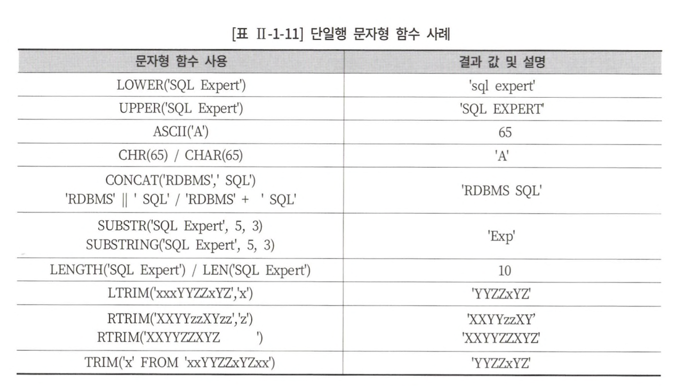

# 1장 SQL 기본

## 1절 관계형 데이터베이스 개요

<table>
<tr>
<td align="center" colspan="3">SQL 종류</td>
</tr>
<tr>
<td align="center">명령어 종류</td><td align="center">명령어</td><td>설명</td>
</tr>
<tr>
<td align="center" rowspan="4">DML</td><td align="center">select</td><td>DB 데이터 조회</td>
</tr>
<tr>
<td align="center">insert</td><td rowspan="3">데이터에 변형을 가하는 명령어</td>
</tr>
<tr>
<td align="center">update</td>
</tr>
<tr>
<td align="center">delete</td>
</tr>
<tr>
<td align="center" rowspan="4">DDL</td><td align="center">create</td><td rowspan="4">생성/변경/삭제 및 이름을 바꾸는 명령어</td>
</tr>
<tr>
<td align="center">alter</td>
</tr>
<tr>
<td align="center">drop</td>
</tr>
<tr>
<td align="center">rename</td>
</tr>
<tr>
<td align="center" rowspan="2">DCL</td><td align="center">grant</td><td rowspan="2">DB 접근 권한 관리</td>
</tr>
<tr>
<td align="center">revoke</td>
</tr>
<tr>
<td align="center" rowspan="2">TCL</td><td align="center">commit</td><td rowspan="2">DML에 의해 조작된 결과를 트랜잭션 별로 제어하는 명령어</td>
</tr>
<tr>
<td align="center">rollback</td>
</tr>
</table>

<table>
<tr align="center">
<td align="center" colspan="2">테이블 관계 용어</td>
</tr>
<tr>
<td align="center">용어</td><td align="center">설명</td>
</tr>
<tr>
<td align="center">정규화</td><td>테이블을 분할하여 정합성 확보 및 불필요한 중복 줄이는 프로세스</td>
</tr>
<tr>
<td align="center">기본키</td><td>각 행을 한 가지 의미로 특정할 수 있는 컬럼</td>
</tr>
<tr>
<td align="center">외부키</td><td>다른 테이블의 기본키로 사용되고 있는 관계 연결 컬럼</td>
</tr>
</table>

<table>
<tr>
<td align="center">데이터 유형</td><td align="center">설명</td>
</tr>
<tr>
<td align="center">char</td><td>- 고정 길이 문자열<br>-할당된 변수 값의 길이가 s보다 작을 경우 그 차이만큼 공간으로 채워짐</td>
</tr>
<tr>
<td align="center">varchar</td><td>- 가변 길이 문자열<br>- s만큼의 최대 길이를 갖지만 가변 길이로 조정이 되어 할당된 변수값의 byte만 적용(= limit)</td>
</tr>
<tr>
<td align="center">numeric</td><td>ex) 정수부 6자리, 소수부 2자리 number(8,2)</td>
</tr>
<tr>
<td align="center">datetime</td><td>날짜와 시각 정보</td>
</tr>
</table>

<table>
<tr>
<td align="center">char</td><td align="center">varchar</td>
</tr>
<tr>
<td>

```text
'AA' = 'AA    '
```
</td>
<td>

```text
'AA' != 'AA    '
```
</td>
</tr>
<tr>
<td>문자열 비교 시 공백을 채워 비교</td>
<td>맨 처음부터 한문자씩 비교하고 공백도 하나의 문자로 취급</td>
</tr>
</table>

## 2절 select 문

```sql
select [all/distinct] *
from table;
```

> all : default 옵션으로 중복된 데이터가 있어도 모두 출력<br>
> distinct : 중복된 데이터가 있을 경우 1건으로 처리해 출력

### 2. 산술 연산자와 합성 연산자

- 문자와 문자 연결 : ||(Oracle)
- 문자와 문자 연결 : +(SQL Server)
- 문자와 문자 연결 : concat(Oracle, SQL Server)

## 3절 함수

### 2. 문자형 함수

<table>
<tr>
<td align="center" colspan="2">단일행 문자형 함수</td>
</tr>
<tr>
<td align="center">함수</td><td align="center">설명</td>
</tr>
<tr>
<td align="center">ltrim</td><td>문자열의 첫 문자부터 확인해 지정 문자 나타나면 해당 문자 제거<br>지정 문자 생략되면 공백 디폴트</td>
</tr>
<tr>
<td align="center">rtrim</td><td>문자열의 마지막 문자부터 확인해 지정 문자 나타나면 해당 문자 제거<br>지정 문자 생략되면 공백 디폴트</td>
</tr>
<tr>
<td align="center">trim</td><td>문자열에서 양쪽에 있는 지정 문자 제거</td>
</tr>
</table>

<div align="center">

</div>

#### [oracle에서 dual 이란](https://dadmi97.tistory.com/37)?

> dummy table

- 오라클 자체에서 제공하는 테이블
- sys 소유 oracle 표준 테이블
- sys 소유지만 어느 사용자에서 접근 가능
- 컬럼 수와 차수가 모두 1인 dummy 테이블

### 3. 숫자형 함수

<table>
<tr>
<td align="center">함수</td><td align="center">설명</td>
</tr>
<tr>
<td align="center">abs</td><td>절대값</td>
</tr>
<tr>
<td align="center">sign</td><td>양수인지, 음수인지, 0인지 구별</td>
</tr>
<tr>
<td align="center">mod(숫자1, 숫자2)</td><td>숫자1을 숫자2로 나눈 나머지</td>
</tr>
<tr>
<td align="center">ceil/ceiling</td><td>크거나 같은 최소 정수</td>
</tr>
<tr>
<td align="center">floor</td><td>작거나 같은 최대 정수</td>
</tr>
<tr>
<td align="center">round</td><td>반올림</td>
</tr>
<tr>
<td align="center">trunc</td><td>버림</td>
</tr>
<tr>
<td align="center">sin, cos, tan</td><td>삼각함수 값</td>
</tr>
<tr>
<td align="center">exp(숫자)</td><td>e^숫자</td>
</tr>
<tr>
<td align="center">power(숫자1, 숫자2)</td><td>숫자1^숫자2</td>
</tr>
<tr>
<td align="center">sqrt</td><td>숫자^1/2</td>
</tr>
<tr>
<td align="center">log(숫자1, 숫자2)</td><td>log숫자2/숫자1</td>
</tr>
<tr>
<td align="center">ln</td><td>log숫자/e</td>
</tr>
</table>

### 4. 날짜형 함수

<table>
<tr>
<td align="center">함수</td><td align="center">설명</td>
</tr>
<tr>
<td align="center">sysdate/getdate()</td><td>현재 날짜와 시간</td>
</tr>
<tr>
<td align="center">extract('year'|'month'|'day', from d)<br>datepart('year'|'month'|'day', d)</td><td>날짜에서 연월일 및 시분초 출력</td>
</tr>
<tr>
<td align="center">to_number(to_char(d, 'yyyy')) = year(d)<br>to_number(to_char(d, 'MM')) = month(d)</td><td>날짜에서 연월일 출력</td>
</tr>
</table>

### 5. 변환형 함수

- `명시적 변환(= Explicit)` : 변환형 함수를 통한 변환
- `암시적 변환(= Implicit)` : DB가 자동으로 변환

<table>
<tr>
<td align="center">함수</td><td align="center">설명</td>
</tr>
<tr>
<td align="center">to_number(문자열)</td><td>숫자로 변환</td>
</tr>
<tr>
<td align="center">to_char(숫자|날짜, format)</td><td>format 형태의 숫자나 날짜를 문자열로 변환</td>
</tr>
<tr>
<td align="center">to_date(문자열, format)</td><td>format 형태의 문자열을 날짜로 변환</td>
</tr>
</table>

### 6. case 표현

<table>
<tr>
<td align="center">pseudo code</td><td align="center">sql</td>
</tr>
<tr>
<td>

```text
if sal > 2000
    then revised_salary = sal
    else revised_salary = 2000
end if
```
</td>
<td>

```sql
select ename,
       case
           when sal > 2000 then sal
           else 2000
       end as revised_salary
from emp;
```
</td>
</tr>
</table>

### 7. null 관련 함수

null이란?
- 정의되지 않은 값 &rarr; &ne; 0, 공백
- not null 제약 조건을 갖지 않은 필드는 null 저장 가능
- null 포함하는 연산 결과 = null

<table>
<tr>
<td align="center">함수</td><td align="center">설명</td>
</tr>
<tr>
<td align="center">nvl(표현식1, 표현식2)<br>isnull(표현식1, 표현식2)</td><td>if null : 표현식2</td>
</tr>
<tr>
<td align="center">nullif(표현식1, 표현식2)</td><td>if 표현식 1 = 표현식 2 : null, else : 표현식1</td>
</tr>
<tr>
<td align="center">coalesce(표현식1, 표현식2, ...)</td><td>null이 아닌 최초의 표현식, 모두 null이라면 null</td>
</tr>
</table>

## 4절 where 절

```sql
select [distinct|all]
from table
where 조건식;
```

### 2. 연산자 종류

<table>
<tr>
<td colspan="2" align="center">연산자 우선 순위</td>
</tr>
<tr>
<td align="center">우선순위</td><td align="center">설명</td>
</tr>
<tr>
<td align="center">1</td><td>괄호</td>
</tr>
<tr>
<td align="center">2</td><td>비교 연산자, SQL연산자(= between, in, like, is null)</td>
</tr>
<tr>
<td align="center">3</td><td>not</td>
</tr>
<tr>
<td align="center">4</td><td>and</td>
</tr>
<tr>
<td align="center">5</td><td>or</td>
</tr>
</table>

### 4. SQL 연산자

<table>
<tr>
<td align="center" colspan="2">와일드카드 종류</td>
</tr>
<tr>
<td align="center">와일드 카드</td><td align="center">설명</td>
</tr>
<tr>
<td align="center">%</td><td>0개 이상의 문자</td>
</tr>
<tr>
<td align="center">_</td><td>1개인 단일 문자</td>
</tr>
</table>

```sql
select *
from player
where player_name like '장%' or
      player_name = '플_타';
```

## 5절 Group By, Having 절

### 2. group by 절

#### group by 없이 집계 함수 사용 불가능

```sql
select position, avg(height)
from player;

# ORA-00937 오류: 단일 그룹의 그룹 함수가 아닙니다.
```

#### group by 절에 별칭 사용 불가능

```sql
select position as 포지션, avg(height)
from player
group by 포지션;

# ORA-00904 오류 : 부적합한 식별자
```

### 3. Having 절

#### where 절 내 집계 함수 사용 불가능

```sql
select position, round(avg(height), 2)
from player
where avg(height) >= 100
group by position;

# ORA-00934 오류 : 그룹 함수는 허가되지 않습니다.
```

#### group by 절과 having 절의 순서를 바꿔 수행 가능

<table>
<tr>
<td>

```sql
select name, count(*)
from ADMIN.MEMBER
group by name
having count(*) > 1;
```
</td>
<td>

```sql
select name, count(*)
from ADMIN.MEMBER
having count(*) > 1
group by name;
```
</td>
</tr>
</table>

#### where 조건 vs having 조건

<table>
<tr>
<td align="center">where</td><td align="center">having</td>
</tr>
<tr>
<td align="center">

```sql
select team_id, count(*)
from player
where team_id in ('k09', 'k02')
group by team_id;
```
</td>
<td align="center">

```sql
select team_id, count(*)
from player
group by team_id
having team_id in ('k09', 'k02');
```
</td>
</tr>
<tr>
<td colspan="2" align="center">where절에 조건을 적용하여 group by 계산 대상을 줄여 자원 활용 &uarr;</td>
</tr>
</table>

> [왜 where 조건이 having 조건보다 성능이 좋을까?](https://dev.mysql.com/doc/refman/8.0/en/select.html)

- having 절은 최적화 없이 결과 반환 직전에 수행
- where절로 최적화 후 결과 범위를 좁힘
- 이후 having 절 조건을 수행하여 결과 반환

```text
The HAVING clause, like the WHERE clause, specifies selection conditions. 
The WHERE clause specifies conditions on columns in the select list, but cannot refer to aggregate functions.
 
The HAVING clause specifies conditions on groups, typically formed by the GROUP BY clause. 
The query result includes only groups satisfying the HAVING conditions. (If no GROUP BY is present, all rows implicitly form a single aggregate group.)

The HAVING clause is applied nearly last, just before items are sent to the client, with no optimization. (LIMIT is applied after HAVING.)
```

## 6절 order by 절

#### order by 특징
- oracle에선 null을 가장 큰 값으로 간주
- sql server에선 null을 가장 작은 값으로 간주

### 2. select 문장 실행 순서

```text
select *
from table
where condition
group by expression
having group condition
order by expression;
```

> 아래 순서 = optimizer &rarr; syntax, semantic 에러 점검 순서 = optimizer &rarr; 문장 해석 논리 순서(&ne; 실제 실행되는 물리 순서)<br>
> ex) frmo절에 정의 되지 않은 컬럼을 where, group by, having, select, order by 절에서 사용하면 에러 발생

1. 테이블 참조(from)
2. 결과 데이터가 아닌 점은 제거(where)
3. 결과 데이터 그룹화(group by)
4. 조건에 맞는 결과 데이터만 출력(having)
5. 결과 출력(select)
6. 데이터 정렬(order by)

## 7절 조인

### 2. Equi join

> inner join과 거의 유사하며 문법만 다름

```sql
select *
from table1, table2
where table1.field = table2.field
```

- PK &harr; FK 관계 기반

### 3. non Equi join

> 두 테이블 간 논리적 관계는 있으나, 컬럼 값이 서로 일치 하지 않은 경우에 사용

```sql
select *
from table1, table2
where table1.field between table2.field1 and table2.field2;
```

### 5. outer join

> equi, non equi join 은 모두 조건의 결과가 참인 행만 반환하는 inner join<br>
> outer join은 조건을 만족하지 않은 행도 함께 반환

## 8절 표준 조인

### 3. natural join

> 두 테이블 간 동일한 이름을 갖는 모든 컬럼들에 대해 equi join 수행

- using, on, where 절에서 join 조건 정의 x
- sql server 지원 x
- select 필드에 식별자 사용 불가능 ex) A.id x

```sql
select *
from emp natural join dept;
```

### 4. using 조건절

> from 절에 using 조건을 이용하여 같은 이름을 가진 컬럼 중 원하는 컬럼에 대해 선택적 equi join 가능

- sql server 지원 x
- select 필드에 식별자 사용 불가능 ex) A.id x

```sql
select *
from dept a
join dept_temp b
using (deptno);
```

- 모든 컬럼명이 같은 두 테이블을 `deptno` 컬럼을 통해 inner join 수행

### 5. on 조건절

#### on 조건절 vs where 조건절, 검색 조건 목적인 경우엔 where 권고 왜?

> [mysql on절 vs where절 : 언제 어떻게 필터링 되는가?](https://codingdog.tistory.com/entry/mysql-on%EC%A0%88-vs-where%EC%A0%88-%EC%96%B8%EC%A0%9C-%EC%96%B4%EB%96%BB%EA%B2%8C-%ED%95%84%ED%84%B0%EB%A7%81-%EB%90%98%EB%8A%94%EA%B0%80)

### 6. cross join

> product의 개념으로 테이블 간 조인 조건이 생길 수 없는 경우 생길 수 있는 모든 데이터의 조합