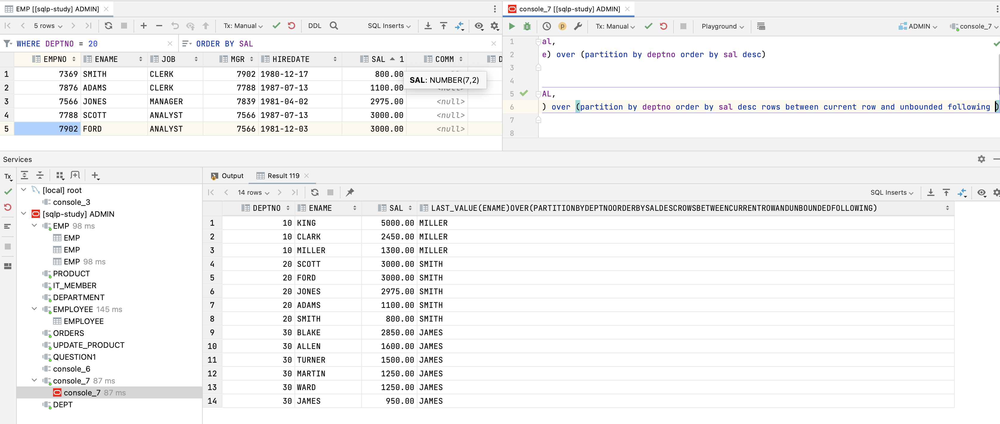
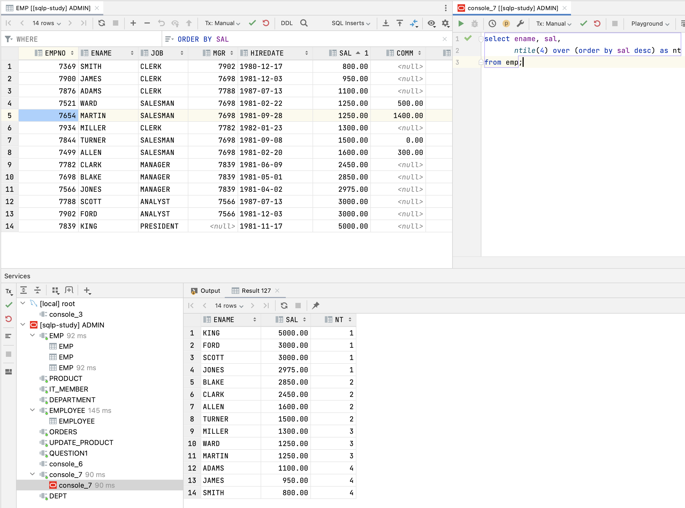
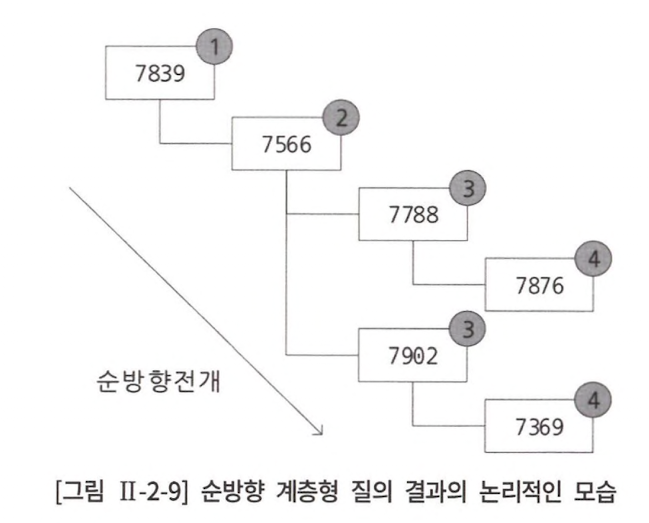

# 2장 SQL 활용

## 1절 서브 쿼리

> 서브 쿼리란, 하나의 SQL 문 안에 포함돼있는 또 다른 SQL 문

#### 서브 쿼리 주의 사항

1. 서브 쿼리는 괄호로 감싸서 기술
2. 단일 행, 복수 행 비교 연산자와 함께 사용 가능
3. 중첩 서브 쿼리 및 스칼라 서브 쿼리에서는 **order by** 사용 불가능

#### 동작하는 방식에 따른 서브 쿼리 분류

<table>
<tr>
<td align="center">종류</td><td align="center">설명</td>
</tr>
<tr>
<td align="center">비연관 서브 쿼리</td>
<td>
서브 쿼리가 메인 쿼리 컬럼을 갖고 있지 않은 형태의 서브 쿼리<br>
메인 쿼리에 값을 제공하기 위한 목적
</td>
</tr>
<tr>
<td align="center">연관 서브 쿼리</td>
<td>서브 쿼리가 메인 쿼리 컬럼을 갖고 있는 형태의 서브 쿼리<br>
메인 쿼리가 먼저 수행돼 얻은 데이터를 서브쿼리에서 조건이 맞는지 확인하고자 할 때 주로 사용
</td>
</tr>
</table>

#### 반환되는 데이터 형태에 따른 서브 쿼리 분류

<table>
<tr>
<td align="center">종류</td><td align="center">설명</td>
</tr>
<tr>
<td align="center">단일 행 서브 쿼리</td>
<td>
서브 쿼리 실행 결과가 항상 1건 이하인 서브 쿼리 의미
</td>
</tr>
<tr>
<td align="center">다중 행 서브 쿼리</td>
<td>
서브 쿼리 실행 결과가 여러 건인 서브 쿼리 의미
</td>
</tr>
<tr>
<td align="center">다중 컬럼 서브 쿼리</td>
<td>
서브 쿼리 실행 결과로 여러 컬럼 반환
</td>
</tr>
</table>

### 1. 단일 행 서브 쿼리

<table>
<tr>
<td align="center">문제</td><td align="center">query</td>
</tr>
<tr>
<td>"정남일 선수"가 소속된 팀의 선수들에 대한 정보 출력</td>
<td>

```oracle
select player_name, position, back_no
from player
where team_id = (select team_id
                 from player
                 where player_name = '정남일')
order by player_name;
```
</td>
</tr>
<tr>
<td>키가 평균키 이하인 선수들의 정보 출력</td>
<td>

```oracle
select player_name, position, back_no
from player
where height <= (select avg(height)
                 from player)
order by player_name;
```
</td>
</tr>
</table>

### 2. 다중 행 서브 쿼리

> 서브 쿼리 결과가 2건 이상 반환될 수 있다면, 반드시 다중 행 비교 연산자(= in, all, any, some)와 함께 사용

#### 다중 행 비교 연산자

<table>
<tr>
<td align="center">연산자</td><td align="center">설명</td>
</tr>
<tr>
<td align="center">in</td><td>mulitple or</td>
</tr>
<tr>
<td align="center">all</td><td>서브 쿼리 결과에 존재하는 모든 값을 만족하는 조건<br>비교 연산자로 `>` 사용했다면 서브 쿼리 결과의 최대값보다 큰 모든 건 조건 만족</td>
</tr>
<tr>
<td align="center">any</td><td>서브 쿼리 결과에 존재하는 어느 하나의 값이라도 만족하는 조건<br> 비교 연산자로 `>` 사용했다면 서브 쿼리 결과의 최소값보다 큰 모든 건 조건 만족</td>
</tr>
<tr>
<td align="center">exists</td><td>서브 쿼리 결과를 만족하는 값이 존재하는지 여부를 확인하는 조건</td>
</tr>
</table>

<table>
<tr>
<td align="center">AS-IS</td><td align="center">TO-BE</td>
</tr>
<tr>
<td>

```oracle
select *
from team
where team_id = (select team_id
                 from player
                 where player_name = '정현수')
order by team_name;

# ORA-01427: 단일 행 하위 질의에 2개 이상의 행이 리턴됐습니다.
```
</td>
<td>

```oracle
select *
from team
where team_id in (select team_id
                 from player
                 where player_name = '정현수')
order by team_name;
```
</td>
</tr>
</table>

### 3. 다중 컬럼 서브 쿼리

> 서브 쿼리 결과로 여러 개 컬럼이 반환돼 메인 쿼리 조건과 동시에 비교<br>
> SQL Server에서는 지원 x

#### 소속팀별 키가 가장 작은 사람들의 정보를 출력

```oracle
select *
from player
where (team_id, height) in (select team_id, min(height)
                            from player
                            group by team_id)
order by team_id, player_name;
```

### 4. 연관 서브 쿼리

> 서브 쿼리 내에 메인 쿼리 컬럼이 사용된 서브 쿼리

#### 선수 자신이 소속 팀의 평균키보다 작은 선수들의 정보 출력

```oracle
select *
from player a, team b
where a.height < (select avg(x.height)
                  from player x
                  where x.team_id = a.team_id
                  group by x.team_id) and
    b.tea_id = a.team_id;
```

### 5. 그 밖의 위치에서 사용하는 서브 쿼리

1. select 절에 서브 쿼리 사용
2. from 절에 서브 쿼리 사용
3. having 절에 서브 쿼리 사용

### 6. 뷰

> 테이블은 실제로 데이터를 갖고 있지만 뷰는 x

#### 뷰 장점

1. `독립성` : 테이블 구조가 변경돼도 뷰는 변경 필요 x
2. `편리성` : 복잡한 질의를 뷰로 생성하여 관련 질의를 단순히 작성 가능
3. `보안성` : 직원 급여 정보 같은 숨기고 싶은 정보가 존재하면 뷰를 생성할 때 해당 컬럼 제외하여 생성함으로써 사용자에게 정보 은닉

1. view 생성

```oracle
create view v_player_team as
    select a.player_name, a.position, a.back_no, b.team_id, b.team_name
    from player a, team b
    where b.team_id = a.team_id
```

2. view로 부터 데이터 추출

```oracle
select *
from v_player_team
where player_name like '황%';
```

3. dbms 처리

> view를 사용하는 경우 dbms가 내부적으로 아래와 같이 재작성

```oracle
select *
from (select a.player_name, a.position, a.back_no, b.team_id, b.team_name
      from player a, team b
      where b.team_id = a.team_id)
where player_name like '황%';
```

4. view 제거

```oracle
drop view v_player_name;
```

## 2절 집합 연산자

#### 집합 연산자 종류

<div align="center">
    
</div>

<table>
<tr>
<td align="center">집합 연산자</td><td align="center">의미</td>
</tr>
<tr>
<td align="center">union</td><td>합집합 연산, 결과에서 모든 중복된 행은 하나의 행으로 통일</td>
</tr>
<tr>
<td align="center">union all</td><td>합집합 연산, 중복된 행도 그대로 표시</td>
</tr>
<tr>
<td align="center">intersect</td><td>교집합 연산</td>
</tr>
<tr>
<td align="center">except</td><td>차집합 연산(ORACLE : minus, SQL Server : except)</td>
</tr>
</table>

## 3절 그룹 함수

### 2. RollUp 함수

> grouping columns의 수를 n이라고 했을 때 n+1 결과 반환<br>
> 최종 그룹화 결과가 아닌 중간 그룹화 결과 또한 표현

<table>
<tr>
<td align="center">roll up X</td><td align="center">roll up O</td>
</tr>
<tr>
<td>

</td>
<td>

</td>
</tr>
</table> 

#### grouping 함수

> `RollUp`, `Cube` 로 계산된 결과에는 `grouping(expression) = 1`로 표시<br>
> 그 외에는 `grouping(expression) = 0`

<table>
<tr>
<td align="center">query</td><td align="center">결과</td>
</tr>
<tr>
<td>

```oracle
select DEPT.DNAME, 
       emp.job, 
       count(*),
       sum(emp.SAL),
       grouping(dept.DNAME),
       grouping(emp.JOB)
from DEPT, EMP
where EMP.DEPTNO = dept.DEPTNO
group by rollup(DEPT.DNAME, emp.JOB)
order by DEPT.DNAME, emp.JOB;
```
</td>
<td>

</td>
</tr>
<tr>
<td>

```oracle
select 
    case grouping(dept.DNAME) 
        when 1 then 'all departments'
        else dept.DNAME 
    end as department,
    case grouping(emp.JOB) 
        when 1 then 'all jobs'
        else emp.job
    end as job,
    count(*),
    sum(emp.SAL)
from DEPT, EMP
where EMP.DEPTNO = dept.DEPTNO
group by rollup(DEPT.DNAME, emp.JOB)
order by DEPT.DNAME, emp.JOB;
```
</td>
<td>

</td>
</tr>
<tr>
<td>

```oracle
select 
    case grouping(dept.DNAME)
        when 1 then 'all departments'
        else dept.DNAME
        end as department,
    case grouping(emp.JOB)
        when 1 then 'all jobs'
        else emp.job 
        end as job,
    count(*),
    sum(emp.SAL)
from DEPT, EMP
where EMP.DEPTNO = dept.DEPTNO
group by rollup(dept.DNAME), emp.JOB
order by DEPT.DNAME, emp.JOB;
```
</td>
<td>

</td>
</tr>
</table>

### 3. Cube 함수

> grouping 컬럼이 가질 수 있는 모든 경우의 수에 대한 부분 집합 생성<br>
> grouping columns 수가 n이면 2^n 개 결과 반환

<table>
<tr>
<td align="center">query</td><td align="center">결과</td>
</tr>
<tr>
<td>

```oracle
select 
    case grouping(dept.DNAME)
        when 1 then 'all departments'
        else dept.DNAME
        end as department,
    case grouping(emp.JOB)
        when 1 then 'all jobs'
        else emp.job
        end as job,
    count(*),
    sum(emp.SAL)
from DEPT, EMP
where EMP.DEPTNO = dept.DEPTNO
group by cube(dept.DNAME, emp.JOB)
order by DEPT.DNAME, emp.JOB;
```
</td>
<td>

</td>
</tr>
</table>

### 4. grouping sets 함수

> union all을 사용한 그룹 함수와 동일한 결과

<table>
<tr>
<td align="center">query</td><td align="center">결과</td>
</tr>
<tr>
<td>

```oracle
select case grouping(dept.DNAME) when 1 then 'all departments' else dept.DNAME end as department,
       case grouping(emp.JOB) when 1 then 'all jobs' else emp.job end as job,
       count(*),
       sum(emp.SAL)
from DEPT, EMP
where EMP.DEPTNO = dept.DEPTNO
group by grouping sets(dept.DNAME, emp.JOB)
order by DEPT.DNAME, emp.JOB;
```
</td>
<td>

</td>
</tr>
</table>

## 4절 윈도우 함수

> 행과 행간의 관계를 정의하기 어려운 rdbms의 문제를 해결하기 위함

#### 윈도우 함수 종류

1. rank 관련 함수 : rank, dense_rank, row_number
2. 집계 관련 함수 : sum, max, min, avg, count
3. 그룹 내 행 순서 관련 함수 : first_value, last_value, lag, lead &rarr; Oracle에서만 지원
4. 그룹 내 비율 관련 함수 : cume_dist, percent_rank, ntitle, ratio_to_report

#### 윈도우 함수 문법

```oracle
select window_function(arguments) over([partition by column] [order by 절] [windowing 절])
from table 명;
```

- `window_function` : 함수
- `arguments` : 인수
- `partition by` : 전체 집합을 기준에 의해 소그룹으로 분할
- `order by` : 정렬
- `windowing` : 함수의 대상이 되는 행 기준 범위 지정

### 2. 그룹 내 순위 함수

ex) 사원 데이터에서 급여가 높은 순서와 직업별로 급여가 높은 순서 같이 출력

#### rank 함수

<table>
<tr>
<td align="center">query</td><td align="center">결과</td>
</tr>
<tr>
<td>

```oracle
select job, ENAME, SAL,
       rank() over (order by sal desc) as "전체 순위",
       rank() over (partition by job order by sal desc) as "직업 내 순위"
    from emp;

```
</td>
<td>

</td>
</tr>
</table>

#### dense rank 함수

> rank와 유사하지만 동일한 순위를 하나의 건수로 취급

<table>
<tr>
<td align="center">query</td><td align="center">결과</td>
</tr>
<tr>
<td>

```oracle
select job, ENAME, SAL,
       rank() over (order by sal desc),
       dense_rank() over (order by sal desc)
    from emp;
```
</td>
<td>

</td>
</tr>
</table>

#### row_number 함수

> 동일한 순위더라도 고유한 순위로 부여

<table>
<tr>
<td align="center">query</td><td align="center">결과</td>
</tr>
<tr>
<td>

```oracle
select job, ENAME, SAL,
       rank() over (order by sal desc),
       row_number() over (order by sal desc)
    from emp;
```
</td>
<td>

</td>
</tr>
</table>

### 4. 그룹 내 행 순서 함수

#### First_value 함수

> partition 별 윈도우에서 가장 먼저 나온 값 조회

[rows unbounded preceding이란? ](https://gent.tistory.com/473)

> 맨 처음 의미<br>
> ex) UNBOUNDED PRECEDING AND 4 FOLLOWING : 처음부터 4번째 행까지 <br>
> ex) UNBOUNDED FOLLOWING : 맨 마지막

<table>
<tr>
<td align="center">query</td><td align="center">결과</td>
</tr>
<tr>
<td>

```oracle
select DEPTNO, ename, SAL,
       first_value(ename) over (partition by deptno order by sal desc)
from emp;
```
</td>
<td>

</td>
</tr>
</table>

#### Last_value 함수

> partition 별 윈도우에서 가장 나중에 나온 값 조회

왜 partition 범위 지정을 하지 않으면 이상한 값이 나올까?

<table>
<tr>
<td align="center">query</td><td align="center">결과</td>
</tr>
<tr>
<td>

```oracle
select DEPTNO, ename, SAL,
       last_value(ename) over (
           partition by deptno 
           order by sal desc)
from emp;
```
</td>
<td>

</td>
</tr>
<tr>
<td>

```oracle
select DEPTNO, ename, SAL,
       last_value(ename) over (
           partition by deptno 
           order by sal desc 
           rows between current row and unbounded following )
from emp;
```
</td>
<td>

</td>
</tr>
</table>

#### Lag 함수

> partition 별 윈도우에서 이전 몇 번째 행 조회<br>

<table>
<tr>
<td align="center">설명</td><td align="center">query</td>
</tr>
<tr>
<td>본인보다 입사일자가 한 명 앞선 사원 정보 조회</td>
<td>

```oracle
select ename, hiredate, sal,
       lag(sal) over (order by hiredate)
from emp
where job = 'salesman';
```
</td>
</tr>
<tr>
<td>
본인 보다 입사일자가 두명 앞선 사원 정보 조회, 데이터가 없을 경우 0으로 처리
</td>
<td>

```oracle
select ename, hiredate, sal,
       lag(sal, 2, 0) over (order by hiredate)
from emp
where job = 'salesman';
```
</td>
</tr>
</table>

`lag(sal, 2, 0)`: 두 행 앞의 salary 가져오고 가져올 값이 없으면 0으로 처리
`lag(sal)` : 두번째 인자의 default 값이 1로 한 행 앞의 salary 가져오고 없으면 null 처리

#### Lead 함수

> partition 별 윈도우에서 이후 몇 번째 행 조회<br>
> Lag 함수와 반대

### 5. 그룹 내 비율 함수

#### Ratio_To_Report 함수

> partition 별 sum 값에 대한 백분율

<table>
<tr>
<td align="center">query</td><td align="center">결과</td>
</tr>
<tr>
<td>

```oracle
select ename, sal,
       round(ratio_to_report(sal) over(), 2) as sal_pr
from emp
where job = 'salesman';
```
</td>
<td>

</td>
</tr>
</table>

#### Percent_Rank 함수

> partition 별 윈도우에서 제일 먼저 나오는 것을 0으로, 제일 늦게 나오는 것을 1로 하여 행의 순서별 백분율<br>
> 상위/하위 백분율 계산 목적

<table>
<tr>
<td align="center">query</td><td align="center">결과</td>
</tr>
<tr>
<td>

```oracle
select deptno, ename, sal,
       percent_rank() over (partition by deptno order by sal desc) as pr
from emp;
```
</td>
<td>

</td>
</tr>
</table>

#### Cume_Dist 함수

> partition 별 윈도우의 전체 건수에서 현재 행보다 작거나 같은 건수에 대한 누적 백분율 조회

- 같은 부서 내 본인 급여가 누적 순서 상 몇 번째 위치 쯤에 있는 지 0과 1 사이 값으로 출력

<table>
<tr>
<td align="center">query</td><td align="center">결과</td>
</tr>
<tr>
<td>

```oracle
select deptno, ename, sal,
       cume_dist() over ( partition by deptno order by sal desc) as cd
from emp;
```
</td>
<td>

</td>
</tr>
</table>

#### Ntile 함수

> partition 별 전체 건수를 argument 값으로 n등분

- 전체 사원을 급여가 높은 순서로 정렬하고, 급여를 기준으로 4개 그룹화

<table>
<tr>
<td align="center">query</td><td align="center">결과</td>
</tr>
<tr>
<td>

```oracle
select ename, sal,
       ntile(4) over (order by sal desc) as nt
from emp;
```
</td>
<td>

</td>
</tr>
</table>

## 5절 Top N 쿼리

### 1. ROWNUM 슈도 컬럼

- 급여가 높은 상위 3명 직원 조회

```oracle
select *
from emp
where ROWNUM < 4
order by sal desc;
```

- 급여 순서 상관 없이 무작위로 추출된 3명에 한해 급여를 내림차순 정렬 &rarr; 원하는 결과 x

```oracle
select *
from (
    select *
    from emp
    order by sal desc
     )
where ROWNUM < 4;
```

- inline-view 를 통해 추출하고자 하는 집합 정렬 후 Top N 쿼리 결과 만듬

### 2. Top 절

> 결과 집합으로 출력되는 행의 수 제한<br>
> SQL Server만 가능

```oracle
Top (Expression) [Percent] [with Ties]
```

- `Expression` : 반환할 행 수 지정
- `Percent` : 쿼리 결과 집합에서 처음 Expression% 행만 반환
- `With Ties` : order by 지정된 경우에만 사용할 수 있으며, Top N 의 마지막 행과 같은 행이 존재하는 경우 추가 행 출력

<table>
<tr>
<td align="center">query</td><td align="center">결과</td>
</tr>
<tr>
<td>

```oracle
select top(2)
    ename, sal
from emp
order by sal desc;
```
</td>
<td>

</td>
</tr>
<tr>
<td>

```oracle
select top(2) with ties
    ename, sal
from emp
order by sal desc;
```
</td>
<td>

</td>
</tr>
</table>

### 3. Row Limiting 절

> Row Limiting 절을 통해 Top N 작성 가능

```oracle
[OFFSET offset {ROW | ROWS}]
[FETCH {FIRST | NEXT} [{rowCount | percent PERCENT}]] {ROW | ROWS} {ONLY | WITH TIES}]
```

- `OFFSET offset` : 건너뛸 행의 개수 지정
- `FETCH` : 반환할 행의 개수나 백분율 지정
- `ONLY` : 지정된 행의 개수나 백분율만큼 반환
- `WITH TIES` : 마지막 행 동순위 포함하여 반환

<table>
<tr>
<td align="center">query</td><td align="center">결과</td>
</tr>
<tr>
<td>

```oracle
select *
from emp
order by sal desc
fetch first 5 rows only;
```
</td>
<td>

</td>
</tr>
<tr>
<td>

```oracle
select *
from emp
order by sal desc
offset 5 rows;
```
</td>
<td>

</td>
</tr>
</table>

## 6절 계층형 질의와 셀프 조인

> 계층형 데이터란, 동일 테이블에 상위와 하위 데이터가 포함된 데이터 ex) 공통 코드

<div align="center">
    
</div>

### 2. 셀프 조인

> 셀프 조인이란, 동일 테이블 사이의 조인

<div align="center">
    
</div>

### 3. 계층형 질의

```oracle
select *
from table
where condition
start with condition
connect by [nocycle] condition
[order siblings by column, ...]
```

- `start with` : 계층 구조 전개 시작 위치 지정 &rarr; root 데이터 지정
- `connect by` : 다음에 전개될 자식 데이터 지정 &rarr; 자식 데이터는 connect by 절 condition 만족
- `prior`
  - `(FK) = prior (PK)` : 부모 &rarr; 자식 (= 순방향)
  - `(PK) = prior (FK)` : 자식 &rarr; 부모 (= 역방향)
- `nocycle` : 오류를 발생시키지 않고 사이클이 발생한 이후의 데이터 전개 x
  - `cycle` : 데이터 전개 중 이미 나타났던 동일한 데이터 나타난 오류 
- `order siblings by` : 형제 노드 사이 정렬 수행

<br>

- 사수와 사원 정보 조회

<table>
<tr>
<td align="center">query</td><td align="center">결과</td>
</tr>
<tr>
<td>

```oracle
select level, empno, mgr
from emp
start with mgr is null
connect by mgr = prior empno;
```
</td>
<td>

</td>
</tr>
</table>

<div align="center">
    
</div>

- 사원으로부터 사수 조회

<table>
<tr>
<td align="center">query</td><td align="center">결과</td>
</tr>
<tr>
<td>

```oracle
select level, empno, mgr
from emp
start with empno = 7876
connect by empno = prior mgr;
```
</td>
<td>

</td>
</tr>
</table>

<div align="center">
    
</div>

## 7절 PIVOT 절과 UNPIVOT 절

> Pivot : 행 &rarr; 열<br>
> Unpivot : 열 &rarr; 행

- Pivot 예제

<table>
<tr>
<td align="center">query</td><td align="center">결과</td>
</tr>
<tr>
<td>

```oracle
select *
from (
    select job, DEPTNO, SAL
    from emp
     )
pivot (
    sum(sal) for DEPTNO in (10, 20, 30)
    );
```
</td>
<td>

</td>
</tr>
</table>

- unpivot 예제

<table>
<tr>
<td align="center">query</td><td align="center">결과</td>
</tr>
<tr>
<td>

```oracle
drop table t1 purge ;

create table t1 as
    select job, d10_sal, d20_sal, d10_cnt, d20_cnt
from (
    select job, deptno, sal
    from emp
    where job in ('ANALYST', 'CLERK')
     )
pivot (
    sum(sal) as sal, count(*) as cnt
    for deptno in (10 as d10, 20 as d20)
    );

select * from t1;

select *
from t1
unpivot (sal for deptno in (d10_sal, d20_sal))
order by 1, 2;
```
</td>
<td>

</td>
</tr>
</table>

## 제 8절 정규 표현식

#### REGEXP_SUBSTR 함수

> 정규 표현식과의 일치 여부

<table>
<tr>
<td align="center">query</td><td align="center">결과</td>
</tr>
<tr>
<td>

```oracle
select regexp_substr('aab', 'a.b'),
       regexp_substr('abb', 'a.b'),
       regexp_substr('acb', 'a.b'),
       regexp_substr('adc', 'a.b')
from DUAL;
```
</td>
<td>

</td>
</tr>
</table>

#### REGEXP_LIKE 함수

> REGEXP_LIKE(source_char, pattern)<br>
> `source_char` 가 pattern에 일치하면 true, 아니면 false

