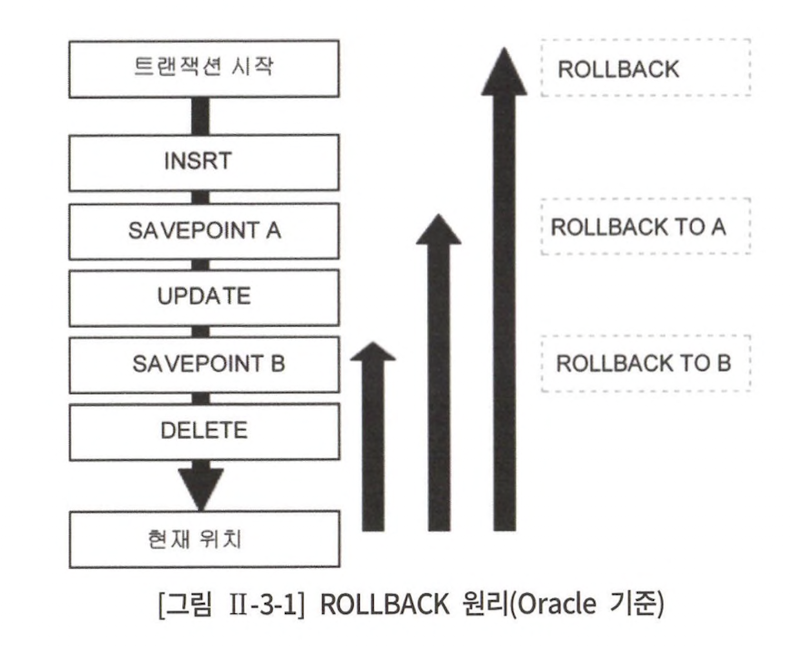
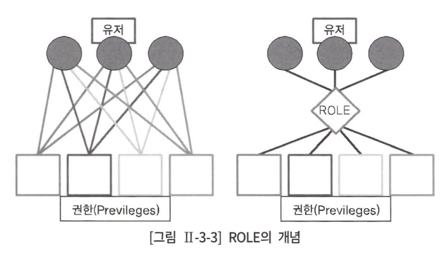

# 3장 관리 구문

## 1절 DML

### 4. Merge

> 새로운 행을 입력하거나, 기존 행을 수정하는 작업 한번에 가능

```sql
merge
    into target table
    using source table
        on (조건식)
    when matched then
        update
            set field1 = value1
    when not matched then
        insert [] 
        values ();
```

mysql에는 merge 절이 없어 아래와 같이 표현 가능

> insert on duplicate key update

```sql
INSERT INTO table(
	column1,
	column2,
	column3,
	column4
)VALUES(
	'value1',
	'value2',
	'value3',
	now()
)
ON DUPLICATE KEY UPDATE
	column2 = 'value4',
	column3 = 'value5', 
	column4 = now()
```

## 2절 TCL

### 1. 트랜잭션 개요

> 트랜잭션이란, DB 논리적 연산 단위<br>
> 밀접히 관련되어 분리될 수 없는 한 개 이상의 DB 조작

#### 트랜잭션의 특성

<table>
<tr>
<td align="center">특성</td><td align="center">설명</td>
</tr>
<tr>
<td align="center">원자성(= atomicity)</td><td>트랜잭션에 정의된 연산은 모두 성공하던지 아니면 전혀 실행되지 않은 상태로 남아 있어야 한다.(all or nothing)</td>
</tr>
<tr>
<td align="center">일관성(= consistency)</td><td>트랜잭션이 실행되기 전의 DB 내용이 잘못돼있지 않다면 트랜잭션 실행 이후에도 DB 내용에 잘못이 존재 x</td>
</tr>
<tr>
<td align="center">고립성(= isolation)</td><td>트랜잭션이 실행되는 도중에 다른 트랜잭션의 영향을 받아 잘못된 결과를 만들어선 안된다.</td>
</tr>
<tr>
<td align="center">지속성(= durability)</td><td>트랜잭션이 성공적으로 수행되면 그 트랜재션이 갱신한 DB 내용은 영구적으로 저장</td>
</tr>
</table>

### 2. Commit

> 입력, 수정, 삭제한 데이터에 대해 전혀 문제가 없다고 판단됐을 경우 commit 명령어로 트랜잭션 완료 가능

#### Commit이나 Rollback 이전의 데이터 상태

- 데이터 변경을 취소해 이전 상태로 복구 가능
- 현재 사용자는 select로 결과 확인 가능
- 다른 사용자는 현재 사용자가 수행한 명령의 결과 확인 x
- 변경된 행은 lock이 설정돼 다른 사용자 변경 x

#### Commit 이후 데이터 상태

- 데이터에 대한 변경 사항 DB 반영
- 이전 데이터는 영원히 잃어버리게 됨
- 모든 사용자 결과 확인 가능
- 관련된 행에 lock 풀리고 다른 사용자가 행 조작 가능

#### SQL Server 트랜잭션

1) auto commit

- Oracle : DML 수행 후 Commit, Rollback 수행해야 트랜잭션 종료 + auto commit option
- SQL Server : default auto commit

2) 암시적 트랜잭션

- 트랜잭션 시작은 DBMS가, 끝은 사용자가 Commit, Rollback으로 처리

3) 명시적 트랜잭션

- 트랜잭션 시작과 끝을 모두 사용자가 명시

### 3. Rollback

> Rollback을 통해 입력/수정/삭제한 데이터에 대해 commit 이전에 변경 사항 취소 가능<br>
> 데이터가 이전 상태로 복구되고 lock이 풀리며 다른 사용자가 데이터 변경 가능

#### Rollback 후의 데이터 상태

- 데이터 변경 사항 취소
- 데이터 트랜잭션 시작 이전의 상태로 되돌려짐
- 관련된 row lock 풀리고 다른 사용자가 행 조작 가능

#### Commit, Rollback 효과

- 데이터 무결성 보장
- 영구적 변경 이전 데이터 변경 사항 확인 가능
- 논리적으로 연관된 작업을 그룹화하여 처리 가능

### 4. Save Point

> Save Point를 정의하여 Rollback 할 때 현 시점에서 Save Point 까지 트랜잭션의 일부만 롤백 가능

<div align="center">
    
</div>

## 3절 DDL

### 제약 조건

> 제약 조건이란, 원하는 조건의 데이터만 유지하기 위한, 데이터 무결성을 유지하기 위한 제약 조건

#### 제약 조건 종류

<table>
<tr>
<td align="center">구분</td><td align="center">설명</td>
</tr>
<tr>
<td align="center">기본키</td><td>데이터를 고유하게 식별하기 위한 기본키<br>하나의 테이블에 하나의 기본키 생성 가능<br>기본키 = 고유키 & not null</td>
</tr>
<tr>
<td align="center">Unique(= 고유키)</td><td>데이터를 고유하게 식별하기 위한 고유키<br>Null을 가진 행이 여러개 있더라도 고유키 제약 위반 x</td>
</tr>
<tr>
<td align="center">Not Null</td><td>null 입력 금지</td>
</tr>
<tr>
<td align="center">Check</td><td>입력할 수 있는 값의 범위 제한<br>true/false로 평가할 수 있는 논리식 지정</td>
</tr>
<tr>
<td align="center">Foreign Key(= 외래키)</td><td>테이블 간 관계를 정의하기 위해 기본키를 다른 테이블의 외래키로 복사하는 경우 외래키 생성</td>
</tr>
</table>

> mysql에선 check 제약 조건을 지원하지 않아 trigger 정의 필요

#### Select 문장으로 테이블 생성 사례

```sql
# Oracle

Create Table Team_temp as select * from team;

# SQL Server
select * into team_temp from team;
```

## 4절 DCL

> 유저를 생성하고 권한을 제어할 수 있는 DCL

### 2. 유저와 권한

#### Oracle에서 제공하는 유저들

<table>
<tr>
<td align="center">유저</td><td align="center">역할</td>
</tr>
<tr>
<td align="center">SCOTT</td><td>Oracle 테스트용 샘플 계정<br>default password : TIGER</td>
</tr>
<tr>
<td align="center">SYS</td><td>백업/복구 등 DB 모든 관리 기능 수행 가능한 최상위 관리자 계정</td>
</tr>
<tr>
<td align="center">SYSTEM</td><td>백업/복구 등 일부 관리 기능을 제외한 모든 시스템 권한을 부여 받은 DBA 계정<br>Oracle 설치 시 비밀번호 설정</td>
</tr>
</table>

#### 유저 생성과 시스템 권한 부여

- SCOTT 유저에게 유저 생성 권한을 부여한 후 SQLD 유저 생성 by ORACLE

```sql
grant create user to SCOTT;
    
conn SCOTT/TIGER
    
create user SQLD identified by DB2019;
```

- sa로 로그인 한 뒤 SQL 인증을 사용하는 SQLD라는 로그인 생성. 로그인 후 최초로 접속할 DB는 AdventureWorks DB로 설정 by SQL Server

```sql
create login SQLD with password='DB2019', default_database=AdventureWorks;
    
use AdventureWorks;
Go
create user SQLD for login SQLD with default_schema = dbo;

conn SYSTEM/MANAGER;
    
grant create session to SQLD;
    
conn SQLD/DB2019;
```

### 3. Role을 이용한 권한 부여

> 용이한 권한 관리를 위해 유저와 권한 사이 중개 역할을 하는 Role 활용<br>
> Role을 생성하고 Role에 각종 권한을 부여한 후 Role을 사용자에 부여

<div align="center">
    
</div>

#### SQLD 유저에게 `Create Sessoin`과 `Create Table` 권한을 가진 Role을 생성한 후 Role을 이용해 다시 권한을 할당.<br>권한을 취소할 때는 Revoke 사용

```oracle
conn SYSTEM/MANAGER;

REVOKE CREATE SESSION, CREATE TABLE FROM SQLD;

CREATE ROLE LOGIN_TABLE;

GRANT CREATE SESSION, CREATE TABLE TO LOGIN_TABLE;

GRANT LOGIN_TABLE TO SQLD;
```