# 1장 SQL 수행 구조

## 1절 데이터베이스 아키텍처

### 1. 데이터베이스 구조

> Oracle에서의 DB = 디스크에 저장된 데이터 집합(= `Datafile`, `Redo Log File`, `Control File`)<br>
> `instance` = SGA 공유 메모리 영역와 이를 접근하는 프로세스 집합

<table>
<tr>
<td>
<div align="center">
    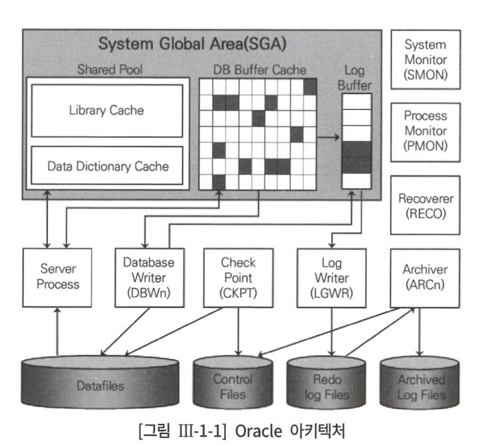
</div>
</td>
<td>
<div align="center">
    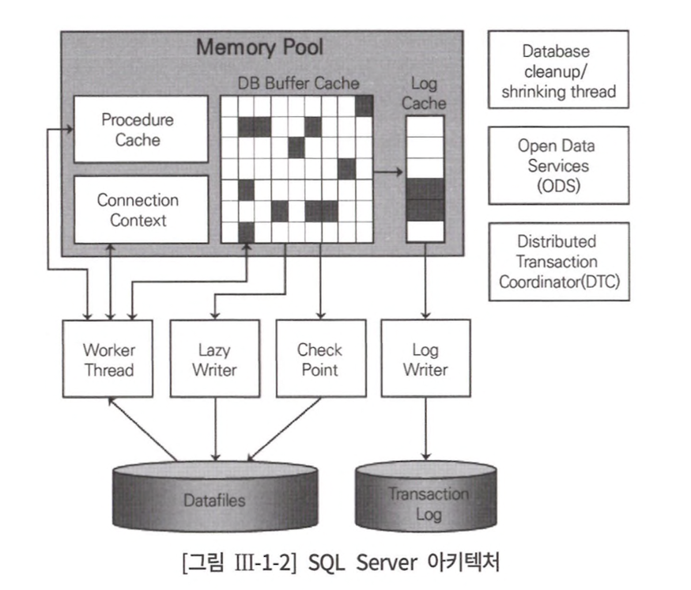
</div>
</td>
</tr>
</table>

#### Oracle 특성

- 기본적으로 instance : DB = 1 : 1
- [RAC(= Real Application Cluster)](https://12bme.tistory.com/322) 에선 instance : DB = n : 1

### 2. 프로세스

> 사용자 프로세스와 통신하며 사용자의 각종 명령 처리<br>
> SQL 파싱 후 최적화 수행

#### 1) 전용 서버 방식

<div align="center">
    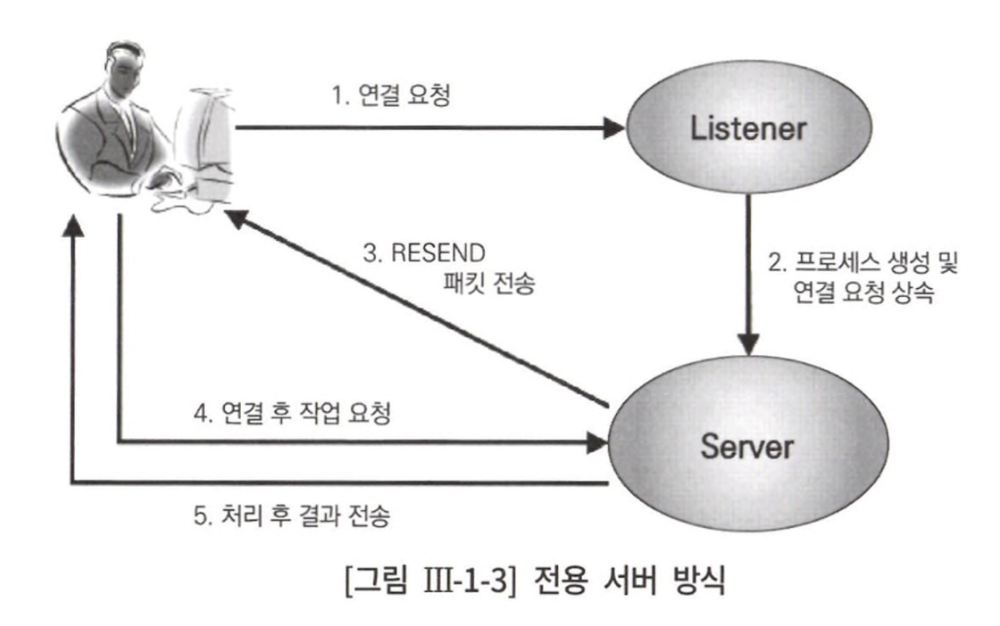
</div>

- 처음 연결 요청을 받는 리스너가 서버 프로세스 생성
- 서버 프로세스는 하나의 사용자 프로세스를 위해 전용 서비스 제공
- SQL 수행 시 연결 요청을 반복하면 서버 프로세스 생성/해제 반복 &rarr; 서버 성능 &darr;<br>
&rArr; OTLP성 애플리케이션에선 Connection Pooling 필수 사용

> [OLTP vs OLAP](https://chankim.tistory.com/6)<br>
> OLTP = application transaction 처리 목적<br>
> OLAP = data 분석 목적

> [Connection Pooling](https://www.holaxprogramming.com/2013/01/10/devops-how-to-manage-dbcp/) 이란, db connection 객체를 생성/할당을 담당하는 기법 

<div align="center">
    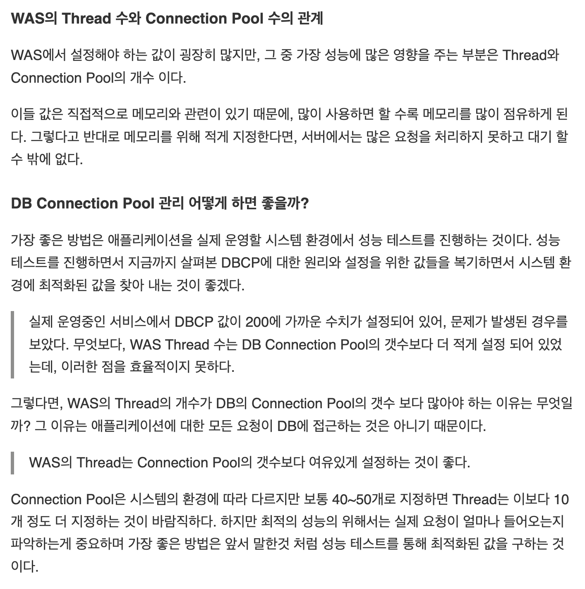
</div>

- 우리는 WAS thread &harr; DB connection 개수 상관 관계가 잘 정의되어 있을까??,,
- 어떤 팀에서 관장해야 할까??,,

#### 2) 공유 서버 방식

> 하나의 서버 프로세스를 여러 사용자 세션이 공유

<div align="center">
    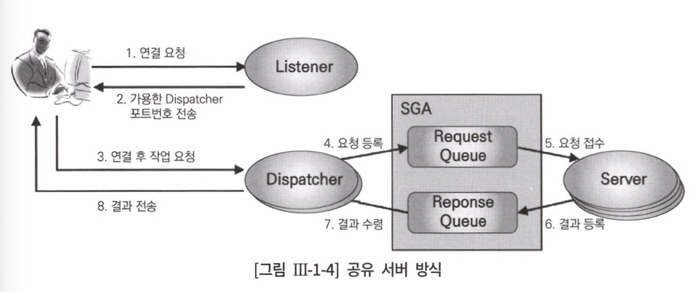
</div>

1. Oracle에 접속하면 사용자 프로세스는 서버 프로세스와 직접 통신하지 않고 Dispatcher 프로세스 수행
2. Dispatcher는 SGA에 있는 Request Queue에 등록
3. 가장 먼저 가용한 서버 프로세스가 Request Queue에 있는 사용자 명령 꺼내어 처리
4. 결과를 Response Queue에 등록
5. Response Queue를 모니터링하던 Dispatcher가 결과를 발견하면 사용자 프로세스에 반환

<table>
<tr>
<td align="center" colspan="3">백그라운드 프로세스</td>
</tr>
<tr>
<td align="center">Oracle</td><td align="center">SQL Server</td><td align="center">설명</td>
</tr>
<tr>
<td align="center">System Monitor</td>
<td align="center">Database cleanup/<br>shrinking thread</td>
<td>
장애가 발생한 시스템을 재기동할 때 인스턴스 복구를 수행하고<br>임시 segment와 extent 모니터링
</td>
</tr>
<tr>
<td align="center">Process Monitor</td>
<td align="center">Open Data Services</td>
<td>
이상이 생긴 프로세스가 사용하던 리소스 복구
</td>
</tr>
<tr>
<td align="center">Database writers</td>
<td align="center">Lazywriter thread</td>
<td>
버퍼 캐시에 있는 Dirty 버퍼를 데이터 파일에 기록
</td>
</tr>
<tr>
<td align="center">Log Writer</td>
<td align="center">Log writer thread</td>
<td>
log buffer entry를 redo log file에 기록
</td>
</tr>
<tr>
<td align="center">archiver</td>
<td align="center">-</td>
<td>
꽉 찬 Redo 로그가 덮어 쓰여지기 전에 Archive 로그 디렉토리로 백업
</td>
</tr>
<tr>
<td align="center">Checkpoint</td>
<td align="center">Database checkpoint thread</td>
<td>
이전에 checkpoint가 일어났던 마지막 시점 이후의 DB 변경 사항을 기록하도록 trigger하고,<br> 기록이 완료되면 현재 어디까지 기록했는지를 control file과 data file header에 저장
</td>
</tr>
<tr>
<td align="center">Recoverer</td>
<td align="center">Distributed Transaction Coordinator</td>
<td>
분산 트랜잭션 과정에 발생한 문제 해결
</td>
</tr>
</table>

> [extent](https://latale.tistory.com/365) 란, 연속적으로 존재하는 block을 묶은 논리적 단위<br>
> segment란, extent를 묶은 논리적 단위

> [임시 segment](http://www.gurubee.net/lecture/1898)란, SQL문의 완전한 실행을 위해 임시 작업 영역이 필요할 때 생성

> [dirty buffer](http://www.gurubee.net/lecture/1887)란, 사용자가 사용하여 내용이 변경되었지만 아직 디스크에 기록되지 않은 버퍼

> 데이터에 변경이 발생할 경우 변경되기 전의 데이터와 변경된 후의 데이터를 모두 [redo log](https://velog.io/@khyup0629/Oracle-Redo-Log-%EA%B4%80%EB%A6%AC%ED%95%98%EA%B8%B0) 기록<br> 
> 복구가 필요할 때 Redo Log File을 이용

### 3. 데이터 저장 구조

<div align="center">
    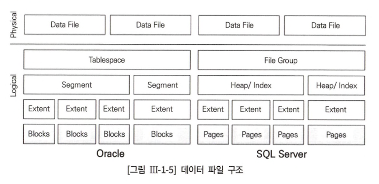
</div>

#### 1) block(= page)

> 데이터를 읽고 쓸 때의 논리적 단위

- 대부분 DBMS에서 I/O = 블록 단위
- Oracle = block, SQL Server = page
- 블록 단위 I/O = 하나의 레코드에서 하나의 컬럼만 읽으려 할 때도 레코드가 속한 block 전체 조회
- 성능 지표 = access하는 block 개수 &ne; record 수

#### 2) extent

> table space로부터 공간을 할당하는 단위<br>

- [table space](https://yoo-hyeok.tistory.com/136) = 데이터가 저장되는 테이블을 한 파일로 관리
- 저장 공간을 필요로 한다 = 한 개 이상의 extent 사용

#### 3) segment

> table, index, undo처럼 저장공간을 필요로 하는 database object<br>

- 한 segment는 자신이 속한 table space 내 여러 데이터 파일에 걸쳐 저장 가능
- segment에 할당된 extent가 여러 data file에 흩어져 저장<br>
&rArr; 디스크 경합을 줄이고 I/O 분산 효과

#### 4) table space

> segment를 담는 container

- 여러 데이터 파일로 구성
- 사용자 = segment를 위한 table space 지정
- DBMS = 실제 값을 저장할 데이터 파일과 extent 할당

#### 임시 데이터 파일

> 중간 결과 집합 저장 용도

- 예시 상황 : 대량 정렬, 해시 작업 중 메모리 부족
- 임시로 저장했다가 자동으로 삭제
- Redo 정보를 생성하지 않아 나중에 파일에 문제가 생겼을 때 복구 x
- 백업 필요 x

#### Log File

- Redo Log(= SQL Server Transaction Log) = DB buffer cache에 가해지는 모든 변경 사항을 기록하는 file
- Fast Commit = 사용자 변경 내용이 메모리 buffer block에만 기록되고 아직 disk엔 기록되지 않았더라도 redo 로그를 믿고 빠르게 commit
- memory buffer block을 disk data block에 기록하는 작업 = Random I/O &rarr; 속도 &darr;
- log 기록 = Append 방식<br>
&rArr; log 파일에 append 방식으로 빠르게 기록하고 buffer block과 data file 간 동기화는 이후 batch로 처리

### 4. 메모리 구조

> 메모리 구조 = 시스템 공유 메모리 영역 + 프로세스 전용 메모리 영역

#### 시스템 공유 메모리 영역

> 여러 프로세스가 동시에 접근할 수 있는 메모리 영역<br>
> System Global Area in Oracle, Memory Pool in SQL Server

- db buffer cache, 공유 pool, log buffer
- 시스템 구조와 제어 구조 caching 영역

#### 프로세스 전용 메모리 영역

> 데이터를 정렬하고 세션과 커서 상태 정보 저장 용도<br>
> Process Global Area

#### DB Buffer Cache

> 데이터 파일로부터 읽어 들인 data block 담는 cache 영역

- 모든 사용자 프로세스는 db buffer cache buffer block 동시 접근 가능
- 대부분 읽고자 하는 block을 우선 buffer cache hit, 없으면 disk
- disk 조회 시에도 cache 적재후 조회
- disk I/O는 access arm 이 움직이면서 head를 통해 동작 &rarr; 속도 &darr;
- memory I/O는 전지적 신호 &rarr; 속도 &uarr;

buffer block 상태

- `free buffer` : 아직 데이터가 읽히지 않아 비어있는 상태, 데이터가 언제든지 덮어써도 무방한 상태(= 동기화 완료)
- `dirty buffer` : buffer cache 이후 변경이 발생했지만 아직 disk에 기록되지 않아 data file block과 동기화 필요한 buffer block
- `pinned buffer` : 읽기, 쓰기 작업이 현재 진행중인 buffer block

#### Shared Pool

> dictionary cache + library cache

- `dictionary cache` : table, index, tablespace, ... 등 메타 정보 저장 영역 
- `library cache` : SQL 문, 실행 계획, procedure 저장 cache 영역

## 2절 SQL 처리 과정

### 2. SQL 처리 과정

<div align="center">
    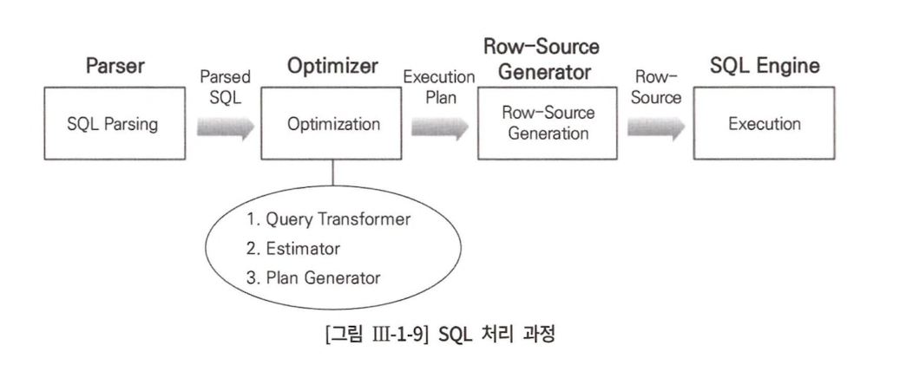
</div>

<table>
<tr>
<td align="center" colspan="2">엔진</td><td align="center">역할</td>
</tr>
<tr>
<td align="center" colspan="2">Parser</td>
<td>
SQL 문장 개별 구성 요소를 분석하고 parsing 하여 parsing tree 생성<br>
SQL syntax 및 semantic 검사
</td>
</tr>
<tr>
<td align="center" rowspan="3">Optimizer</td>
<td align="center">Query Transformer</td>
<td>parsing된 SQL을 좀 더 일반적이고 표준적 형태로 반환</td>
</tr>
<tr>
<td align="center">Estimator</td>
<td>
query 수행의 각 단계의 selectivity, cardinality, 비용 계산 &rarr; 실행 계획 전체 비용 계산
</td>
</tr>
<tr>
<td align="center">Plan Generator</td>
<td>쿼리 수행 시 후보군이 될만한 실행 계획 생성</td>
</tr>
<tr>
<td colspan="2" align="center">Row-Source Generator</td>
<td>Optimizer가 생성한 실행 계획을 SQL 엔진이 실행할 수 있도록 변환</td>
</tr>
<tr>
<td colspan="2" align="center">SQL Engine</td>
<td>SQL 실행</td>
</tr>
</table>

### 3. SQL Optimizer

> 사용자가 원하는 작업을 가장 효율적으로 수행할 수 있는 최적의 데이터 접근 경로 선택

1. 사용자로부터 전달받은 쿼리를 수행하는데 후보군이 될만한 실행 계획 조회
2. 각 실행 계획 예상 비용 산정
3. 최저 비용 나타내는 실행 계획 선택

### 5. Optimizer Hint

> 더 좋은 실행 계획으로 유도하기 위한 매커니즘

#### 힌트가 무시되는 경우

- 문법적 오류
- 의미적으로 옳지 않게 힌트 기술
- 잘못된 참조 사용 ex) 존재하지 않는 index
- 논리적으로 불가능한 접근 경로 ex) 조인절에 = 조건이 없는데 해시 조인으로 유도

## 3. 데이터베이스 I/O 메커니즘

#### 1) 블록 단위 I/O

- data file에서 db buffer cache로 block 적재 
- data file에서 block 직접 읽고 쓸 때
- buffer cache에서 block 읽고 쓸 때
- buffer cache에서 변경된 block을 다시 data file에 쓸 때

#### 2) 버퍼 캐시 히트율

> 전체 읽은 블록 중에서 메모리 버퍼 캐시에서 찾은 비율

#### 3) Sequential I/O vs Random I/O

<div align="center">
    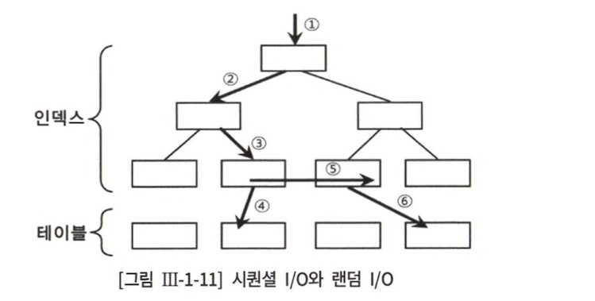
</div>

- `sequential access` : 차례대로 읽어 나가는 방식(1 ~ 5)
- `random access` : 한 건을 읽기 위해 한 블록씩 접근(4, 6)

I/O tuning 핵심 원리
- sequential access 선택 비중 &uarr; = 읽은 총 건수 중 결과 집합으로 선택되는 비중 &uarr; = 얼마나 적은 레코드로 읽느냐
- random access 발생량 &darr;

<table>
<tr>
<td align="center" colspan="3">Sequential Access 선택 비중 높이기</td>
</tr>
<tr>
<td align="center">query</td>
<td align="center">결과</td>
<td align="center">설명</td>
</tr>
<tr>
<td>

```sql
select count(*)
from t;
```
</td>
<td>

</td>
<td>
49,906 레코드 저장
</td>
</tr>
<tr>
<td>

```sql
select count(*)
from t
where owner like 'SYS%';
```
</td>
<td>
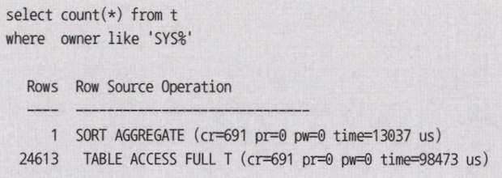
</td>
<td>
24,613개 레코드 선택 위해 49,906 레코드 조회 &rarr; 49%<br>
조회한 블록 수 = 691개
</td>
</tr>
<tr>
<td>

```sql
select count(*)
from t
where owner like 'SYS%' and
      object_name = 'ALL_OBJECTS';
```
</td>
<td>
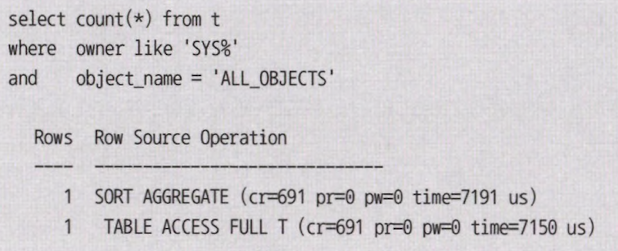
</td>
<td>
1개 레코드 선택 위해 49,906 레코드 조회 &rarr; 0.002%(table full scan 비효율 &uarr; &uarr; &uarr;)
</td>
</tr>
<tr>
<td>

```sql
create index t_index on t(owner, object_name);

select /** index(t t_index) */ count(*)
from t
where owner like 'SYS%' and
      object_name = 'ALL_OBJECTS';
```
</td>
<td>
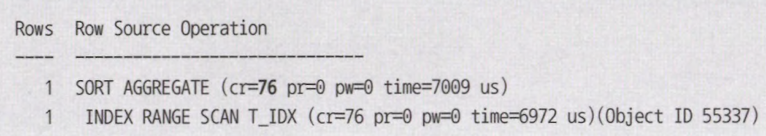
</td>
<td>
조회하는 컬럼이 모두 인덱스에 있어 인덱스만 스캔하여 결과 조회 가능<br>
1개 레코드 읽기 위해 76개 블록 조회
</td>
</tr>
<tr>
<td>

```sql
create index t_index on t(object_name, owner);

select /** index(t t_index) */ count(*)
from t
where owner like 'SYS%' and
      object_name = 'ALL_OBJECTS';
```
</td>
<td>
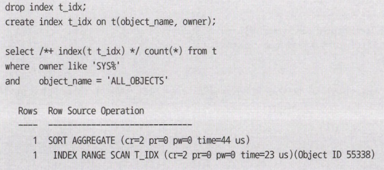
</td>
<td>
루트와 리프, 단 2개의 인덱스 블록만 읽어 가장 효율적인 방식으로 sequential access 수행
</td>
</tr>
</table>

<table>
<tr>
<td colspan="3" align="center">Random Access 발생량 줄이기</td>
</tr>
<tr>
<td align="center">query</td>
<td align="center">결과</td>
<td align="center">설명</td>
</tr>
<tr>
<td>

```sql
create index t_index on t(owner);

select object_id
from t
where owner = 'SYS' and
      object_name = 'ALL_OBJECTS';
```
</td>
<td>
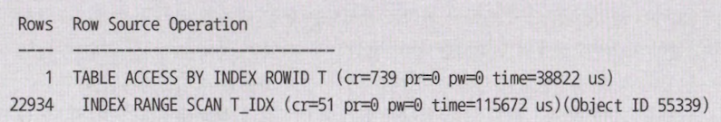
</td>
<td>
index로부터 조건을 만족하는 22,943 건을 읽어 그 횟수만큼 random access
</td>
</tr>
<tr>
<td>

```sql
create index t_index on t(owner, object_name);

select object_id
from t
where owner = 'SYS' and
      object_name = 'ALL_OBJECTS';
```
</td>
<td>
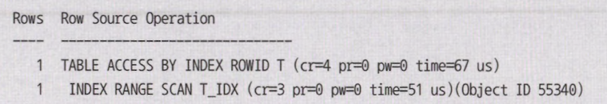
</td>
<td>
index로부터 1건 출력하여 테이블 1번 조회<br>
실제 발생한 random access도 1(= 4 - 3)번
</td>
</tr>
</table>

### 4. Single Block I/O vs MultiBlock I/O

> `Single Block I/O` = 한번의 I/O 에 하나의 데이터 블록만 읽어 메모리에 적재 ex) index 조회<br> 
> `MultiBlock I/O` = I/O 필요한 시점에 인접한 블록을 같이 읽어 메모리 적재 ex) full scan

<table>
<tr>
<td align="center">Single Block I/O</td>
<td align="center">MultiBlock I/O</td>
</tr>
<tr>
<td>
64개 index block 읽으면서 64번 I/O(= db file sequential read 대기 이벤트) 발생
</td>
<td>
<div align="center">
    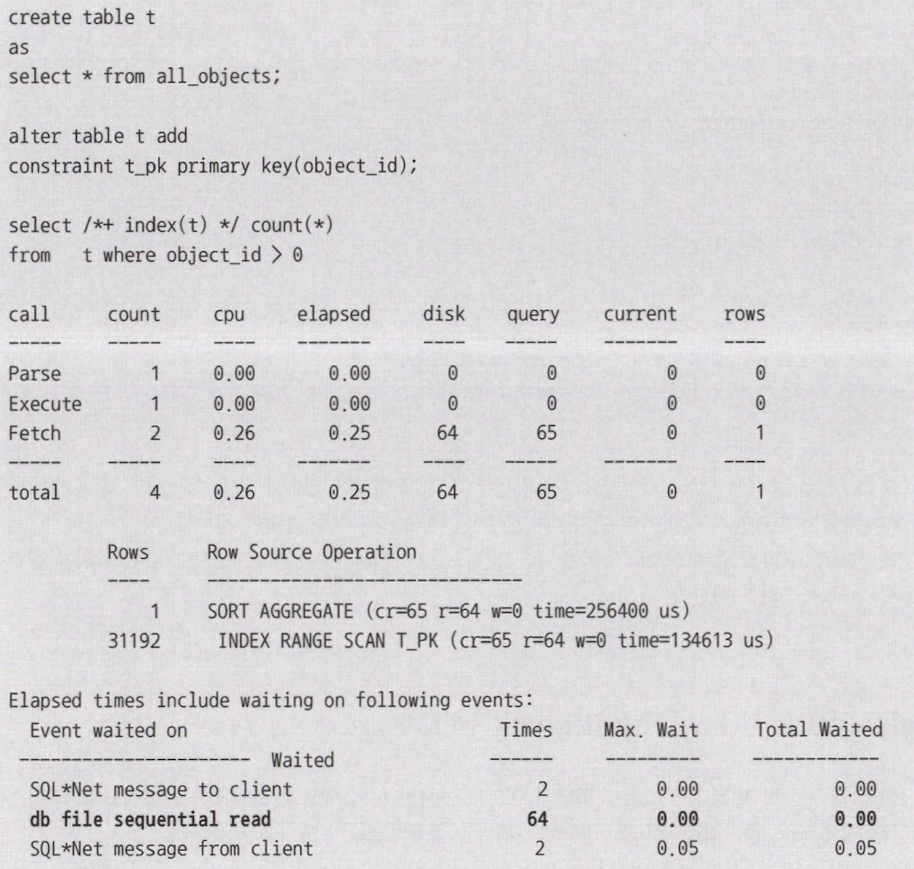
</div>
</td>
</tr>
<tr>
<td>
64개 block을 disk에서 읽었지만 I/O(= db file scattered read) 9번 발생
</td>
<td>
<div align="center">
    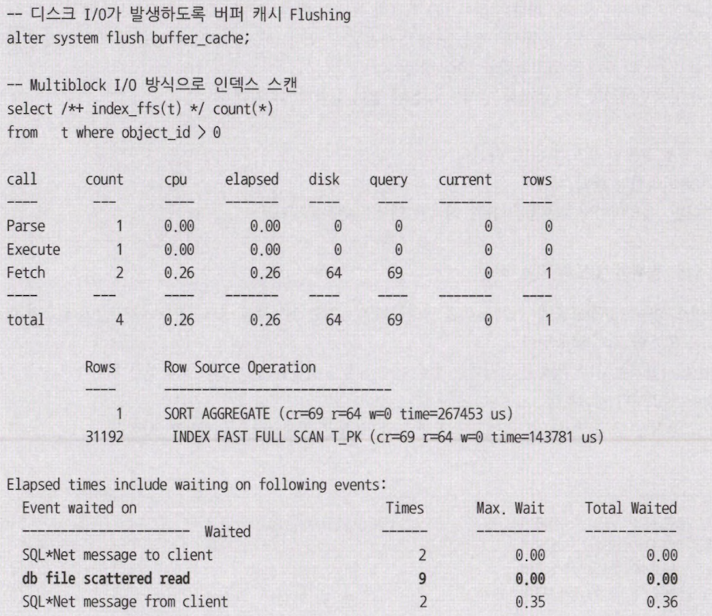
</div>
</td>
</tr>
</table>
