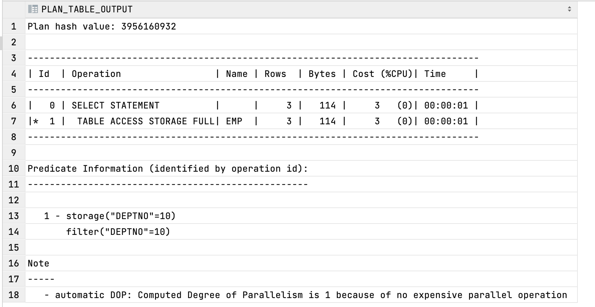
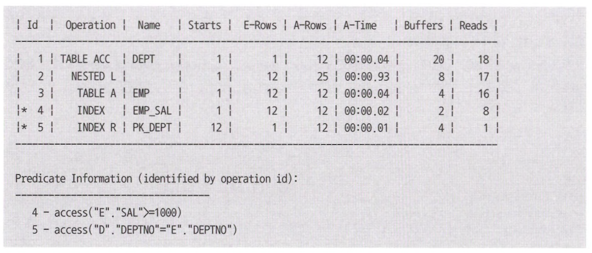
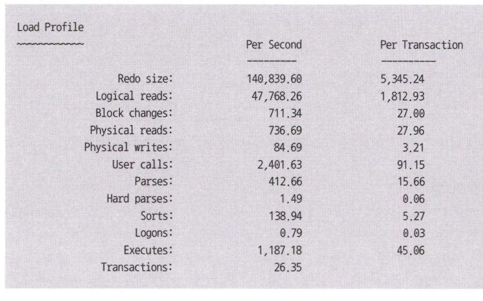
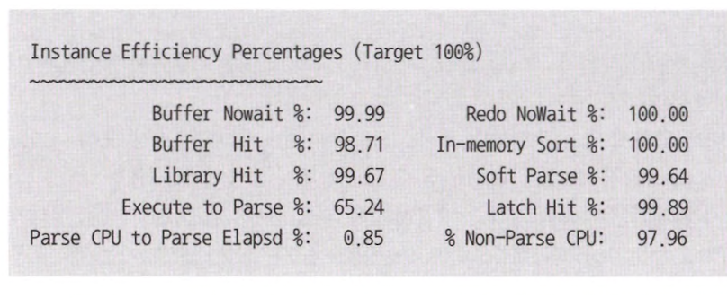
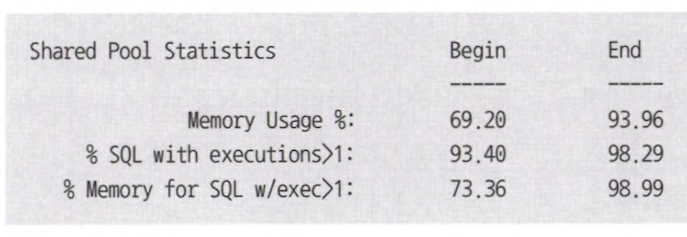

# 2장 SQL 분석 도구

## 1절 예상 실행계획

> 실행 계획이란, SQL을 최적으로 수행하고자 DBMS가 내부적으로 수립한 처리 절차

<table>
<tr>
<td align="center">query</td><td align="center">결과</td>
</tr>
<tr>
<td>

```sql
explain plan 
    set statement_id = 'query' 
    for
        select * 
        from emp 
        where DEPTNO = '10';

select * 
from table(dbms_xplan.display);
```
</td>
<td>

</td>
</tr>
</table>

## 2절 SQL 트레이스

> [SQL Trace](http://www.gurubee.net/lecture/1842)란? SQL 실행 통계를 세션 별로 모아 Trace 파일 생성

- 세션과 인스턴스 레벨에서 SQL 분석 가능
- 인스턴스 레벨로 Trace를 수행시키면 수행 능력 20~30% &darr;<br>
&rArr; 세션 레벨로 Trace 파일 생성

#### SQL 트레이스 분석

|   항목    |설명|
|:-------:|:----|
|  call   |parse : 커서를 파싱하고 실행 계획 생성 통계<br>execute : 커서 실행 단계 통계<br>fetch : 레코드를 실재로 fetch 하는 통계|
|  count  |parse, execute, fetch 각 단계 수행 횟수|
|   cpu   |현재 커서가 각 단계에서 사용한 cpu time|
| elapsed |현재 커서가 각 단계를 수행하는데 소요 시간|
|  disk   |디스크로부터 읽은 블록 수|
|  query  |consistent 모드에서 읽은 블록 수|
| current |current 모드에서 읽은 블록 수|
|  rows   |각 단계에서 읽거나 갱싱한 처리 건수|

| dbms_xplan | sql trace | 설명                |
|:----------:|:---------:|:------------------|
|   A-Rows   |   rows    | 각 단계에서 읽거나 갱신한 건수 |
|   A-Time   |   time    | 각 단계별 소요 시간       |
|  Buffers   |    cr     | 캐시에서 읽은 버퍼 블록 수   |
|   Reads    |    pr     | 디스크로부터 읽은 블록 수    |


<table>
<tr>
<td align="center">query</td><td align="center">결과</td>
</tr>
<tr>
<td>

```sql
select *
from table(
    DBMS_XPLAN.DISPLAY_CURSOR(null, null, 'allstats')
);
```
</td>
<td>

</td>
</tr>
</table>

## 3절 응답 시간 분석

### 1. 대기 이벤트

> 대기 이벤트란, 프로세스가 일을 처리하기 위해 다른 프로세스가 마칠 때까지 기다려야 하는 상황<br>
> 이 때 해당 프로세스는 일을 진행할 수 있는 조건이 충족될 때 까지 sleep 상태 대기

### 2. 응답 시간 분석

> Response Time = Service Time + Wait Time<br>
> &nbsp;&nbsp;&nbsp;&nbsp;&nbsp;&nbsp;&nbsp;&nbsp;&nbsp;&nbsp;&nbsp;&nbsp;&nbsp;&nbsp;&nbsp;&nbsp;&nbsp;&nbsp;&nbsp;&nbsp;&nbsp;&nbsp;&nbsp;&nbsp;&nbsp;
> = CPU Time + Queue Time

- `service time` : 프로세스가 정상적으로 동작하여 일을 수행한 시간(= `cpu time`)
- `wait time` : 프로세스가 잠시 수행을 멈추고 대기한 시간(= `queue time`)

### 3. AWR

> Automatic Workload Repository란, 응답 시가 분석 방법론 지원하는 Oracle 표준 도구

```shell
@?/rdbms/adimin/awrrpt
```

#### 1) 부하 프로필



- `per second` = 각 측정 지표 값들을 측정 시간으로 나눔(= 초당 부하 발생량)
- `per transaction` = commit, rollback 수행 횟수

#### 2) 인스턴스 효율



- `execute to parse $` 항목을 제외하면 모두 100% 가까워야함
- `Parse CPU to Parse Elapsed %` 항목이 0.85%인 이유 = active 프로세스 폭증으로 인해 과도한 parse call 발생(= 장애 상황)

#### 3) 공유 풀 통계



- Active 프로세스 폭증으로 인해 과도한 parse call로 os 레벨에서 paging까지 심하게 발생한 장애 상황
- Cpu time이 Total Call Time에서 차지하는 비중이 가장 높아야함