# 3장 인덱스 튜닝

## 1절 인덱스 기본 원리

### 1. 인덱스 구조

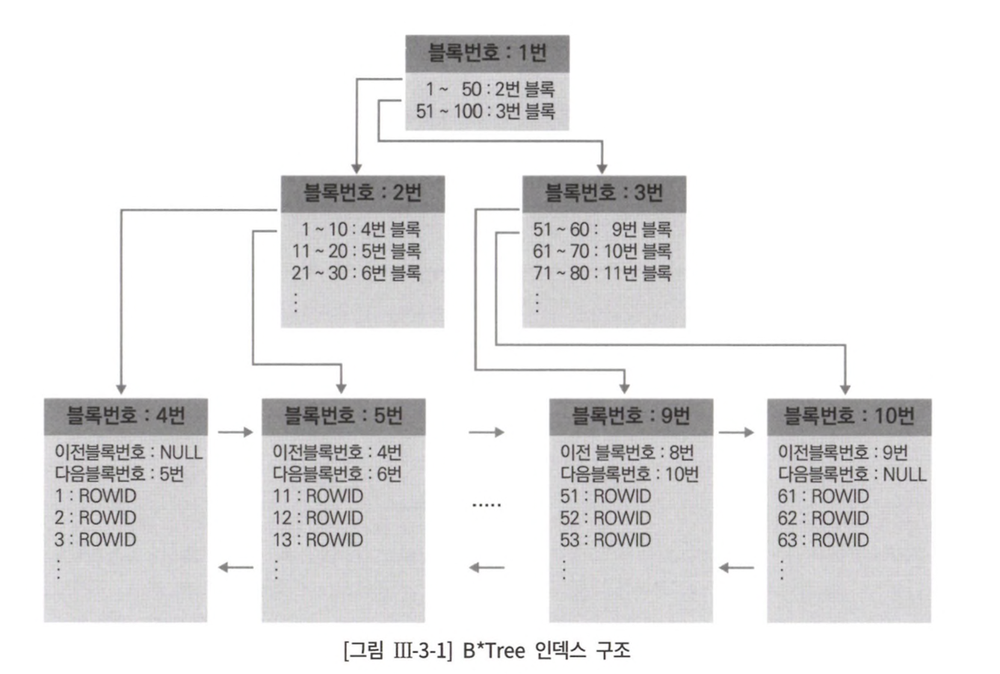

- index height = `root ~ leaf` 거리
- leaf block = index key 값과 그 key 값에 해당하는 테이블 레코드를 찾아가는데 필요한 주소 정보 가짐
- leaf block은 항상 index key로 정렬, range scan 가능, double linked list 구조로 연결
- Oracle에선 인덱스 구성 컬럼이 모두 Null인 레코드 인덱스 저장 x
- SQL Server에선 인덱스 구성 컬럼이 모두 null인 레코드 인덱스 저장

#### 인덱스 탐색

> 인덱스 탐색 과정 = 수직적 탐색 + 수평적 탐색

- `수평적 탐색` = index leaf block에 저장된 레코드끼리 연결된 순서에 따라 좌 ~ 우 스캔
- `수직적 탐색` = root ~ leaf 아래쪽으로 진행

### 2. 다양한 인덱스 스캔 방식

#### Index Range Scan

> index root block에서 leaf block까지 수직적으로 탐색 후 leaf block을 필요한 range만 스캔

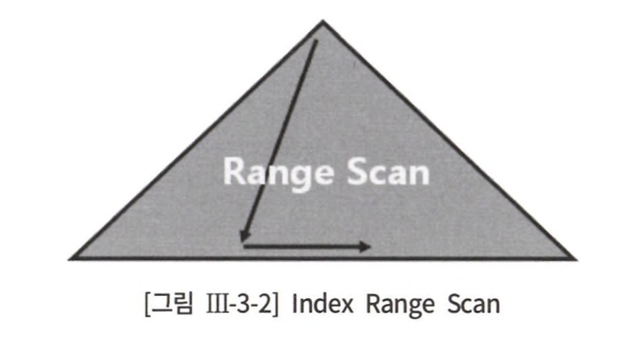

- index range scan이 항상 **빠른 속도 보장 x** &rarr; table access 횟수 줄이는게 관건
- index range scan 통한 쿼리는 index column 순으로 정렬 &rarr; order by, min/max 생략 가능

#### Index Full Scan

> index leaf block을 처음부터 끝까지 수평적으로 탐색

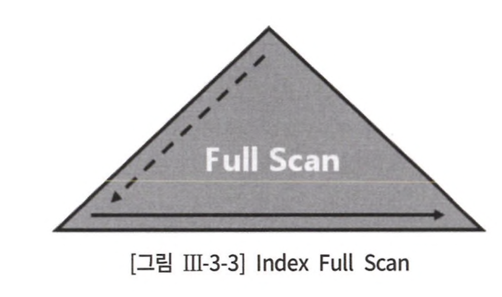

- 데이터 검색을 위한 최적 인덱스가 없을때 차선으로 선택됨
- 데이터 저장 공간 = column 길이 * record 수 &rarr; 인덱스 공간 <<<< 테이블
- index full scan 효율 사례 = 연봉이 5000 초과 하는 사원이 극히 일부인 경우
- index full scan 비효율 사례 = 연봉이 1000 초과 하는 사원(대부분의 사원 연봉이 1000 초과) &rarr; 거의 모든 record table access 발생(table full scan, index range scan 보다 비효율)
  - order by, min/max 목적이라면 index full scan이 더 효율
- index full scan 통한 쿼리는 index column 순으로 정렬 &rarr; order by, min/max 생략 가능

#### Index Unique Scan

> 수직적 탐색만으로 데이터 찾는 방식, Unique 인덱스 조건으로 탐색하는 경우 해당

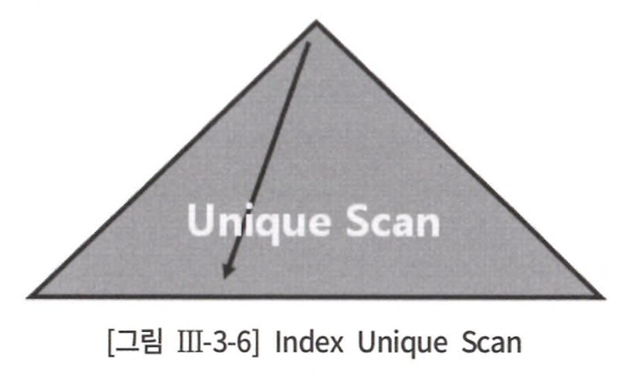

#### Index Skip Scan

> root block에서 읽은 정보를 통해 조건에 부합하는 record를 포함할 `가능성이 있는` 하위 block access 방식

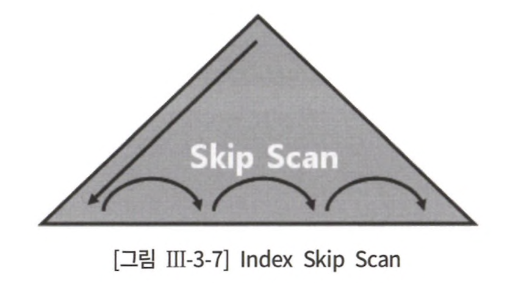

- 조건절에 빠진 index 선두 column distinct value가 적고 후행 column distinct value가 많을 때 유용 &rarr; ..?? 무슨 의미??,,

#### Index Fast Full Scan

> index tree 구조를 무시하고 index segment 전체를 Multiblock Read 방식으로 스캔

- `Singleblock Read` : 한번의 I/O Call에 하나의 데이터 블록만 읽어 메모리에 적재 &rarr; db file sequential read 
- `MultiBlock Read` : I/O Call 시점에 인접한 블록들을 같이 읽어 메모리에 적재 &rarr; db file scattered read
  - `인접한 블록` : 한 extent 내에 속한 블록

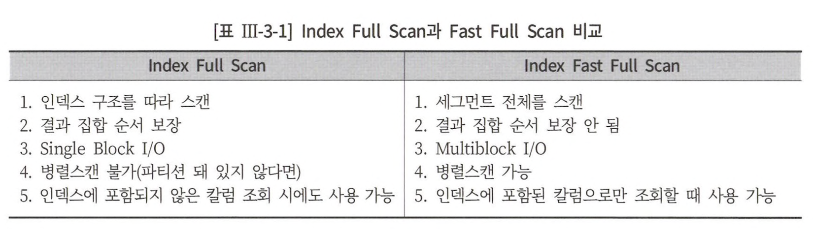

#### Index Range Scan Descending

> Index Range Scan + 내림차순 정렬된 결과 집합

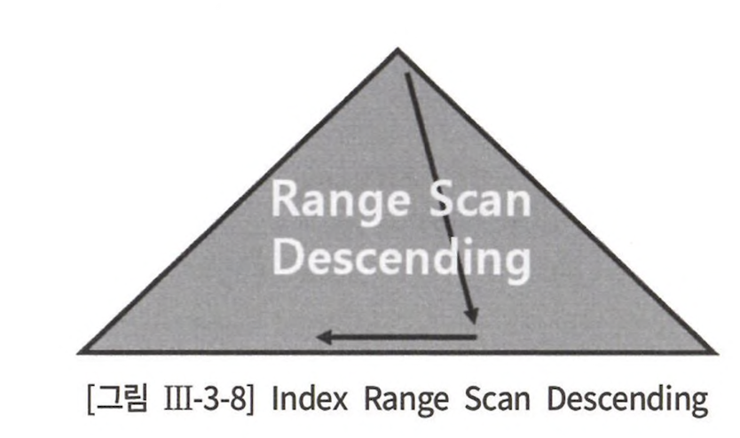

- index 값으로 max 함수를 사용하면 인덱스를 뒤에서부터 한 건만 읽고 멈춤

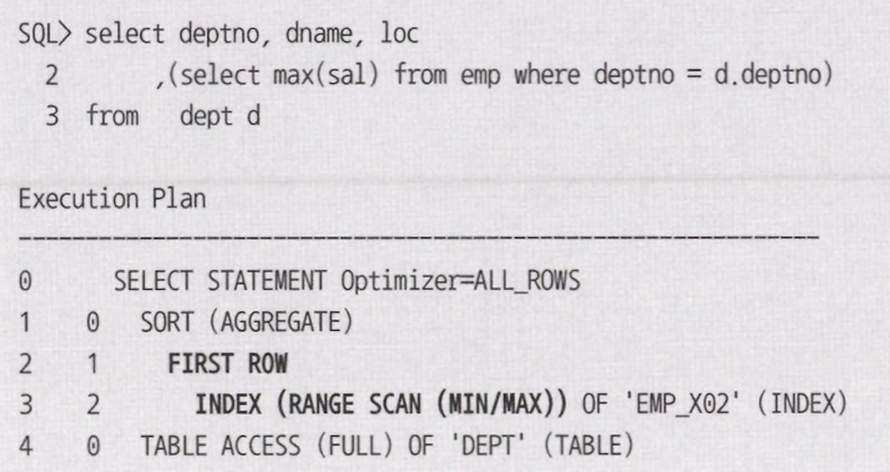

### 3. 인덱스 종류

#### Index Fragmentation(= index 단편화)

#### 1) Unbalanced Index

> 다른 leaf node에 비해 root block 거리가 더 멀거나 가까운 leaf node 발생 가능

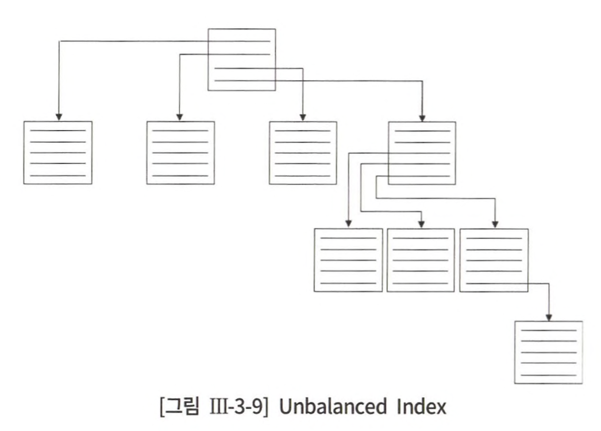

- delete 동작으로 발생 가능
- B*Tree 구조에선 발생 x

**B(= balanced)Tree**
- `index root ~ leaf block`까지 어떤 값으로 탐색하더라도 읽는 블록 수가 같다
- `root ~ leaf block` height 동일

#### 2) Index Skew

> index entry가 왼쪽 또는 오른쪽에 치우치는 현상

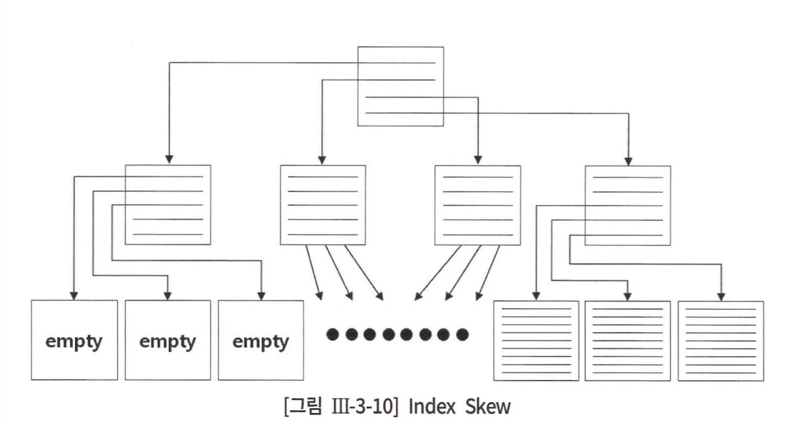


- 대량 delete 이후 인덱스 왼쪽 leaf block empty, 오른쪽은 꽉참

```sql
delete from t where no <= 5000;
```

- 텅 빈 index block은 commit 하는 순간 freelist로 반환되지만 index 구조는 그대로 존재
- 상위 block에서 leaf block을 가리키는 entry가 그대로 남아있어 재사용 가능
- 새로운 값이 입력되기 전 다른 node에 index 분할이 발생되면 재사용 가능 &rarr; 상위 block에서 leaf block을 가리키는 entry가 제거돼 다른 branch 자식 node로 이동하고 freelist에서 제거<br>
&rArr; record가 모두 삭제된 block은 재사용 가능하지만, 다시 채워질때까지 index scan 효율 &darr; &darr;

#### 3) Index Sparse

> index block density가 떨어지는 현상

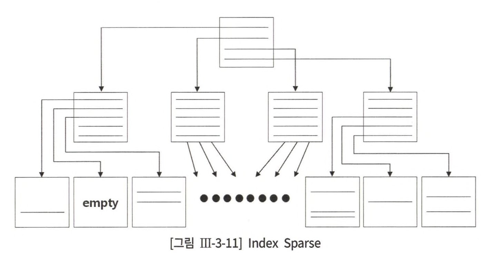

- delete 이후 index block density 50% ex) 100만건 중 50만건 지우더라도 index block 수 = 2001개
- index scan 효율 &darr;
- 지워진 자리에 새로운 값이 입력되지 않으면 영영 재사용 안될 수 있음 &rarr; leaf block 가리키는 entry 삭제 불가능<br>
&rArr; record 수가 일정한데도 index 공간 사용량이 계속 커질 수 있음

#### 비트맵 인덱스

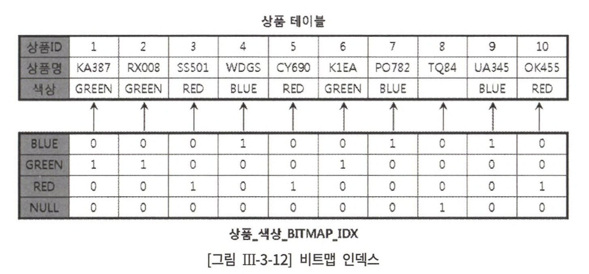

- distinct value 개수가 적을 때 효율 &darr; &rarr; 다양한 조건절이 사용되는 쿼리에 유리
- B*Tree index보다 훨씬 적은 용량 차지 &rarr; index가 여러개 필요한 대용량 테이블에 유리 
- distinct value 개수가 많으면 B*Tree index 보다 공간 많이 차지
- Lock에 의한 DML 부하 심함 &rarr; record 하나만 변경되더라도 비트맵 범위에 속한 모든 레코드 lock
- OLAP 환경에 적합

#### 리버스 키 인덱스

> index 값을 거꾸로 변환하여 저장하는 인덱스


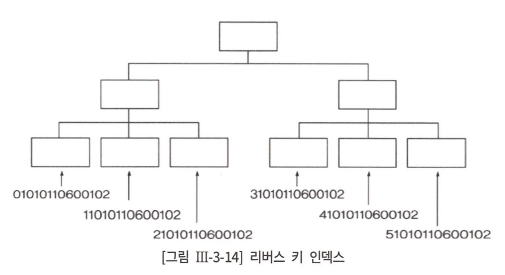

```sql
create index 주문_idx01 on 주문( reverse(주문일시) )
```

- AI, 주문일시 같은 컬럼에 인덱스 만들면 순차적으로 증가하여 가장 오른쪽 leaf block에만 데이터 생성 &rarr; right growing(= right hand) index
- 동시 insert가 심할 때 index race가 일어나 tps &darr;
- reverse key index를 통해 데이터 고르게 분포
- index range scan 불가능 ∵ 데이터를 거꾸로 입력하여 = 조건으로만 검색 가능

#### 클러스터 인덱스

> 클러스터 key 값이 같은 레코드가 한 블록에 모이도록 저장

> [IOT(= Index-Organized Table)](https://jungmina.com/726https://jungmina.com/726) 이란, 처음부터 인덱스 구조로 생성된 테이블<br>
- index leaf block = data record
- 정렬 상태를 유지하며 저장

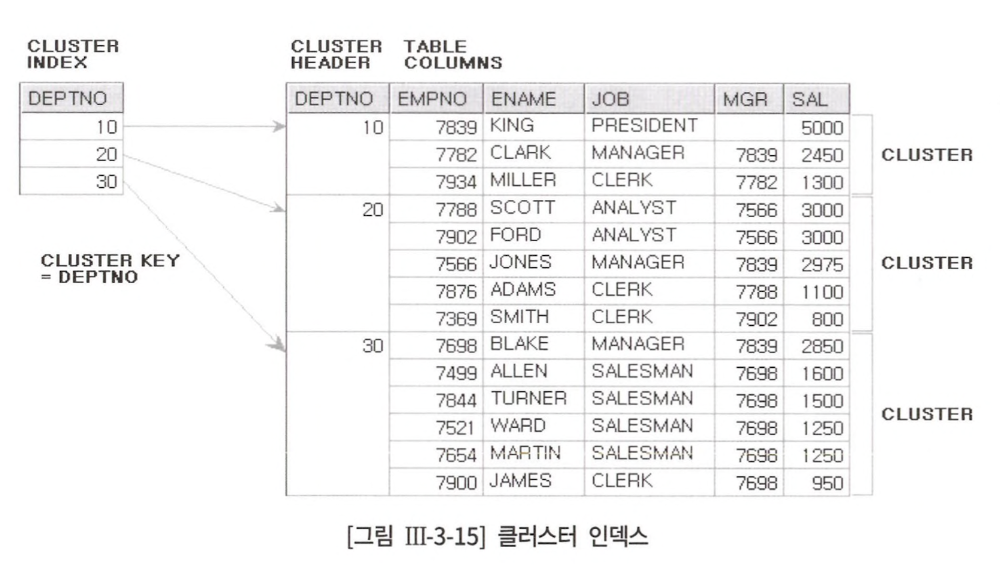

- 한 block에 모두 담을 수 없을 땐 새로운 block을 할당하여 cluster chain으로 연결
- B*Tree index를 사용하지만 해당 key 값을 저장하는 첫번째 데이터 블록만 가리킴
- cluster index key 항상 unique
- cluster key 새로운 값이 자주 입력되는(= 새 클러스터 할당), 수정이 자주 발생되는(= 클러스터 이동) 부적합

활용 상황
- 넓은 범위 탐색
- 컬럼 수가 적고 row 수가 많은 테이블
- 데이터 입력과 조회 패턴이 서로 다른 테이블

  > ex) 100명 사원의 일별 실적 집계하는 테이블

  - 한 페이지에 100개 레코드 저장
  - 1년이면 365개 페이지 생성
  - 비클러스터형이면 사원마다 365개 데이터 페이지 random access
  - 사번이 첫번쨰 정렬 기준이 되도록 클러스터형 인덱스 생성 &rarr; 한 페이지만 읽어 처리 가능

### 4. 인덱스 튜닝 기초

#### 범위 스캔이 불가능하거나 인덱스 사용이 불가능한 경우

<table>
<tr>
<td align="center">설명</td><td align="center">query</td>
</tr>
<tr>
<td>
조건절에서 가공한 경우
</td>
<td>

```sql
select *
from 업체
where substr(업체명, 1, 2) = '대한'
```
</td>
</tr>
<tr>
<td>
부정형 비교
</td>
<td>

```sql
select *
from 고객
where 직업 <> '학생'
```
</td>
</tr>
</table>

<table>
<tr>
<td colspan="2" align="center">튜닝 방안</td>
</tr>
<tr>
<td align="center">AS-IS</td><td align="center">TO-BE</td>
</tr>
<tr>
<td>

```sql
select *
from 업체
where substr(업체명, 1, 2) = '대한'
```
</td>
<td>

```sql
select *
from 업체
where 업체명 like '대한%'
```
</td>
</tr>
<tr>
<td>

```sql
select *
from 사원
where 월급여 * 12 = 36000000 
```
</td>
<td>

```sql
select *
from 사원
where 월급여 = 36000000 / 12
```
</td>
</tr>
<tr>
<td>

```sql
select *
from 주문
where to_char(일시, 'yyyymmdd') = dt
```
</td>
<td>

```sql
select *
from 주문
where 일시 >= to_date(dt, 'yyyymmdd') and
      일시 < to_date(dt, 'yyyymmdd') + 1
```
</td>
</tr>
<tr>
<td>

```sql
select *
from 고객
where 연령 || 직업 = '30공무원'
```
</td>
<td>

```sql
select *
from 고객
where 연령 = 30 and
      직업 = '공무원'
```
</td>
</tr>
<tr>
<td>

```sql
select *
from 회원사지점
where 회원번호 || 지점 번호 = str
```
</td>
<td>

```sql
select *
from 회원사지점
where 회원번호 = substr(str, 1, 2) and
      지점번호 = substr(str, 3, 4)
```
</td>
</tr>
</table>

#### 묵시적 형변환

> 명시적으로 가공하지 않더라도 조건절에서 비교되는 두 값의 데이터 타입이 다르면 형변환 발생

```sql
select *
from emp
where deptno = '20'
```

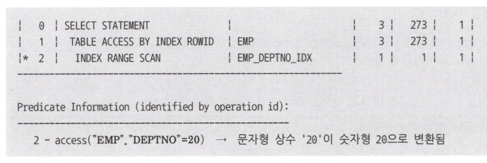

- deptno number 형이지만 optimizer가 자동으로 형변환
- 인덱스 정상 사용

```sql
select *
from emp
where cdeptno = 20
```

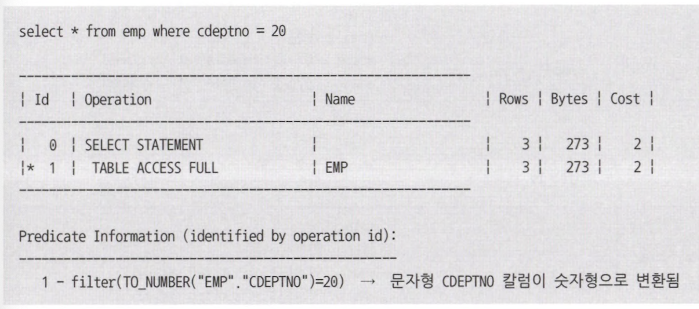

- cdeptno 문자형
- 인덱스 사용 불가 &rarr; full scan

## 2절 테이블 액세스 최소화


> [ROWID](https://m.blog.naver.com/regenesis90/222206835812)란, 데이터 주소

<table>
<tr>
<td align="center">query</td><td align="center">결과</td>
</tr>
<tr>
<td>

```sql
select ROWID,
       EMPNO,
       ENAME,
       JOB
from emp;
```
</td>
<td>
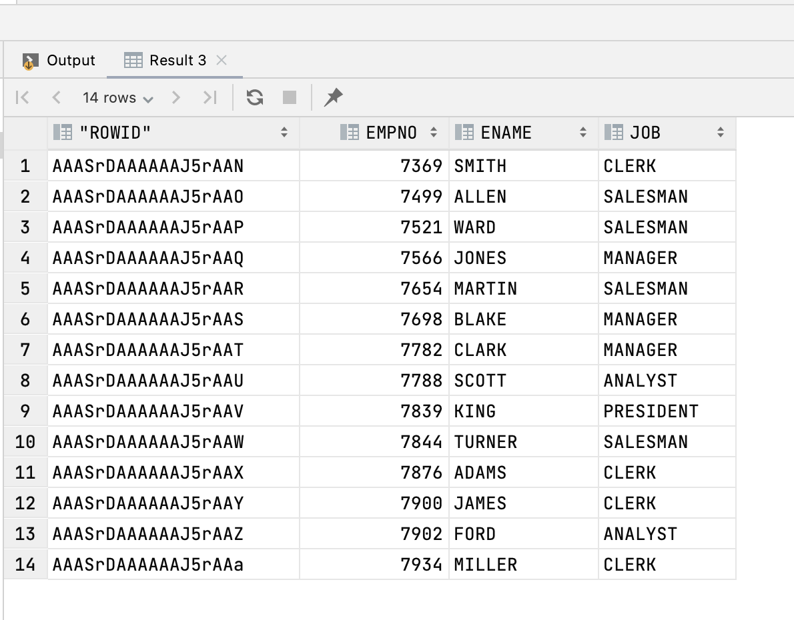
</td>
</tr>
</table>

### 1. 인덱스 ROWID에 의한 테이블 랜덤 액세스

> 쿼리에서 참조되는 컬럼이 인덱스에 모두 포함되는 경우가 아니라면 table random access 발생

#### 인덱스 ROWID를 이용해 table block 조회 메커니즘

- 인덱스에서 하나의 rowid 조회 후 디스크 상의 블록 위치 정보(= DBA)를 해시 함수에 적용해 해시 값 확인
- 해시 값으로 해시 버킷 조회
- 해시 버킷으로 블록 헤더 조회
- 블록 헤더로 버퍼 블록 조회
- 블록 헤더 찾지 못하면 LRU 리스트를 스캔하여 Free buffer 조회
- Free buffer 조회 실패하면 Diry buffer를 디스크에 기록하여 free buffer 확보
- Free buffer 확보 후 disk에서 블록을 읽어 캐시 적재

#### [ROWID로 index scan 방안](https://truman.tistory.com/59)

<table>
<tr>
<td align="center">ROWID X</td><td align="center">ROWID O</td>
</tr>
<tr>
<td>
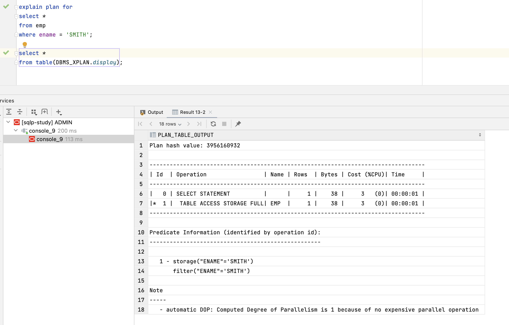
</td>
<td>
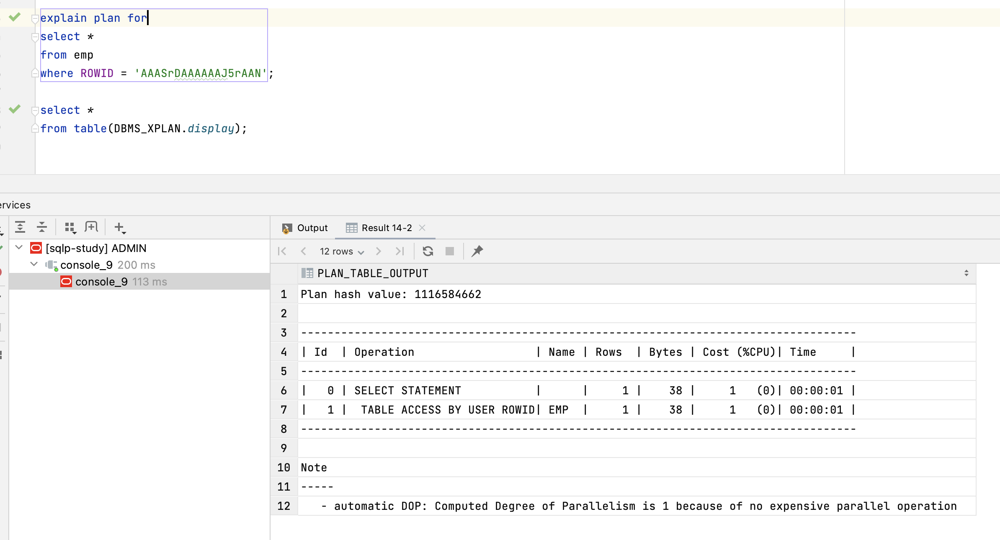
</td>
</tr>
</table>

#### 클러스터링 팩터

> 데이터가 모여 있는 정도(= 군집성 계수)

<table>
<tr>
<td align="center">good</td><td align="center">bad</td>
</tr>
<tr>
<td>
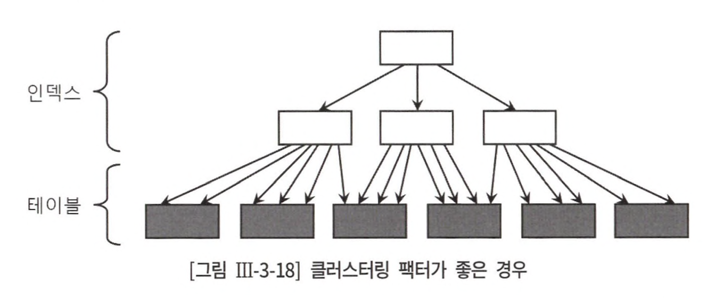
</td>
<td>
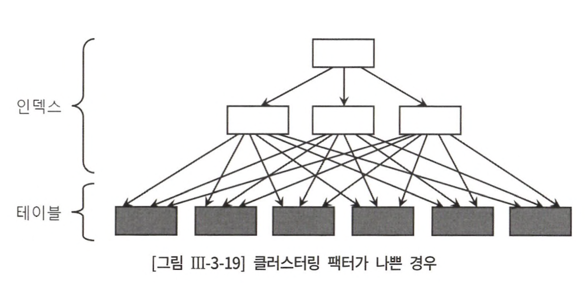
</td>
</tr>
</table>

- 클러스터링 팩터가 좋은 컬럼에 생성한 인덱스 검색 효율 &uarr;
- 데이터가 물리적으로 근접하면 데이터 찾는 속도 &uarr;

#### 인덱스 손익 분기점

> 손익 분기점이란, index range scan에 의한 access 속도 < table full scan 속도 지점

- 인덱스 손익 분기점 = 10% &rarr; 1000개 중 100개 레코드 이상을 읽을 때는 table full scan 유리
- 일반적으로 5~20%, 클러스터링 팩터가 나쁘면 손익분기점 5% 미만, 아주 좋으면 90% 이상
- index access가 table full scan보다 더 느리게 만드는 요인
  - index rowid table access : random access, table full scan : sequential access
  - disk i/o 시 index rowid table access : single block read, full table scan : multiblock read

#### 손익 분기점 극복하기

- 클러스터형 인덱스 + Oracle IOT
- SQL Server Include Index &rarr; 인덱스 키 외에 미리 지정한 컬럼을 leaf level에 함께 저장하여 random access &darr;
- Oracle Clustered table
- partitioning

### 2. 테이블 액세스 최소화 튜닝

#### 인덱스 컬럼 추가

<table>
<tr>
<td align="center">AS-IS</td><td align="center">TO-BE</td>
</tr>
<tr>
<td>

```sql
select *
from emp
where deptno = 30 and
      sal >= 2000
```
</td>
<td>

```sql
select *
from emp
where deptno = 30 and
      job = 'CLERK'
```
</td>
</tr>
<tr>
<td>

- 위 조건 만족하는 사원 1명이지만 table access 6번 발생
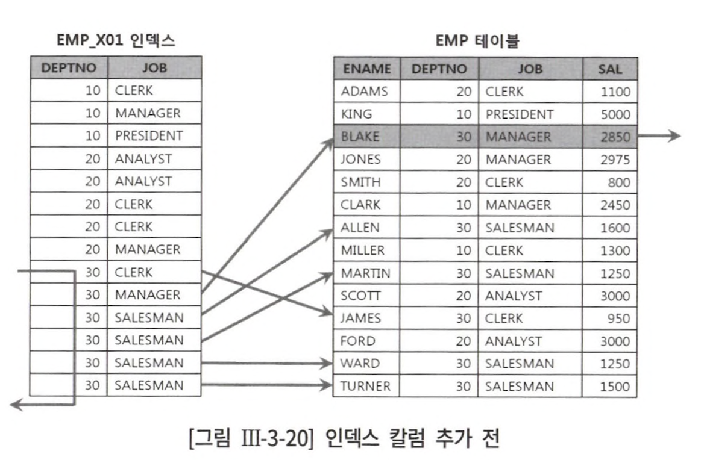
</td>
<td>

- index scan량은 줄지 않지만, table random access 횟수 &darr; 
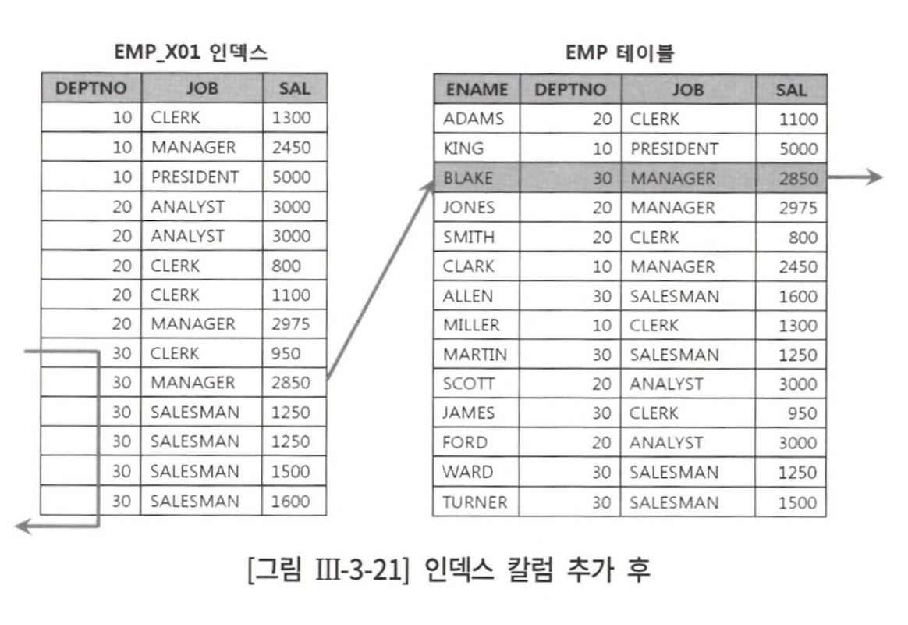
</td>
</tr>
</table>

## 3절 인덱스 스캔 효율화

#### I/O tuning 핵심 원리

1. random access &darr;
2. sequential access 선택 비중 &uarr;

- `sequential access` = 레코드간 논리적, 물리적 순서에 따라 차례대로 읽어 나감
- `random access` = 레코드간 논리적, 물리적 순서를 따르지 않고 한 블록씩 접근

### 1. 인덱스 선행 컬럼이 범위 조건일 때의 비효율

- 인덱스 구성 컬럼이 조건절에서 모두 등치(=) 조건으로 비교되면 leaf block scan하면서 읽은 레코드 모두 table access
- 읽고 버리는 레코드가 없어 index scan 효율 &uarr;&uarr;&uarr;

> 인덱스 구성 = (인터넷 매물 + 아파트 시세 코드 + 평형 + 평형 타입)

<table>
<tr>
<td align="center">good</td><td align="center">bad</td>
</tr>
<tr>
<td>

```sql
where 아파트 시세 코드 = a and
    평형 = b and
    평형 타입 between c and d
```
</td>
<td>

```sql
where 인터넷 매물 in (a, b) and
    아파트 시세 코드 = c and
    평형 = d and
    평형 타입 = e
```
</td>
</tr>
<tr>
<td>
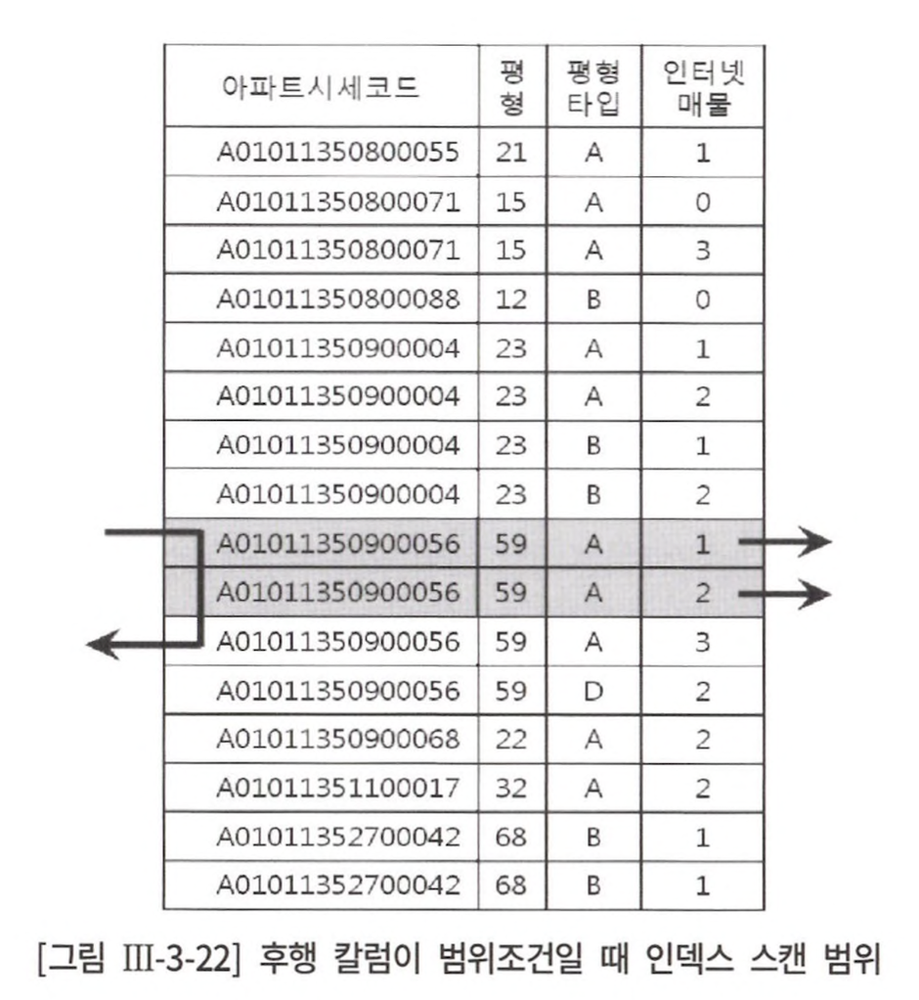
</td>
<td>
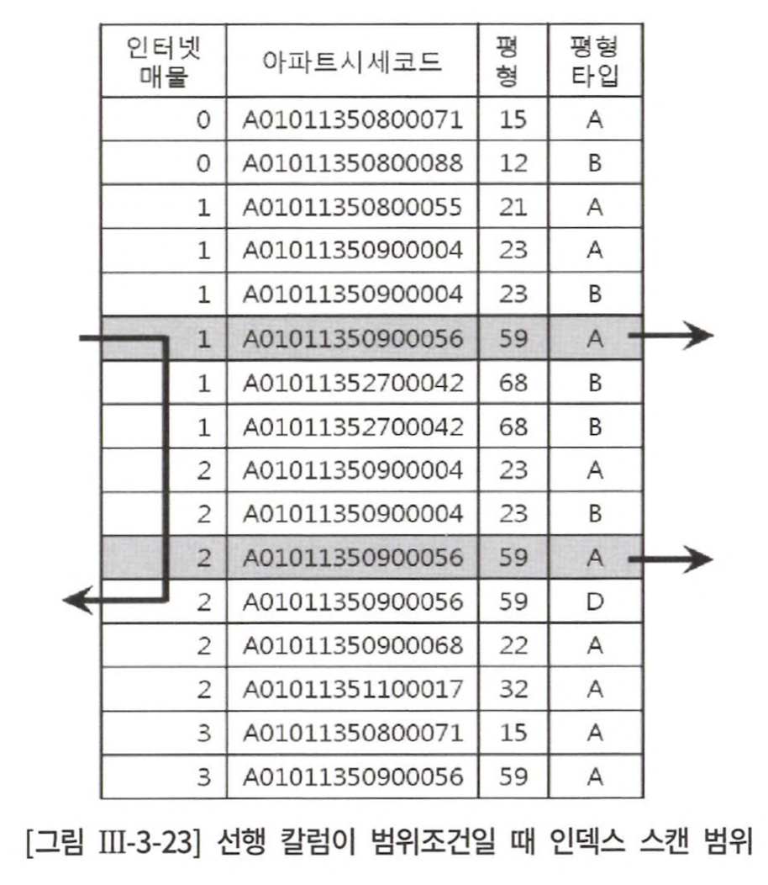
</td>
</tr>
</table>

### 2. 범위조건을 In-List로 전환

> `between` &rarr; `In-List`

<table>
<tr>
<td align="center">query</td><td align="center">결과</td>
</tr>
<tr>
<td>

```sql
where 인터넷 매물 in (a, b) and
    아파트 시세 코드 = c and
    평형 = d and
    평형 타입 = e
```
</td>
<td>
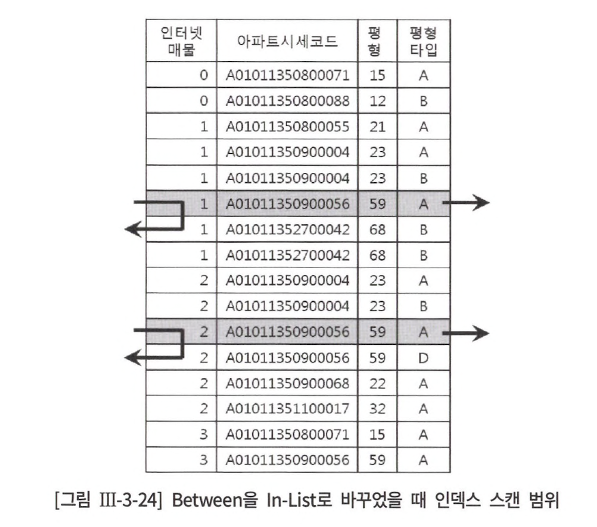
</td>
</tr>
<tr>
<td>

```sql
where 인터넷 매물 = a and
    아파트 시세 코드 = c and
    평형 = d and
    평형 타입 = e
union all
    where 인터넷 매물 = b and
    아파트 시세 코드 = c and
    평형 = d and
    평형 타입 = e
```
</td>
<td>

- 모두 등치 조건
- 인덱스를 두번 탐색하는 것과 동일한 효과
</td>
</tr>
</table>

- In-List 개수가 많지 않을때만 효율 &rarr; union all 너무 많으면 비효율 &rarr; index height이 높을 때 특히 비효율

### 3. 범위조건을 2개 이상 사용할 때의 비효율

> 첫번째 인덱스가 스캔 범위를 거의 결정하고, 두번째는 필터 조건 역할만 하는 경우 존재

<table>
<tr>
<td align="center">AS-IS</td><td align="center">TO-BE</td>
</tr>
<tr>
<td>

```sql
select *
from 가입상품
where 회사 = a and
      지역 like b and 
      상품명 like c
```
</td>
<td>

```sql
select *
from 가입상품
where 회사 = a and
      상품명 like c and
      b is null
union all
select *
from 가입상품
where 회사 = a and
      지역 = b and
      상품명 like c and 
      b is not null
```
</td>
</tr>
</table>

- union all 상단 쿼리까지 최적화하기 위해 (회사 + 상품명) 순으로 구성된 인덱스 추가 필요
- 인덱스 추가가 부담이면 (회사 + 상품명 + 지역) 수 변경 고려 가능 &rarr; union all 하단 쿼리 불리 &rarr; 상품명 조건 값 선택도 따라 결정