# 4장 조인 튜닝

## 1절 NL 조인

> 조인 컬럼을 선두로 갖는 인덱스가 있는지 매우 중요<br>
> ∵ outer table에서 읽히는 건마다 inner table 전체 스캔

### 1. 기본 메커니즘

<table>
<tr>
<td align="center">PL/SQL</td><td align="center">query</td>
</tr>
<tr>
<td>

```sql
begin
    for outer in (select deptno, empno, rpad(ename, 10) ename from emp)
    loop -- outer loop
        for inner in (select dname from dept where deptno = outer.deptno)
        loop --inner loop
            dbms_output.put_line(outer.empno || ' : ' || outer.ename || ' : ' || inner.dname);
        end loop;
    end loop;
end;
```
</td>
<td>

```sql
select /*+ ordered use_nl(d) */ e.empno, e.ename, d.dname
from emp e, dept d
where d.deptno = e.deptno

select /*+ leading use_nl(d) */ e.empno, e.ename, d.dname
from dept d, emp e
where d.deptno = e.deptno
```
</td>
</tr>
</table>

### 2. NL 조인 수행 과정 분석

<table>
<tr>
<td align="center">query</td><td align="center">실행 계획</td>
</tr>
<tr>
<td>

```sql
select /*+ ordered use_nl(e) */
    e.empno, 
    e.ename, 
    d.dname,
    e.job,
    e.sal
from dept d, emp e
where e.deptno = d.deptno and       # 1
      d.loc = 'SEOUL' and           # 2
      d.gb = '2' and                # 3
      e.sal >= 1500                 # 4
order by sal desc
```
</td>
<td>
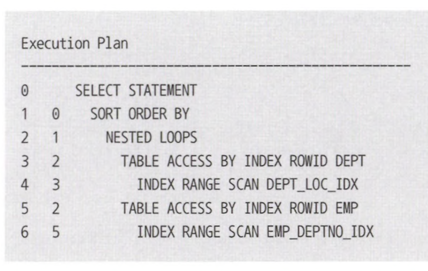
</td>
</tr>
<tr>
<td>

1. `dept_loc_idx` 인덱스 범위 스캔(ID = 4)
2. 인덱스 `rowid`로 dept table access(ID = 3)
3. `emp_deptno_idx` 인덱스 범위 스캔(ID = 6)
4. 인덱스 `rowid`로 emp table access(ID = 5)
5. sal 기준 내림차순 정렬(ID = 1)
</td>
<td>
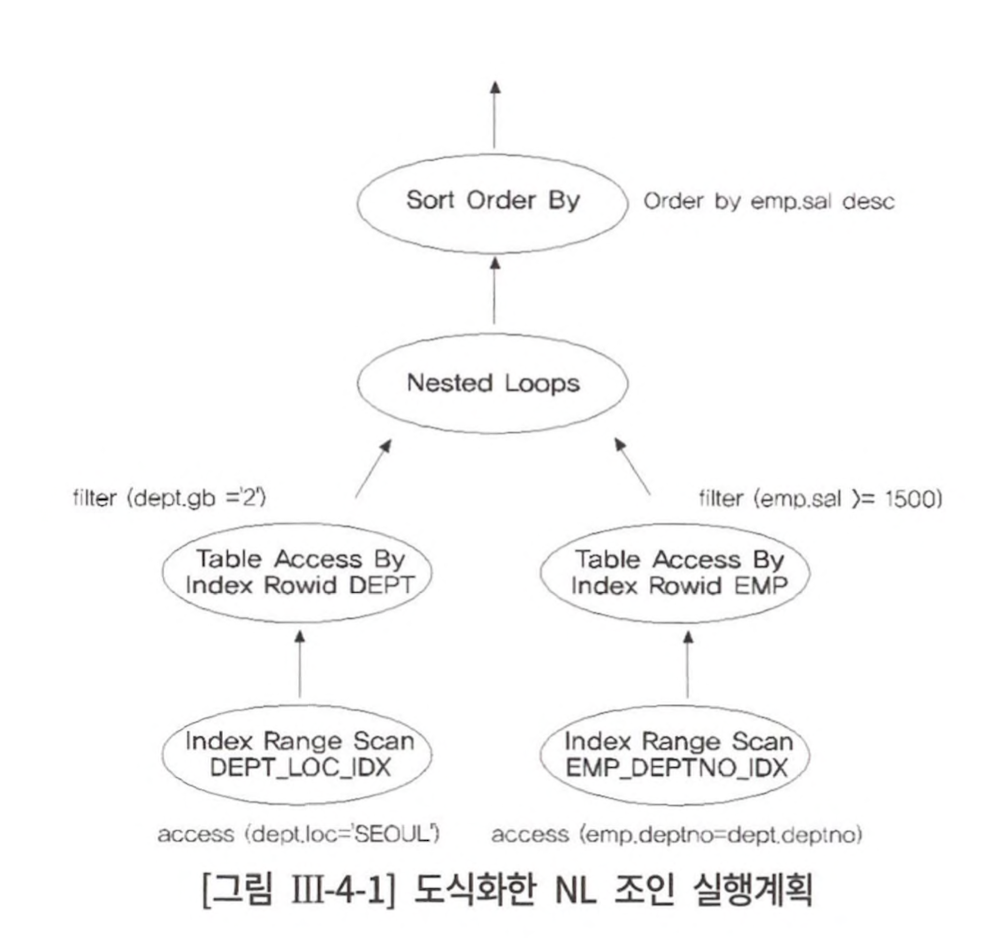
</td>
</tr>
<tr>
<td colspan="2">

1. `dept.loc = 'SEOUL` 조건을 만족하는 레코드 찾기 위해 `dept_loc_idx` index range scan
2. `dept_loc_idx` index에서 읽은 rowid를 가지고 dept table에 access 하여 `dept.gb = '2'` 필터 조건 만족 레코드 조회
3. dept 테이블에서 조회한 deptno를 통해 조인 조건을 만족하는 emp table 레코드를 찾기 위해 `emp_deptno_idx` index range scan
4. `emp_deptno_idx` index에서 읽은 rowid를 가지고 emp table에 access 하여 `sal >= 1500` 필터 조건 만족 레코드 조회
5. 1~4 과정을 통과한 레코드들은 sal column 기준 desc 후 결과 반환
</td>
</tr>
</table>

- 조건 비교 순서 = 2 &rarr; 3 &rarr; 1 &rarr; 4(query 주석 기준)
- Sibling Node = 위에서 아래로, Parent-Child Node = 안에서 밖으로, 자식부터 조회
- 각 단계 완료 후 다음 단계로 넘어가는 게 아니라 한 레코드씩 순차적으로 진행
  - order by는 작업 모두 완료 후 다음 작업 진행 ∵ 전체 집합 대상으로 정렬 필요

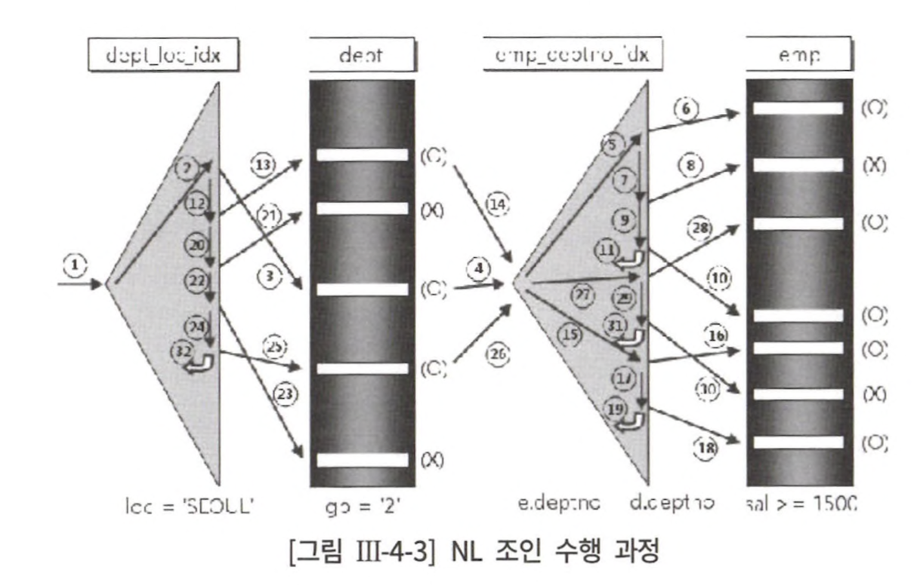

- (O) = table filter 조건에 의해 레코드가 걸러지지 않음, (X) = table filter 조건에 의해 레코드 걸리짐
- `ioc = 'SEOUL'` 조건으로 비효율 없이 6건 조회, 6건의 table random access 발생
- `gb = '2'` 조건에 의해 필터링 되는 비율이 높다면 `dept_loc_idx`에 gb column 추가 필요
- `emp_deptno_idx` = random access = outer table인 dept 조회 후 join access 발생 횟수(= 3회 - 4, 14, 26)
- `sal >= 1500` 조건에 의해 필터링 되는 비율이 높다면 `emp_deptno_idx` 인덱스에 sal column 추가 필요

### 3. NL 조인의 특징

#### 1. NL은 random access 위주의 조인 방식

- 대부분 DBMS block or page 단위로 I/O 수행
- 하나의 레코드를 읽기 위해 블록을 통째로 읽는 random access 방식은 memory buffer에서 읽어도 비효율 존재<br>
&rArr; NL은 **대량 데이터 조인할 때 매우 비효율**

#### 2. join을 한 레코드씩 순차적으로 진행

- **순차적으로 진행**하기 때문에 **먼저 access 되는 테이블 처리 범위**에 의해 전체 트래픽 결정

### 4. NL 조인 확장 메커니즘

> `Prefetch`, `Batch I/O` 기능 도입<br>
> 읽는 block마다 건건이 I/O Call 발생 시키는 비효율 줄이기 위함

- `Prefetch` : index를 통해 table access 하다가 disk I/O 필요해지면 곧 읽게될 block까지 미리 읽어 buffer cache 적재
- `Batch I/O` : disk I/O Call을 미뤘다가 읽을 블록이 일정량 쌓이면 한꺼번에  처리
  - inner table block을 모두 buffer cache에서 읽으면 성능 차이 x, but 일부를 disk에서 읽으면 성능, 정렬 순서 차이

<table>
<tr>
<td align="center">일반</td>
<td align="center">Prefetch</td>
<td align="center">Batch I/O</td>
</tr>
<tr>
<td>
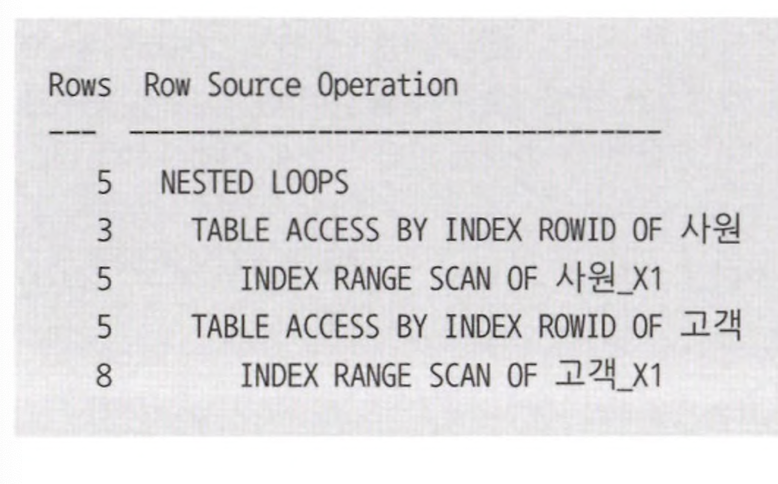
</td>
<td>
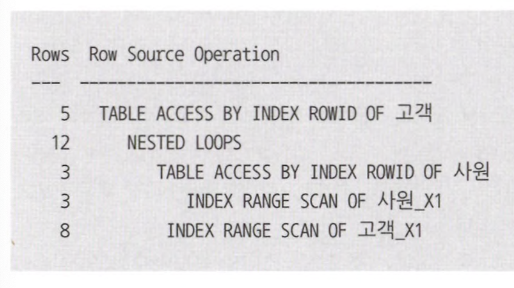
</td>
<td>
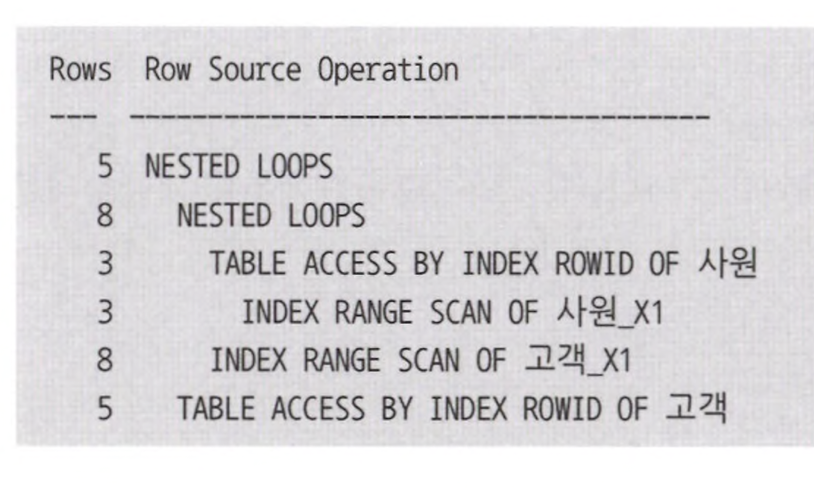
</td>
</tr>
</table>

## 2절 소트 머지 조인

> 두 테이블을 각각 정렬 후 두 집합을 merge 하면서 join 수행

1. `Sort 단계` : 양쪽 집합을 join column 기준으로 정렬
2. `Merge 단계` : 정렬된 양쪽 집합을 서로 merge

- join column에 index 있으면 Sort 단계 거치지 않고 바로 join 가능

### 1. 기본 메커니즘

<table>
<tr>
<td align="center">query</td><td align="center">수행 과정</td>
</tr>
<tr>
<td>
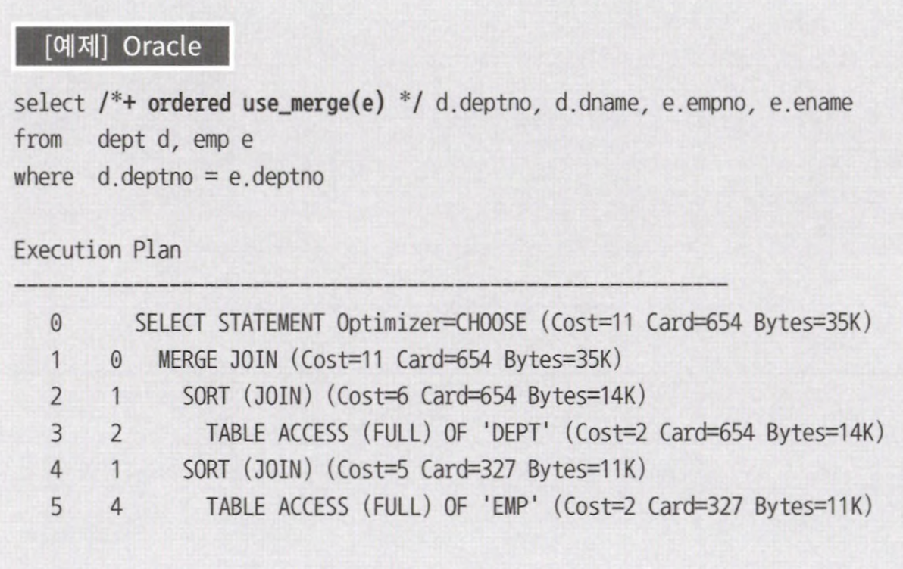
</td>
<td>
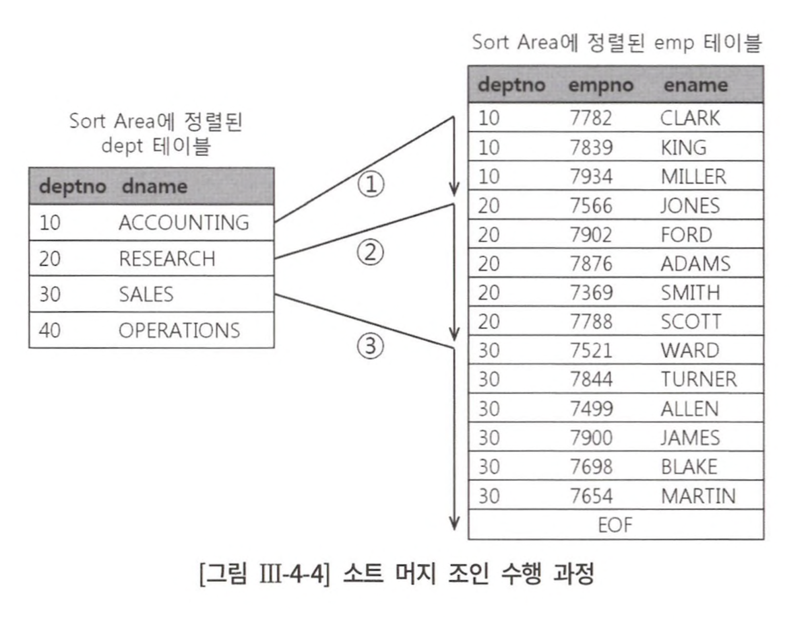
</td>
</tr>
</table>

#### pseudo code

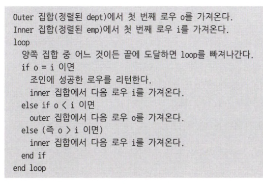

> NL 조인과 크게 다르지 않고 inner 집합과 outer 집합 미리 정렬한 점만 차이

- inner 집합 emp 테이블 정렬 상태 &rarr; join에 실패하는 레코드 만나는 순간 멈춤
- 스캔 시작점을 찾기 위해 매번 재탐색 필요 x &rarr; 2번 스캔은 1번에서 스캔하다 멈춘 지점 기억 후 거기서 시작
- outer 집합 dept 테이블도 정렬되어 있어 가능

### 2. 소트 머지 조인의 특징

#### 1. 조인 하기 전에 양쪽 집합 정렬

- NL 조인의 경우 대량 집합 조인은 랜덤 액세스 위주기에 비효율 &rarr; 이 비효율을 줄이고자 소트 머지 조인 나옴
- 만약 정렬 대상이 초대용량이면 성능 &darr; &rarr; 정렬 자체도 큰 비용 수반
- index나 정렬된 object 이용하면 정렬 없이 바로 조인할 수 있어 성능 &uarr;

#### 2. 부분적으로 부분범위처리 가능

- outer 테이블이 정렬된 상태에서 일부 row만 fetch 하다가 멈추면 outer 테이블 끝까지 조회 필요 x

#### 3. 테이블별 검색 조건에 의해 전체 일량 결정

- `NL Join` : outer 테이블 건마다 inner 테이블 탐색 &rarr; **outer 집합 내 조인 대상**이 되는 건수에 의해 전체 일량 결정
- `Sort Merge Join` : 두 테이블 각각 정렬 후 조인 &rarr; 각 **테이블 크기, 테이블별 검색 조건**에 의해 전체 일량 결정

#### 4. 스캔 위주의 조인 방식

- `NL Join` : random access 위주의 join
- `Sort Merge Join` : Scan 위주의 join &rarr; inner 테이블을 반복 조회하지 않기 때문
  - but, random access 전무는 x
  - 각 테이블 검색 조건으로 조회시 발생 가능

## 3절 해시 조인

> NL join, Sort Merge join 비효율 해결하고자 나온 Hash Join

<table>
<tr>
<td align="center">query</td><td align="center">수행 과정</td>
</tr>
<tr>
<td>
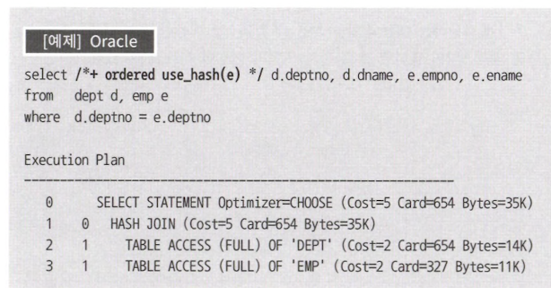
</td>
<td>
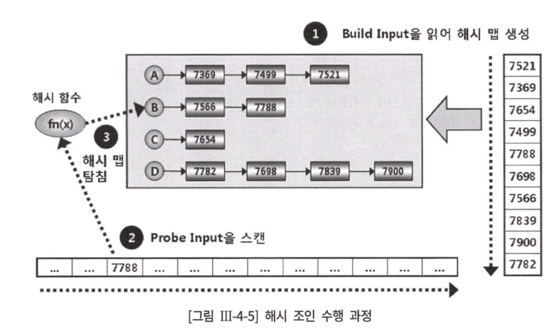
</td>
</tr>
</table>

> hash 함수 : 같은 입력값에 대해 같은 출력값 보장 함수<br>
> hash 충돌 : 다른 입력값에 출력값 같은 상황<br>
> hash 충돌 발생하면 입력값이 다른 엔트리가 한 hash bucket 내 저장 가능

- 둘 중 작은 테이블을 읽어 hash area에 hash table 생성
- 반대쪽 큰 집합을 읽어 hash table을 탐색하며 join

#### Hash Join 과정

1. hash table 생성

> hash table이란, hash bucket으로 구성된 배열

- 테이블 중 작다고 판단되는 테이블 읽어 hash 함수를 통해 hash table 생성
- 해시 값이 같은 데이터를 같은 버킷에 연결리스트로 연결

2. 선택되지 않은 나머지 데이터 집합 스캔

3. 데이터 조회

- hash 함수를 사용하여 hash table 탐색
- hash 함수에서 반환 받은 bucket 주소로 hash chain을 스캔하며 데이터 조회

#### 특징

- random access x, sorting x &rarr; only hash table 생성 비용
- **join 대상 테이블이 작을때** 효과적 &rarr; 대용량 테이블이면 disk 썼다가 다시 읽는 과정 필요
- **hash key값으로 사용되는 컬럼에 중복 값이 거의 없을 때** 효과적

### 2. Build Input이 가용 메모리 공간을 초과할 때 처리 방식

> In-Memory hash join이 불가능할 때 `Grace hash Join` 알고리즘 사용

#### Grace Hash Join 순서

1. 파티션 단계

- Join되는 양쪽 테이블 모두 join column에 hash 함수 적용
- 반환된 hash 값에 따라 동적 파티셔닝<br>
&rArr; 양쪽 테이블을 모두 읽어 disk 상 temp 공간에 저장 필요해 In-Memory join 보다 성능 &darr;&darr;&darr;

2. 조인 단계

- 각 파티션 pair에 대해 하나씩 조인 수행
- 파티션 pair 별로 작은 쪽 파티션을 build input으로 선택해 hash table 생성<br>
&rArr; 모든 파티션 pair 처리 완료까지 위 과정 반복

#### Recursive Hash Join(= Nested-loops hash join)

> 파티션 pair 끼리 조인 수행 시 작은 파티션을 메모리에 올리는 과정에서 OOM 발생할 때 사용

- 위 OOM 발생 시 파티셔닝 추가 진행<br>
&rArr; `Recursive Hash Join`

### 3. Build Input 해시 키 값에 중복이 많을 때 발생하는 비효율

> hash join &rarr; hash 충돌을 최소화 해야 성능 &uarr;

- hash 충돌 최소화 하기 위해 hash bucket 할당 &uarr;
- hash bucket을 아무리 많이 할당하더라도 hash table에 저장할 key column에 중복값이 많으면 하나의 hash bucket에 많은 엔트리 할당됨
- hash bucket을 아무리 빨리 찾더라도 hash bucket을 스캔하는 과정에서 비용 발생 &uarr;

### 4. Hash Join 사용 기준

- 한 쪽 테이블이 가용 메모리에 담길 정도로 충분히 &darr; 
- build input hash key column에 중복값 &darr;
- join column에 적당한 인덱스가 없어 NL 조인이 비효율일 때
- join column에 인덱스 있더라도 inner table 쪽으로 join access 가 많아 random access가 많을 때
- Sort Merge Join으론 두 테이블이 너무 커 sort 부하가 심할 때
- 수행 빈도가 낮고 쿼리 수행 시간이 오래 걸리는 대용량 테이블 join 시

## 4절 스칼라 서브 쿼리

> 서브 쿼리란, 쿼리에 내장된 또 다른 쿼리 블록<br>
> 스칼라 서브 쿼리란, 함수처럼 한 레코드당 하나의 값을 반환하는 서브쿼리

<table>
<tr>
<td align="center">scala subquery</td><td align="center">join</td>
</tr>
<tr>
<td>

```sql
select empno,
       ename,
       sal,
       hiredate,
       (select d.dname
        from dept d 
        where d.deptno = e.deptno) dname
from emp e
where sal >= 2000
```
</td>
<td>

```sql
select /*+ ordered use_nl(d) */ e.empno,
                                e.ename,
                                e.sal,
                                e.hiredate,
                                d.dname
from emp e right outer join dept d
on d.deptno = e.deptno
where e.sal >= 2000
```
</td>
</tr>
</table>

### 1. 스칼라 서브 쿼리 캐싱 효과

> 스칼라 서브 쿼리를 사용하면 내부적으로 캐시 생성

```sql
select empno,
       ename,
       sal,
       hiredate,
       (
           select d.dname                   -- 출력값 : d.dname
           from dept d
           where d.deptno = e.empno         -- 입력값 : e.empno
       )
from emp e
where sal >= 2000
```

- 메인 쿼리로부터 같은 입력값 들어오면 서브 쿼리 실행 대신 캐시된 출력값 반환
- 캐시에서 찾지 못할 때만 쿼리 수행, 결과는 캐시 저장<br>
&rArr; 입력 값의 종류가 소수여서 해시 충돌 가능성이 낮을 때 캐싱 효과 &uarr;

### 2. 두 개 이상의 값을 리턴하고 싶을 때

```sql
select d.deptno,
       d.dname,
       avg_sal, 
       min_sal,
       max_sal
from dept d
right outer join (
    select deptno,
           avg(sal) avg_sal,
           min(sal) min_sal,
           max(sal) max_sal
    from emp
    group by deptno
) e on e.deptno = d.deptno
where d.loc = 'CHICAGO'
```

- 사원 테이블을 전체 다 읽어야 하는 비효율 발생

```sql
select d.deptno,
       d.dname,
       (
           select avg(sal),
                  min(sal),
                  max(sal)
           from emp
           where deptno = d.deptno
         )
from dept d
where d.loc = 'CHICAGO'
```

- 스칼라 서브 쿼리는 한 레코드당 하나의 값만 리턴하여 불가능

```sql
select d.deptno,
       d.dname,
       (
           select avg(sal)
           from emp
           where deptno = d.deptno
       ) avg_sal,
       (
           select min(sal)
           from emp
           where deptno = d.deptno
       ) min_sal,
       (
           select max(sal)
           from emp
           where deptno = d.deptno
       ) max_sal
from dept d
where d.loc = 'CHICAGO'
```

- emp에서 같은 범위를 반복적으로 조회하는 비효율

```sql
select deptno,
       dname,
       to_number(substr(sal, 1, 7)) avg_sal,
       to_number(substr(sal, 8, 7)) min_sal,
       to_number(substr(sal, 15))   max_sal
from (
    select d.deptno,
           d.dname,
           (
               select lpad(avg(sal), 7) || lpad(min(sal, 7)) || max(sal)
               from emp
               where deptno = d.deptno
           ) sal
    from dept d
    where d.loc = 'CHICAGO'
    )
```

- 문자열로 모든 결과 추출 후 메인 쿼리에서 가공하여 반환

### 3. 스칼라 서브 쿼리 [Unnesting](http://wiki.gurubee.net/pages/viewpage.action?pageId=4949052)

## 5절 고급 조인 기법

### 1. 인라인 뷰 활용

<table>
<tr>
<td align="center">query</td><td align="center">실행 계획</td>
</tr>
<tr>
<td>

```sql
select *
from 일별상품판매 t1, 상품 t2
where t1.판매일자 between '20090101' and '20091231' and
      t1.상품코드 = t2.상품코드
group by t2.상품코드
```
</td>
<td>
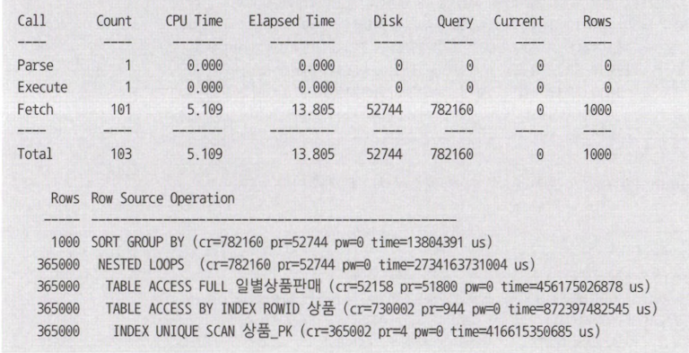
</td>
</tr>
</table>

- 2009년도 상품별 판매수량과 판매금액 집계
- 일별상품판매 테이블로부터 읽힌 365,002개 레코드마다 상품 테이블과 조인 시도
- 조인 과정에서 739,002 블록 I/O 발생, 총 소요 시간 = 13.8초

<table>
<tr>
<td align="center">query</td><td align="center">실행 계획</td>
</tr>
<tr>
<td>

```sql
select *
from (
    select *
    from 일별상품판매
    where 판매일자 between '20090101' and '20091231'
    group by 상품코드
    ) t1, 상품 t2
where t1.상품코드 = t2.상품코드
```
</td>
<td>
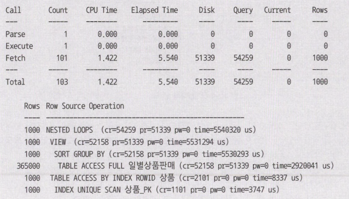
</td>
</tr>
</table>

- 상품코드별로 먼저 집계한 결과 건수 1000건이므로 상품 테이블과 조인도 1000번만 발생
- 조인 과정에서 2101 블록 I/O 발생, 총 소요 시간 = 5.5초

### 2. 배타적 관계의 조인

> - 개통/장애처리 요청 받으면 작업 기사에게 작업 지시<br>
> - 한 작업자에게 작업 지시를 내리기도 하고 여러 작업자가 필요한 경우도 존재

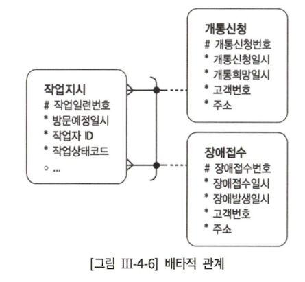

<table>
<tr>
<td align="center">1번</td><td align="center">2번</td>
</tr>
<tr>
<td>개통 신청 번호와 장애 접수 번호 두 컬럼을 따로 두고 레코드별로 둘 중 하나 컬럼에만 값 입력</td>
<td>작업 구분과 접수 번호 컬럼을 두고 작업 구분이 1일 땐 개통 신청 번호를, 2일 땐 장애 접수 번호 입력</td>
</tr>
<tr>
<td>

```sql
select *
from 작업지시
left join 개통신청 on 개통신청.개통신청번호 = 작업지시.개통신청번호
left join 장애접수 on 장애접수.장애접수번호 = 작업지시.장애접수번호
where 작업지시.방문예정일시 between :방문예정일시1 and :방문예정일시2
```
</td>
<td>

```sql
select *
from 작업지시
left join 개통신청 on 개통신청.개통신청번호 = (case when 작업지시.작업구분 = '1' then 작업지시.접수번호 end)
left join 장애접수 on 장애접수.장애접수번호 = (case when 작업지시.작업구분 = '2' then 작업지시.접수번호 end)
where 작업지시.방문예정일시 between :방문예정일시1 and :방문예정일시2
```
</td>
</tr>
</table>

### 3. 부등호 조인

<table>
<tr>
<td align="center">윈도우 함수</td><td align="center">부등호 조인</td>
</tr>
<tr>
<td>

```sql
select 지점,
       판매월,
       매출,
       sum(매출) over (partition by 지점 order by 판매월
       range between unbounded preceding anc current row) 누적 매출
from 월별지점매출;
```
</td>
<td>

```sql
select t1.지점,
       t1.판매월,
       min(t1.매출),
       sum(t2.매출)
from 월별지점매출 t1, 월별지점매출 t2
where t2.지점 = t1.지점 and
      t2.판매월 <= t1.판매월
group by t1.지점, t1.판매월
order by t1.지점, t1.판매월;
```
</td>
</tr>
</table>