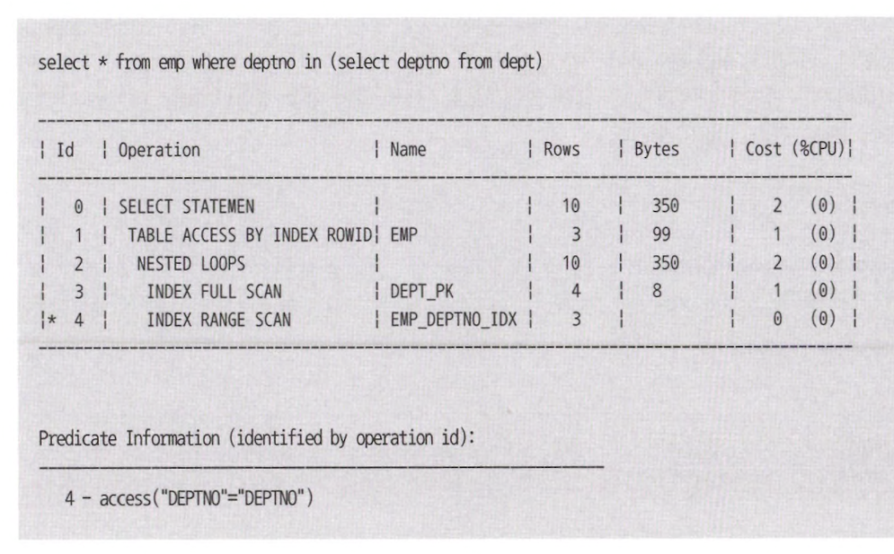
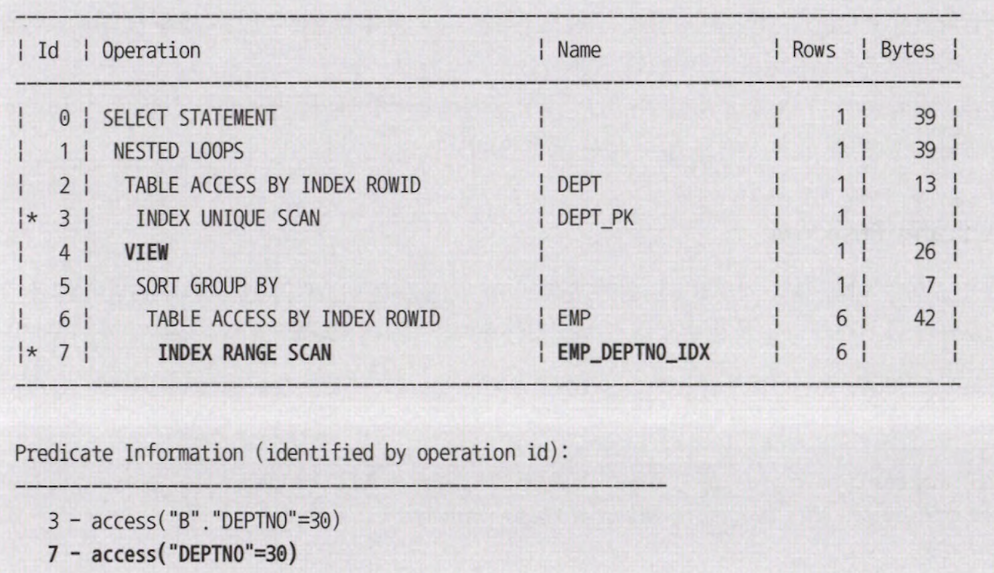

# 5장 SQL 옵티마이저

## 1절 SQL 옵티마이징 원리

### 1. 옵티마이저 소개

<table>
<tr>
<td align="center">규칙 기반 옵티마이저</td><td align="center">비용 기반 옵티마이저</td>
</tr>
<tr>
<td>
규칙 : access 경로별 우선 순위 &rarr; 인덱스 구조, 연산자, 조건절 형태가 순위 결정
</td>
<td>
비용 : 쿼리를 수행하는데 소요되는 일량, 시간
</td>
</tr>
<tr>
<td>
미리 정해 놓은 규칙에 따라 access 경로를 평가 및 실행 계획 선택
</td>
<td>
비용 기반 최적화 수행
</td>
</tr>
</table>

#### 최적화 목표

<table>
<tr>
<td align="center">전체 처리속도 최적화</td><td align="center">최초 응답속도 최적화</td>
</tr>
<tr>
<td>
쿼리 최종 결과를 전제로 시스템 리소스를 가장 적게 사용하는 실행 계획 선택
</td>
<td>
전체 결과 집합 중 일부만 읽다가 멈추는 점을 전제<br>
전체 다 읽으면 전체 처리 속도 최적화 실행계획보다 더 많은 리소스를 사용
</td>
</tr>
<tr>
<td>

```sql
--system level 변경
alter system set optimizer_mode = all_rows;
    
-- session level 변경
alter session set optimizer_mode = all_rows;
    
-- query level 변경
select /** all_rows */ *
from t
where ... ;
```
</td>
<td>

```sql
select /*+ first_rows(10) */ *
from t
where ... ;
from 
```
</td>
</tr>
</table>

### 2. 옵티마이저 행동에 영향을 미치는 요소

- sql과 연산자 형태
- optimizing factor : 쿼리를 동일하게 작성하더라도 인덱스, IOT, clustering, partitioning 등 어떻게 구성했는지에 따라 실행 계획 달라짐
- DBMS 제약
- optimizer hint : optimizer 판단보다 사용자 지정 힌트 우선
- 옵티마이저 관련 파라미터 : DBMS 버전을 업그레이드하면 옵티마이저 다르게 작동
- DBMS 버전, 종류

### 3. 옵티마이저의 한계

#### 옵티마이징 팩터 부족

- 사용자가 적절한 옵티마이징 팩터(= 인덱스, 클러스터링, 파티셔닝)을 구성하지 않으면 실행 계획 bad

#### 통계 정보 부정확성

```sql
select *
from 사원
where 직급 = '부장' and
      연봉 >= 5000;
```

- 직급 = 부장, 과장, 대리, 사원 &rarr; 25% 구성
- 전체 사원이 1000명이고 연봉 >= 5000 조건 만족하는 사원 = 10%
- 옵티마이저 계산 = 1000 * 0.25 * 0.1 = 25명
- 실제로 연봉이 5000만원 이상이 모두 부장이라면 위 쿼리 결과 = 1000 * 0.1 = 100명

### 4. 통계정보를 이용한 비용계산 원리

<table>
<tr>
<td align="center" colspan="2">옵티마이저 통계 유형</td>
</tr>
<tr>
<td align="center">통계 유형</td><td align="center">세부 통계 항목</td>
</tr>
<tr>
<td align="center">테이블 통계</td>
<td>
전체 레코드 수, 총 블락 수, 빈 블록 수, 한 행당 평균 크기
</td>
</tr>
<tr>
<td align="center">인덱스 통계</td>
<td>
인덱스 높이, 리프 블록 수, 클러스터링 팩터, 인덱스 레코드 수
</td>
</tr>
<tr>
<td align="center">컬럼 통계</td>
<td>
값의 수, 최저 값, 최고 값, 밀도, null 값 개수
</td>
</tr>
<tr>
<td align="center">시스템 통계</td>
<td>
CPU 속도, 평균 I/O 속도, 초당 I/O 처리량
</td>
</tr>
</table>

#### 선택도

> 전체 대상 레코드 중 특정 조건에 의해 선택 예상 되는 레코드 비율

- 선택도 &rarr; 카디널리티 &rarr; 비용 &rarr; 액세스 방식, 조인 순서, 조인 방법 결정
- 선택도 = 1 / distinct value 개수

#### 카디널리티

> 특정 access 단계를 거치고 난 후 출력 예상 되는 레코드 수

- 전체 행에 대한 중복 수치
- 카디널리티 = 총 로우 수 x 선택도

&rArr; 중복도 &darr; &rarr; 카디널리티 &uarr;

#### 비용

> 비용 = blevel &nbsp;&nbsp;&nbsp;&nbsp;&nbsp;&nbsp;&nbsp;&nbsp;&nbsp;&nbsp;&nbsp;&nbsp;&nbsp;&nbsp;&nbsp;&nbsp;&nbsp;&nbsp;&nbsp;&nbsp;&nbsp;&nbsp;&nbsp;&nbsp;&nbsp;&nbsp;&nbsp;&nbsp;&nbsp;&nbsp;&nbsp;&nbsp;&nbsp;&nbsp;&nbsp;&nbsp;&nbsp;&nbsp;&nbsp;&nbsp;&nbsp;&nbsp;&nbsp; -- 인덱스 수직적 탐색 비용<br>
> `+` (리프 블록 수 x 유효 인덱스 선택도) &nbsp;&nbsp;&nbsp;&nbsp;&nbsp;&nbsp; -- 인덱스 수평적 탐색 비용<br>
> `+` (클러스터링 팩터 x 유효 테이블 선택도) &nbsp; -- 테이블 랜덤 액세스 비용

<table>
<tr>
<td align="center" colspan="2">인덱스를 경유한 테이블 액세스 비용 항목</td>
</tr>
<tr>
<td align="center">blevel</td>
<td>
브랜치 레벨, 리프 블록에 도달하기 전 읽게 될 브랜치 블록 개수
</td>
</tr>
<tr>
<td align="center">클러스터링 팩터</td>
<td>
특정 컬럼을 기준으로 같은 값을 갖는 데이터가 서로 모여 있는 정도<br>
인덱스를 경유해 테이블 전체 row를 접근할 때 읽을 것으로 예상되는 논리적인 블록 개수로 계수화
</td>
</tr>
<tr>
<td align="center">유효 인덱스 선택도</td>
<td>
전체 인덱스 레코드 중에서 조건절을 만족하는 레코드를 찾기 위해 접근할 것으로 예상되는 비율
</td>
</tr>
<tr>
<td align="center">유효 테이블 선택도</td>
<td>
전체 레코드 중에서 인덱스 스캔을 완료하고서 최종적으로 테이블을 방문할 것으로 예상되는 비율
</td>
</tr>
</table>

## 2절 SQL 공유 및 재사용

### 1. 소프트 파싱 vs 하드 파싱

> 소프트 파싱 : SQL과 실행 계획을 캐시에서 찾아 곧바로 실행 단계로 넘어감<br>
> 하드 파싱 : SQL과 실행 계획을 캐시에서 찾지 못해 최적화 과정을 거치고 실행 단계로 넘어감

#### 실행 계획 공유 조건

1. syntax 검사
2. 해시 함수로부터 반환된 해시 값으로 라이브러리 캐시 내 해시 버킷 찾아감
3. 찾아간 해시버킷에 체인으로 연결된 엔트리를 차례로 스캔하면서 같은 SQL 문장 찾음
4. SQL 문장 찾으면 함께 저장된 실행 계획으로 바로 실행
5. 찾아간 해시 버킷에서 SQL 문장 찾지 못하면 최적화 수행
6. 최적화 거친 SQL과 실행계획을 방금 탐색한 해시버킷 체인에 연결
7. 방금 최적화한 실행 계획으로 수행

#### 실행 계획 공유하지 못하는 경우

<table>
<tr>
<td align="center">설명</td><td align="center">query</td>
</tr>
<tr>
<td>
공백 문자, 줄바꿈
</td>
<td>

```sql
select * from customer;
select*            from custmer;
```
</td>
</tr>
<tr>
<td>
대소문자 구분
</td>
<td>

```sql
select * from customer;
select * from CUSTOMER;
```
</td>
</tr>
<tr>
<td>
주석
</td>
<td>

```sql
select * from customer;
```
</td>
</tr>
<tr>
<td>
테이블 owner 명시
</td>
<td>

```sql
select * from CUSTOMER;
select * from HR.CUSTOMER;
```
</td>
</tr>
<tr>
<td>
옵티마이저 힌트 사용
</td>
<td>

```sql
select * from customer;
select /*+ all_rows */ * from CUSTOMER;
```
</td>
</tr>
<tr>
<td>
조건절 비교 값
</td>
<td>

```sql
select * from CUSTOMER WHERE LOGIN_ID = 'tommy';
select * from CUSTOMER WHERE LOGIN_ID = 'kim';
select * from CUSTOMER WHERE LOGIN_ID = 'han';
select * from CUSTOMER WHERE LOGIN_ID = 'park';
```
</td>
</tr>
</table>

### 2. 바인드 변수 사용

<table>
<tr>
<td align="center">oracle</td><td align="center">mysql</td>
</tr>
<tr>
<td>

```sql
select *
from customer
where login_id = :login_id;
```
</td>
<td>

```sql
select *
from customer
where login_id = @login_id;
```
</td>
</tr>
</table>

- bind 변수 사용 시 처음 수행한 세션이 하드 파싱으로 실행 계획 생성
- 라이브러리에 캐싱하여 다른 세션들이 재사용
- 세션은 캐시에서 실행 계획 조회하여 입력 값만 새롭게 바인딩

#### 바인드 변수 필요 없는 경우

- 배치 프로그램, OLAP, Long Running query &rarr; OLTP에선 바인드 변수 사용 권고!
- 조건절 컬럼 값 종류 distinct value가 소수일 때

## 3절 쿼리 변환

### 1. 쿼리 변환이란?

> 옵티마이저가 SQL을 분석해 같은 결과를 반환하면서도 더 나은 성능이 기대되는 형태로 재작성

- Heuristic 쿼리 변환(= 규칙 기반 최적화) : 결과만 보장된다면 무조건 쿼리 변환 수행
- Cost-based 쿼리 변환 : 변환된 쿼리 비용이 더 낮을 때만 사용, 그렇지 않을 때는 원본 쿼리 그대로 두고 최적화 수행

### 2. 서브쿼리 Unnesting

> 중첩된 서브쿼리를 풀어냄

- 동일한 결과를 보장하는 조인문으로 변환 후 최적화
- 서브쿼리를 unnesting 하지 않고 원래대로 둔 상태에서 최적화
  - 메인 쿼리와 서브 쿼리를 별도의 서브 플랜으로 구분해 각각 최적화
  - 서브쿼리에 필터 동작

```sql
select *
from emp a
where exists (
    select 1
    from dept
    where deptno = a.deptno
) and sal > (
    select avg(sal)
    from emp b
    where exists(
        select 1
        from salgrade
        where b.sal between losal and hisal and
              grade = 4
    )
)
```

<table>
<tr>
<td align="center">query</td><td align="center">query plan</td>
</tr>
<tr>
<td>

```sql
select *
from emp
where deptno in (
    select deptno
    from dept
)
```
</td>
<td>

</td>
</tr>
</table>

- SQL unnesting 없이 최적화
- predicate 1번을 통해 옵티마이저가 서브쿼리를 별도의 서브 플랜으로 최적화
- 메인 쿼리도 서브쿼리를 제외한 상태에서 별도로 최적화 &rarr; 아무 조건절이 없어 full table scan이 최적<br>
&rArr; Uneesting 하지 않은 서브쿼리를 수행할 때는 메인 쿼리에서 읽히는 레코드마다 값을 넘기면서 서브 쿼리 반복 실행

<table>
<tr>
<td align="center">query</td><td align="center">query plan</td>
</tr>
<tr>
<td>

```sql
select *
from (
    select deptno
    from dept
     ) a, emp b
where b.deptno = a.deptno

-- 이후 뷰 merging 과정을 거쳐 최종 단계
select emp.*
from dept, emp
where emp.deptno = dept.deptno
```
</td>
<td>

</td>
</tr>
</table>

- SQL unnesting 일어난 실행 계획
- Unnesting 했지만 더 나은 성능 x

#### Oracle Unnesting hint

- `unnest` : 서브쿼리를 Unnesting 함으로써 조인 방식으로 최적화하도록 유도
- `no_unnest` : 서브쿼리를 그대로 둔 상태에서 필터 방식으로 최적화하도록 유도

#### 서브쿼리가 n쪽 집합이거나 Non-unique 인덱스인 경우

<table>
<tr>
<td align="center">subquery</td><td align="center">query 변환</td>
</tr>
<tr>
<td>

```sql
select *
from dept
where deptno in (
    select deptno
    from emp
)
```
</td>
<td>

```sql
select *
from (
    select deptno
    from emp
     ) a, dept b
where b.deptno = a.deptno
```
</td>
</tr>
<tr>
<td>

</td>
<td>

</td>
</tr>
<tr>
<td>

```sql
select *
from emp
where deptno in (
    select deptno 
    from dept
)
```
</td>
<td>

```sql
alter table dept drop primary key;

create index dept_deptno_idx on dept(deptno);

select *
from emp
where deptno in (
    select deptno
    from dept
);

-- 실제로 dept 테이블 unique 하지만 불확실해 옵티마이저 쿼리 변환
select b.*
from (
    select /*+ no_merge */ distinct deptno
    from dept
    order by deptno
 ) a, emp b
 where b.deptno = a.deptno
```
</td>
</tr>
</table>

### 3. 뷰 Merging

<table>
<tr>
<td align="center">inline view</td><td align="center">view merging</td>
</tr>
<tr>
<td>

```sql
select *
from (select * from emp where job = 'SALESMAN') a,
     (select * from dept where loc = 'CHICAGO') b
where a.deptno = b.deptno
```
</td>
<td>

```sql
select *
from emp a, dept b
where a.deptno = b.deptno and
      a.job = 'SALESMAN' and
      b.loc = 'CHICAGO'
```
</td>
</tr>
<tr>
<td>

```sql
create or replace view emp_salesman as
    select *
    from emp
    where job = 'SALESMAN';

select *
from emp_salesman e, dept d
where d.deptno = e.deptno and
      e.sal >= 1500;
```
</td>
<td>

```sql
select *
from emp e, dept d
where d.deptno = e.deptno and
      e.job = 'SALESMAN' and
      e.sal >= 1500
```
</td>
</tr>
<tr>
<td>

</td>
<td>

</td>
</tr>
</table>

#### View Merging 하더라도 성능이 나빠지는 경우

- group by 절
- select-list 내 distinct 연산자 포함

#### View Merging 불가능한 경우

- set 연산자 ex) union, union all, intersect, minus
- connect by
- rownum
- select-list 내 집계 함수 ex) avg, count, max, min, sum
- 분석 함수

### 4. 조건절 Pushing

> View를 참조하는 쿼리 블록 조건절을 View 쿼리 블록 안으로 밀어 넣는 기능

- 조건절 Pushdown : 쿼리 블록 밖에 있는 조건절을 쿼리 블록 안쪽으로 밀어 넣음
- 조건절 Pullup : 쿼리 블록 안에 있는 조건절을 쿼리 블록 밖으로 보냄
- 조인 조건 Pushdown : NL 조인 수행 중 드라이빙 테이블에서 읽은 값을 건건이 inner 쪽 view 쿼리 블록 안으로 밀어 넣음

#### 조건절 Pushdown

<table>
<tr>
<td align="center">AS-IS</td><td align="center">TO-BE</td>
</tr>
<tr>
<td>

```sql
select deptno,
       avg_sal
from (
    select deptno,
           avg(sal) avg_sal
    from emp
    group by deptno
 ) a
 where deptno = 30
```
</td>
<td>

```sql
select b.deptno,
       b.dname,
       a.avg_sal
from (
    select deptno,
           avg(sal) avg_sal
    from emp
    group by deptno
 ) a, dept b
 where a.deptno = b.deptno and
       b.deptno = 30 and
       a.deptno = 30
```
</td>
</tr>
<tr>
<td>

</td>
<td>

</td>
</tr>
</table>

- group by 절을 포함한 view를 처리할 때 쿼리 블록 밖에 있는 조건절을 쿼리 블록 안쪽에 밀어 넣어 group by 해야 할 데이터 &darr;
- inline view에 `deptno = 30` 으로 데이터 양 줄인 뒤 group by와 조인 연산 수행

#### 조건절 Pullup

<table>
<tr>
<td align="center">AS-IS</td><td align="center">TO-BE</td>
</tr>
<tr>
<td>

```sql
select *
from (
    select deptno,
           avg(sal)
    from emp
    where deptno = 10
    group by deptno
) e1, (
    select deptno,
           min(sal),
           max(sal)
    from emp
    group by deptno
) e2
where e1.deptno = e2.deptno
```
</td>
<td>

```sql
select *
from (
    select deptno,
           avg(sal)
    from emp 
    where deptno = 10
    group by deptno
) e1, (
    select deptno,
           min(sal),
           max(sal)
    from emp
    where deptno = 10
    group by deptno
) e2
where e1.deptno = e2.deptno
```
</td>
</tr>
<tr>
<td>

</td>
<td>

</td>
</tr>
</table>

#### 조인조건 Pushdown

<table>
<tr>
<td align="center">query</td><td align="center">query plan</td>
</tr>
<tr>
<td>

```sql
select d.deptno,
       d.dname,
       e.avg_sal
from dept d, (
    select /*+ no_merge push_pred */
      deptno,
      avg_sal
    from emp
    group by deptno
) e
where e.deptno(+) = d.deptno
```
</td>
<td>

</td>
</tr>
</table>

- `push_pred` : 조인 조건 컬럼을 view 안으로 병합 힌트
- `no_merge` : 메인쿼리와 inline view 합쳐짐 &rarr; 즉 병합을 하지말고 inline view 먼저 실행

### 5. 조건절 이행

> `(A = B) 이고 (B = C) 이면 (A = C) 이다` 로 새로운 조건절을 내부적으로 생성해주는 쿼리 변환

<table>
<tr>
<td align="center">query</td><td align="center">query 변환</td>
</tr>
<tr>
<td>

```sql
select *
from dept d, emp e
where e.job = 'MANAGER' and
      e.deptno = 10 and
      d.deptno = e.deptno
```
</td>
<td>

```sql
select *
from dept d, emp e
where e.job = 'MANAGER' and
      e.deptno = 10 and
      d.deptno = 10
```
</td>
</tr>
<tr>
<td colspan="2">

</td>
</tr>
</table>

### 6. 불필요한 조인 제거

> 1:n 관계인 두 테이블을 조인하는 쿼리에서 1쪽 테이블을 참조하지 않는다면 쿼리 수행 시 n쪽 테이블만 읽도록 쿼리 변환

- 조인 제거 기능 위해 PK, FK 제약 설정 필요
- PK 없으면 두 테이블 간 조인 카디널리티 파악 불가
- FK 없으면 조인에 실패하는 레코드 발생 가능<br>
&rArr; 옵티마이저가 함부로 쿼리 변환 x

<table>
<tr>
<td align="center">query</td><td align="center">query 변환</td>
</tr>
<tr>
<td>

```sql
select e.empno,
       e.ename,
       e.deptno,
       e.sal,
       e.hiredate
from dept d, emp e
where d.deptno = e.deptno
```
</td>
<td>

```sql
select e.empno,
       e.ename,
       e.deptno,
       e.sal,
       e.hiredate
from emp e
left outer join dept d on d.deptno = e.deptno
```
</td>
</tr>
</table>

### 7. OR 조건을 Union으로 변환

<table>
<tr>
<td align="center">or condition</td><td align="center">union condition</td>
</tr>
<tr>
<td>

```sql
select *
from emp
where job = 'CLERK' or
      deptno = 20
```
</td>
<td>

```sql
select *
from emp
where job = 'CLERK'

union all

select *
from emp
where deptno = 20 and
      lnnvl(job = 'CLERK')
```
</td>
</tr>
<tr>
<td colspan="2">

</td>
</tr>
</table>

- 위 브랜치는 `job = 'CLERK'` 조회, 아래 브랜치는 `deptno = 20` 조회 &rarr; emp table access 2회
- 중복 access 데이터 비중이 낮을수록 효과적
- `use_concat` : or-expansion 유도
- `no_expand` : or-expansion 방지

### 8. 기타 쿼리 변환

<table>
<tr>
<td align="center">query</td><td align="center">query 변환</td>
</tr>
<tr>
<td>

```sql
select job,
       mgr
from emp

minus

select job,
       mgr
from emp
where deptno = 10;
```
</td>
<td>

```sql
select distinct job,
                mgr
from emp e
where not exists(
    select 1
    from emp
    where deptno = 10 and
          sys_op_map_nonnull(job) = sys_op_map_nonnull(e.job) and
          sys_op_map_nonnull(mgr) = sys_op_map_nonnull(e.mgr)
)
```
</td>
</tr>
<tr>
<td>

```sql
select count(e.empno),
       count(d.dname)
from emp e, dept d
where d.deptno = e.deptno and
      sal <= 2000
```
</td>
<td>

```sql
select count(e.empno),
       count(d.dname)
from emp e, dept d
where d.deptno = e.deptno and
      sal <= 2000 and
      e.deptno is not null and
      d.deptno is not null
```
</td>
</tr>
</table>

#### 조건절 비교 순서


```sql
select *
from T
where A = 1 and 
      B = 1000;
```

- B column condition 먼저 평가 유리
- 대부분 `B = 1000` 만족 x<br>
- &rArr; 옵티마이저가 조건절 비교 순서 최적화