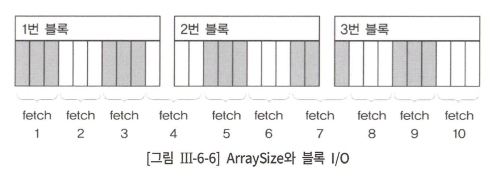

# 6장 고급 SQL 튜닝

## 1절 소트 튜닝

### 1. 소트와 성능

> Sort Area란, SQL 수행 중 정렬 동작 수행 위해 할당하는 메모리 공간

- Oracle은 PGA, SQL Server는 buffer cache에 할당
- sort memory 부족하면 disk 사용 &rarr; Oracle은 Temp Tablespace, SQL Server는 tempdb


#### Sort 발생시키는 명령어

1. Sort Aggregate

- 전체 로우 대상으로 집계 수행 시 나타남
- Oracle엔 Sort로 표현되지만 실제 정렬 발생 x


2. Sort Order by

- 정렬된 결과 집합 얻을 때 나타남


3. Sort Group by 

- 그룹별 집계 수행 시 나타남


4. Sort Unique

- 결과 집합에서 중복 레코드 제거할 때 나타남


5. Sort Join

- sort merge join 시 나타남


### 2. 데이터 모델 측면에서의 검토

<table>
<tr>
<td>

</td>
<td>

</td>
</tr>
<tr>
<td>

```sql
select 과금.고객id,
       과금.상품id,
       과금.과금액,
       가입상품.가입일시
from 과금, 가입상품
where 과금.고객id = 가입상품.고객id and
      과금.상품id = 가입상품.상품id and
      과금.과금연월 = :yyyymm
```
</td>
<td>

```sql
select 과금.고객id,
       과금.상품id,
       과금.과금액,
       가입상품.가입일시
from 과금,
     (
         select 고객 id,
                상품id,
                min(가입일시) 가입일시
         from 고객별_상품_라인
         group by 고객id,
                  상품 id
     ) 가입 상품
where 과금.고객id = 가입상품.고객id and
    과금.상품id = 가입상품.상품id and
    과금.과금연월 = :yyyymm
```
</td>
</tr>
</table>

### 3. 소트가 발생하지 않도록 SQL 작성

### 1. Union을 Union ALL로 대체

<table>
<tr>
<td>

```sql
select *
from emp
where deptno = 10
union
select *
from emp
where deptno = 20;
```
</td>
<td>

```sql
select *
from emp
where deptno = 10
union all
select *
from emp
where deptno = 20;
```
</td>
</tr>
<tr>
<td>

</td>
<td>

</td>
</tr>
</table>

- 두 대상 중복 가능성이 전혀 없어 union과 union all 결과 집합 동일

#### 2. Distinct를 Exists 서브쿼리로 대체

<table>
<tr>
<td>

```sql
select distinct 과금연월
from 과금
where 과금연월 <= :yyyymm and
      지역 like :reg || '%'
```
</td>
<td>

```sql
select 연월
from 연월테이블 a
where 연월 <= :yyyymm and
      exists (
          select 1
          from 과금
          where 과금연월 = a.연월 and
                지역 like :reg || '%'
      )
```
</td>
</tr>
<tr>
<td>

</td>
<td>

</td>
</tr>
</table>

### 4. 인덱스를 이용한 소트 연산 대체

> 인덱스는 항상 키 컬럼 순으로 정렬된 상태를 유지하여 정렬 동작 생략 가능

#### 1. Sort Order By 대체


- index = [region + custid]
- `region = 'A'` 만족하는 전체 로우 읽지 않고도 정렬된 결과 집합 조회 가능
- OLTP 환경에서 성능 &uarr;

#### 2. Sort Group By 대체


<table>
<tr>
<td align="center">query</td><td align="center">query plan</td>
</tr>
<tr>
<td>

```sql
select region,
       avg(age),
       count(*)
from customer
group by region
```
</td>
<td>

</td>
</tr>
</table>

#### 3. index를 활용한 Min, Max 구하기

- 인덱스가 항상 정렬 상태를 유지해 대상 레코드 전체를 읽지 않고도 추출 가능

### 5. 소트 영역을 적게 사용하도록 SQL 작성

<table>
<tr>
<td align="center">일반 정렬</td><td align="center">미리 정렬</td>
</tr>
<tr>
<td>

```sql
select lpad(상품번호, 30) || lpad(상품명, 30) || lpad(고객ID, 10) ||
       lpad(고객명, 20) || to_char(주문일시, 'yyyymmdd hh24:mi:ss')
from 주문상품
where 주문일시 between :start and :end
order by 상품번호
```
</td>
<td>

```sql
select lpad(상품번호, 30) || lpad(상품명, 30) || lpad(고객ID, 10) ||
       lpad(고객명, 20) || to_char(주문일시, 'yyyymmdd hh24:mi:ss')
from (
    select 상품번호, 상품명, 고객ID, 고객명, 주문일시
    from 주문상품
    where 주문일시 between :start and :end
    order by 상품번호
 )
```
</td>
</tr>
<tr>
<td>

```sql
explain plan for
select lpad(ename, 30), lpad(job, 30), lpad(HIREDATE, 30)
from EMP
order by sal desc;
```
</td>
<td>

```sql
explain plan for
select lpad(ename, 30), lpad(job, 30), lpad(HIREDATE, 30)
from (
    select *
    from emp
    order by sal desc
);
```
</td>
</tr>
<tr>
<td align="center" colspan="2">

</td>
</tr>
</table>

- 미리 정렬하는 쿼리가 sort 영역 훨씬 적게 사용
- 가공하지 않은 상태로 정렬 끝낸 후 최종 출력할 때 가공하기 때문<br>
- EMP 테이블 query plan으로는 동일,,
&rarr; 실제로 그런가??,,

#### Top N Query


- 맨 우측에 있는 가장 큰값과 비교해서 그보다 작은 값이 나타날때만 정렬
- 전체 레코드를 정렬하지 않고도 오름차순으로 최소값 갖는 10개 레코드 파악 가능<br>
&rArr; sort 연산 횟수와 sort 영역 사용량 &darr;

### 6. 소트 영역 크기 조정

- sort가 불가피하다면 메모리 내에서 작업 완료할 수 있어야 최적
- 디스크 정렬이 불가피하다면 임시 공간에 기록했다가 다시 읽는 횟수 최소화할 수 있어야 최적

## 2절 DML 튜닝

### 1. 인덱스 유지 비용

#### 데이터 변경 시 인덱스 비용 

- 변경할 인덱스 레코드 찾아가는 비용 + Redo, Undo 생성 비용
- 인덱스 레코드는 Delete & Insert 방식 ∵ 인덱스 정렬 상태 유지
- 인덱스 유지를 위해 Undo record 2개씩 기록

### 2. Insert 튜닝

> Direct Path Insert이란, 버퍼 캐시를 거치지 않고 데이터 파일에 곧바로 입력하는 방식

#### Direct Path Insert으로 데이터 입력 방법

- insert select 문장에 `/*+ append */` hint 사용
- 병렬 모드로 insert
- direct option 지정하고 SQL loader로 데이터 로드
- `CTAS(= create table ... as select)` 문장 수행

#### nologging mode Insert

> 테이블 속성을 nologging으로 바꾸면 redo 로그까지 최소화하여 더 빠르게 insert

### 3. Update 튜닝

- 대량의 데이터 갱신할 때는 Update/delete 보다는 truncate 후 insert
- Oracle Merge 문 활용

## 3절 데이터베이스 Call 최소화

### 1. 데이터베이스 Call 종류

#### SQL Cursor에 대한 작업 요청에 따른 구분

- `Parse Call` : SQL 파싱 요청하는 call
- `Execute Call` : SQL 실행 요청하는 call
- `Fetch Call` : Select 결과 데이터 전송 요청하는 Call

#### Call 발생 위치에 따른 구분

- `User Call` : DBMS 외부에서 요청하는 call
- `Recursive Call` : DBMS 내부에서 발생하는 call
  - SQL parsing, 최적화 과정에서 발생하는 데이터 딕셔너리 조회
  - procedure 내에서의 SQL

### 2. 데이터베이스 Call과 성능

- 한방 쿼리 = select 후 save * n번 vs saveAll n개 1번

### 3. Array Processing 활용

- bulk로 n건씩 fetch하여 bulk로 insert

### 4. Fetch Call 최소화




### 7. 사용자 정의 함수 프로시저의 특징과 성능

#### 사용자 정의 함수 프로시저 특징

- 가상 머신 같은 별도 실행 엔진을 통해 실행 ∵ 네이티브 코드로 완전 컴파일된 형태 x
- 실행될 때마다 context switching 발생
- 메인 쿼리가 참조하는 함수에 또 다른 쿼리문 내장돼있으면 성능 &darr; ∵ 함수에 내장된 쿼리 실행할 때마다 Execute Call, Fetch Call 재귀적으로 발생

## 4절 파티셔닝

### 1. 파티션 개요

> 파티셔닝이란, 테이블 또는 인덱스 데이터를 파티션 단위로 나누어 저장

### 2. 파티션 유형

#### Range Partitioning


- 파티션 키 값의 range로 분할
- 주로 날짜 컬럼으로 기준

#### Hash Partitioning

- 파티션 키 값에 해시 함수를 적용하고 거기서 반환된 값으로 파티션 매핑
- 데이터가 모든 파티션에 고르게 분산되도록 DBMS 관리
- 파티션 키 데이터 분포가 고른 컬럼이어야 효과적
- 병렬 처리 시 성능 극대화

#### List Partitioning

- 불연속적인 값 목록 각 파티션에 지정
- 순서와 관계없이 사용자가 미리 정한 기준에 따라 데이터 분할 저장

#### Composite Paritioning


- range나 list 파티션 내 또 다른 서브 파티션 구성

### 3. [파티션 Pruning](https://gngsn.tistory.com/203)

> 파티션 Pruning이란, 옵티마이저가 SQL 대상 테이블과 조건절을 분석해 불필요한 파티션을 접근 대상에서 제외하는 기능

#### 정적 파티션 Pruning

- 접근할 파티션을 컴파일 시점에 미리 결정
- 파티션 키 컬럼을 상수 조건으로 조회하는 경우에 작동


#### 동적 파티션 Pruning

- 접근할 파티션을 런타임 시점에 결정
- 파티션 키 컬럼을 바인드 변수로 조회하는 경우


### 4. 인덱스 파티셔닝

<table>
<tr>
<td align="center">local paritition index</td><td align="center">global paritition index</td>
</tr>
<tr>
<td>
테이블 파티션과 1:1 대응되도록 파티셔닝한 인덱스
</td>
<td>
테이블 파티션과 독립적인 구성을 갖도록 파티셔닝한 인덱스
</td>
</tr>
<tr>
<td>

</td>
<td>

</td>
</tr>
</table>

- `Prefixed Partition Index` : 파티션 인덱스 생성 시 파티션 키 컬럼을 인덱스 키 컬럼 왼쪽 선두에 둠
- `NonPrefixed Partition Index` : 파티션 인덱스 생성 시 파티션 키 컬럼을 인덱스 키 컬럼 왼쪽 선두에 두지 않음

## 6절 고급 SQL 활용

### 3. Union All을 활용한 M:M 관계의 조인

#### M:M 관계


```sql
select *
from (
    select 상품, 계획연월, sum(계획수량)
    from 부서별판매계획
    where 계획연월 between '200901' and '200903'
    group by 상품, 계획연월
    ) a
full outer join (
    select 상품, 판매연월, sum(판매수량)
    from 채널별판매실적
    where 판매연월 between '200901' and '200903'
    group by 상품, 판매연월
) b
on a.상품 = b.상품 and
   a.계획연월 = b.계획연월
```

- group by 먼저 수행해 두 집합 1:1 관계 만들어 full outer join

```sql
select *
from (
    select 상품, 계획연월 as 연월, 계획수량, to_number(null) as 실적수량
    from 부서별판매계획
    where 계획연월 between '200901' and '200903'
    union all
    select 상품, 판매연월 as 연월, to_number(null) as 계획수량, 판매수량
    from 채널별판매실적
    where 판매연월 between '200901' and '200903'
) a
group by 상품, 연월;
```

- union all을 통해 M:M 조인 및 full outer join 해결